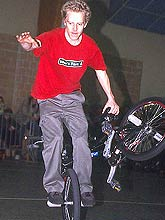
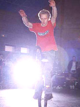
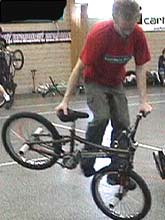
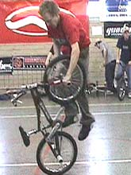
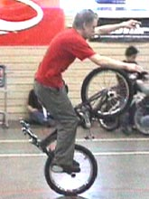

# Interview : Steven Blatter

paru le 27/02/2002 sur <a href="http://bmx.agoride.com/">Agoride</a>

A la tête de la scène suisse, il fait partie de la relève flat européenne.

_La Suisse est plus connue pour son chocolat, ses montres à précision et ses comptes bancaires que pour ses joyeux drilles qui déambulent sur leur petit vélo. Et bien c’est un tort car aujourd’hui la scène bmx suisse se développe à vitesse grand V et des nouvelles têtes débarquent sur les dance floor. Steven lui, est un habitué des contests depuis longtemps, il se déplace à pratiquement tout les rassemblements en Europe._

_Mr Blatter est un original, déjà quand on pratique le bmx, on est un peu en marge mais lui va encore plus loin. Ses tricks et son style n’appartiennent à personne qu’à lui même, à l’inverse de la tendance experte actuelle._

**Présentation ?**

Steven Blatter, né le 09.05.1978 et habitant à Prangins, Suisse.

**Tu roules depuis quand ? Qu’est-ce qui t’a motivé à commencer ?**

Je roule en BMX depuis 1996 mais je fais du flat depuis 1997. J’étais à un camp de snowboard et en fin de journée j’allais au skatepark faire du roller. C’est là que j’ai vu pour la première fois un bmxer rider en rampe. Six mois plus tard, un pote m’a prêté une vidéo de race avec du flat entre les courses et c’est là qu j’ai vu ce qu’on pouvait faire au sol avec un BMX. Ca m’a vraiment plu, d’autant plus que c’était un sport bien plus underground que le roller.

**Tu roules où ? Combien d’heures par jour ? Avec qui ?**

Quand le sol est sec, je roule sur un terrain de basket à Prangins ou à côté du skatepark de Genève. Sinon je vais rouler à l’aéroport de Genève sur un sol parfait en faux marbre. Je practice en moyenne 6 à 8 heures par semaine seul ou avec Grigori Singovski et Marco Vetterli.

**As-tu des sponsors ? T’en cherches ?**

Je fais partie du team Boarderspark, un shop de skate et snowboard à Nyon qui me trouve des plans pour du matos meilleur marché. Je cherche des sponsors, mais c’est difficile en Suisse parce qu’il n’y a pas beaucoup de riders ; les marques ne voient pas d’intérêt dans le BMX.

**Tes modèles, ton inspiration ?**

Je pense qu’Alexis Désolneux et James White sont des riders qui ont une bonne philosophie du flat, ils n’ont rien à prouver, mais je n’ai pas vraiment de modèle, je fais (j’essaie) les figures qui me plaisent et qui sont de mon niveau. Je roule surtout pour me changer les idées, me dépenser physiquement et assouvir ma passion du flat. Et ce que j’aime est ce côté underground du flat : si tu voyages même sans ton BMX et tu tombes sur un flatlander tu sais qu’il te considérera presque tout de suite comme un pote.

**Que penses-tu de la nouvelle scène flat experte avec tout ces clones d’Alex et de Jimmy ?**

Personnellement je n’ai jamais été groupie ou fan d’une personne, je préfère être individualiste, rester moi-même. Mais si ces riders se sentent bien dans leur peau en s’habillant et en ridant comme certains pros, tant mieux pour eux. A mon avis, tôt ou tard, ils trouveront leur propre style. Je pense qu’il est important de rouler seul le plus possible car c’est ainsi qu’on le développe.

**Que penses-tu du BMX en France ?**

Il est parfait avec des contests et des jams partout, un niveaux qui ne cesse de grimper chez les pros et chez les experts. Je trouve que la scène flat est très animée. A chaque fois que je bouge sur un contest, c’est un bon souvenir de plus. Surtout le Flat Time King dont l’organisation et l’ambiance étaient vraiment exceptionnelles. Le seul hic est cette tension qu’il y a entre les différents teams français.

**Tu participes à la vidéo Flatland Manifesto, peux-tu nous en dire plus?**

Comme je me déplace sur pas mal de contests en Europe et que je les filme, Dave Artz1 m’a mis en contact avec Shane de Flatland Manifesto qui avait besoin d’images du vieux continent. On fonctionne sur un système d’échange de service entre les trois, pas d’argent entre nous ! En plus je trouve que Flatland Manifesto est une vidéo de très bonne qualité donc autant filmer pour un bon résultat.

**A part le vélo, tu fais quoi ? Tu as d’autres passions ?**

Je travaille en tant qu’indépendant comme monteur vidéo, preneur de son et caméraman pour la télévision. A part le flat, j’ai d’autres passions comme le snowboard, le cinéma gore, le rock alternatif style Pixies, Grandaddy et le HxC métal.

**Que penses-tu des sites Internet (the flatlander, backlash, agoride,...) ?**

Internet est le média le plus rapide et le plus accessible. Il est très important que de tels sites existent, car ils permettent le développement du BMX et une bonne communication entre riders du monde entier. Et je crois que particulièrement pour le flat, discipline laissée-pour-compte, Internet est devenu une plate-forme d’échange d’information importante qui a permis d’organiser bon nombre de jams et contests par exemple ceux de l’IFL.

**Au niveau des tricks, quels sont ceux qui t’impressionnent, tes projets ?**

Les tricks qui m’impressionnent sont les rollings en crossfooted, backward et autres, ainsi que les tricks news school de Martti ou des riders Japonnais, et ceux des riders dans Intrikat. Mais quand je regarde une vielle vidéo genre Dorking ou Baco, je me prends à chaque fois une claque parce que leurs tricks sont déjà hyper techniques et qu’ils faisaient cela il y a 8 ans déjà. Je n’ai pas tellement de projet, j’essaie ce qui me vient à l’esprit pendant que je ride, je m’amuse quoi. En ce moment je travaille sur backward crakpaker.

**Cherches-tu à avoir un style particulier comme c’est la grande mode ou seuls les tricks t’intéressent ?**

Mon problème est que je n’arrive pas à rider sans avoir un style sketchy par manque de practice, donc je travaille plutôt les tricks et essaie de rentrer mes enchaînements de A à Z.

**La scène suisse est-elle assez développé pour toi ? Y-a t-il des shops, mags, ... ?**

La scène suisse est très dispersée à cause de la difficulté à communiquer entre les 3 régions linguistiques et parce que chaque bmxer reste dans sa ville ; très peu d’entre eux bougent. Il manque un point de contact et c’est pour cette raison qu’on a, avec d’autres bmxers, monté une association de BMX freestyle (pas de race) : "Swiss BMX Freestyle". Je pense que c’est la première en Suisse. Nous allons organiser des contests, des jams et des voyages à l’étranger. Je ne connais pas de shops spécialisés en BMX. Les pièces de qualité sont difficiles à trouver. Heureusement que la France et l’Allemagne ont de bons shops de vente par correspondance ! Les seuls mags que l’ont puissent trouver en Suisse (mais qui ne le sont pas) sont "Soul" et "Freedom".

**Y-a t-il des points négatifs dans le BMX qui t’énervent ?**

La prise de tête de certains riders pros, comme s’ils avaient quelque chose de plus que les autres. Il faut qu’ils comprennent que le monde du BMX n’est pas le seul à exister. Une autre chose qui me dérange est que certains bikers, dès qu’ils sont ensemble en soirée après un contest, ne trouvent rien de mieux à faire que de tout démolir ; on dirait que leur but ultime est de se faire jeter ou casser la figure par les videurs?! Je suis d’accord que l’on déconne en soirée mais de là à salir l’image des bmxers jusqu’à ce que plus aucun bar ou hôtel ne veuille nous accepter…

**Un message aux internautes ?**

Ridez pour le plaisir et essayez de développer le BMX dans votre région. Et si vous voulez devenir membre de "Swiss BMX Freestyle" n’hésitez pas à nous contacter sur swissbmx@hotmail.com UNITED WE STAND, DIVIDED WE FALL !

**Des remerciements ?**

Je remercie Daniela, ma famille, Dave Artz1, Grigori, Marco "Peace" Vetterli, Stefan "Laser" Löber, Christian Wolff, Michel et Karine de Bâle, David et Vinz @ Boarderspark, les experts français, Roger et les Grenoblos, East Nyon HxC, Shane @ Flatland Manifesto, James @ Offbeat So’ton, les riders du skatepark de Genève, mon BMX, la sécurité de l’aéroport et ceux que j’ai oublié mais qui le savent. Merci encore à Manu Massabova et Agoride pour cet interview.

Merci à toi

Photos : Fred Aubailly et Agoride
