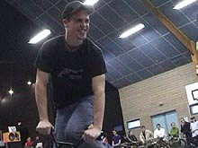
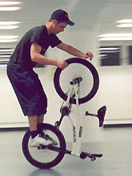
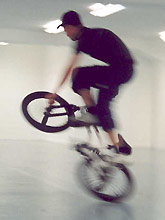
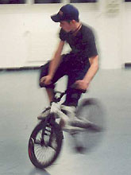
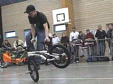

# Interview : Marco Vetterli

paru le 20/03/2002 sur [Agoride](http://bmx.agoride.com/)

Nous continuons notre petit tour de Suisse avec un rider que vous avez pu découvrir lors du dernier circle cow.

**Présentation :**

Marco Vetterli, j’ai 19 ans et je viens de Langnau de Zurich en Suisse. En ce moment, j’habite dans un petit appartement à Genève pendant la semaine.

**Tu rides depuis combien de temps ?**

J’ai commencé le bmx en 1996 et je fais que du flat depuis 1998.

**Comment as-tu commencé ?**

J’étais à un contest de streetball et j’ai vu quelqu’un qui faisait un show de flat. J’ai voulu l’essayer moi-même, car ça me semblait très intéressant. Un ami m’a prêté un vieux vélo, j’ai essayé de rouler un peu et ça m’a beaucoup plu. Quelques temps après, j’ai acheté un bmx pas cher pour débutant. 1 ou 2 ans plus tard, j’avais un Hoffman Ep "deuxième main" et j’ai vraiment commencé à faire du flat.

**Tes premiers tricks ?**

Endo, barspin et fire hydrant.

**Pourquoi le flat et pas le street ou le dirt ?**

En Suisse, il n’y a pas beaucoup de gens qui connaissent le flat. Donc, c’est très underground, ce qui me plaît beaucoup. J’aime le style du flatland et c’est la "discipline" la plus intéressante pour moi. De plus, j’adore le flow, qu’on peut sentir pendant le riding. Mais la vraie raison, qui me pousse à en faire, c’est la philosophie derrière le flat. Le flatland est présent dans ma tête tout le temps. Je crois, que je peux bien m’exprimer par le flat.

**Nous avons déjà posé cette question à ton collègue Steven mais ton point de vue nous intéresse aussi, Comment se passe le bmx en Suisse ?**

Bon, je ne connais pas tout les riders suisses. Il y en a partout, mais pas beaucoup. Nous sommes une petite scène très cool à Genève. Il n’y a pas de magasin suisse spécialisé en bmx. On a un magazine suisse et un site internet (bmxbible) qui sont basés sur la race. Je ne sais pas, s’il y a d’autres magasins, vidéos et magazines en Suisse. Normalement, on achète freedombmx ou Soul et on commande les pièces, les vidéos et des autres choses en Allemagne, en France ou même sur flatlandfuel aux USA.

**Tu penses que ça va évoluer plus tard ?**

Quelques potes de Genève viennent de fonder une association de bmx (merci à Steven). La ville de Genève va nous payer quelques trucs, comme les voyages pour les compétitions ou encore une salle pour rider en hiver, ce que je trouve très bien. Mais quand même, à mon avis, le bmx ne va pas être très connu en Suisse.

**Tu rides où ? Et combien de temps par jour ?**

A Genève, je ride habituellement à Plainpalais. C’est un skatepark, qui est éclairé environ jusqu’à 10 heures. Le soir, il n’y a pas beaucoup de monde, donc c’est super pour faire du flat. En hiver et quand il pleut, je peux rider à l’aéroport de Genève. Il y a un indoor-spot parfait !!! J’y ride seul ou avec Steven Blatter et Grigori Singovski. Le week-end, quand je suis à Langnau, je ride sur un terrain de sport près d’une école (Schwerzi), presque toujours avec Stefan Löber. Et sinon, je ride autant que possible, disons 5 à 10 heures par semaine.

**Que penses-tu de la scène française ?**

Je ne connais pas beaucoup les riders qui font du street/dirt, mais j’aime bien le riding des flateurs de France. La plupart d’entre eux ont un style qui me plait beaucoup. Et puis, les riders français que je connais sont très gentils, mais je pense qu’il y a aussi des riders qui ont un peu la grosse tète. De plus, j’ai constaté, qu’il y a vraiment beaucoup de clones de Jimmy et Alex. Mais ça ne me dérange pas chacun son style!

**Et les riders américains ?**

Là aussi, j’aime beaucoup regarder les riders américains. Ce que je trouve bien, c’est qu’il y a des riders forts partout dans le monde et pas seulement en Amérique.

**Qu’as-tu pensé du Circle cow ?**

Ce contest m’a beaucoup plu J’ai rencontré beaucoup de gens vraiment sympas. L’atmosphère était tranquille et j’étais surpris du niveau des riders, surtout les masters qui étaient super forts, et bien sûr les pros.

**As-tu des sponsors ?**

Non, je n’ai pas de sponsors et je ne sais même pas s’il y en a en Suisse.

**Que fais-tu quand tu ne rides pas ?**

J’ai fini mon apprentissage en 2001. Depuis septembre, je travaille à Genève chez une assurance pour apprendre le français. Là-bas (à Genève), j’ai appris une autre manière de vivre qui est un peu différente de Zurich. En août, je vais retourner à Zurich pour travailler dans la même compagnie et je dois aller au service militaire. Je ne sais pas encore, ce que je vais faire après… on verra…

**Tu penses que tu pourrais tout arrêter pour le bmx ?**

Oui, ce serait vraiment tranquille, mais je pense qu’il est impossible en Suisse de survivre en faisant que du bmx. Dans d’autres pays ça serait peut-être possible…

**Y-a t-il des contests en Suisse ?**

Il n’y a pas des grandes compétitions en Suisse. Il y a des petits jams, mais pas beaucoup.

Je viens de participer au Circle-Cow 3, qui était ma première compète. C’était bien, parce que je ne l’ai pas pris trop sérieux. Le plus agréable aux contests, c’est de rencontrer d’autres riders, de faire des petites jams et de voir des nouveaux tricks et styles.

**Souhaiterais-tu participer aux X-games ?**

Non, je n’aime pas les grands sponsors commerciaux, les médias et les règlements stricts. Je trouve que les X-Games ne sont là que pour faire de l’argent et je ne peux pas supporter ça. Même si j’avais les possibilités, je ne pense pas que j’y participerais.

**Qu’est-ce qui t’énerve dans le bmx ?**

Comme je l’ai dis, je n’aime pas les gens et les sponsors, qui ne connaissent rien sur le bmx et qui veulent faire de l’argent avec ça. Je ne veux pas voir le bmx comme un sport commercial, tout comme le football ou le baseball. Le bmx est un truc très spécial et je pense qu’il faut le garder comme ça!

**Comment vois-tu ton futur ?**

Moi, j’aimerais simplement avoir du bon temps pour vivre avec plaisir. J’espère rider longtemps pour améliorer mes tricks autant que possible. J’aimerais aller à plusieurs jams et compétitions, mais c’est un peu cher De plus, j’aimerais voyager beaucoup, voir d’autres cultures et d’autres manières de vivre, rencontrer des gens, etc.

**Qu’aimes-tu à part le bmx ?**

J’adore le chill out avec mes potes, faire du slalom-skateboard, aller au cinéma, écouter la musique et je kiffe les road-trips en voiture, des grillades en été et j’aime bien manger des trucs forts...

**As-tu un message pour les débutants ?**

Croyez en vous-même et n’abandonnez jamais. Ridez avec plaisir et autant que possible pour trouver l’équilibre, la force et le flow. Bon courage!!!

**Last words :**

Carpe Diem (jouir chaque moment de votre vie) et keep on riding!

Merci à Manu pour nous avoir montré la ville et la scène de Paris et pour cette interview. Peace & Props à mes parents, ma sœur Aline, mes potes Stefan Löber, Mr. FrankyFoxxx, Dani Marty (en Australie en ce moment), le Sunshine-Bounce-Clique de Langnau, les Xtrüümli Productions, Zone10, et encore Steven Blatter, Grigori Singovski et Michael de Genève. PEACE !
