# Asphaltissimo 2002

paru le 19/06/2002 sur [Agoride](http://bmx.agoride.com/)

La Suisse accueillait les riders européens les 1er et 2 juin derniers pour une bonne jam de street/flat.

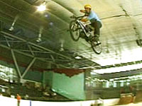

Le bouche à oreille a bien marché puisque les meilleurs riders de la région ont fait le déplacement de France et de Suisse pour venir rouler à la jam de BMX street/flat qui a eu lieu à Genève les 1er et 2 juin 2002.

C’était la première manifestation organisée par l’association SBF (Swiss BMX Freestyle) avec la Délégation de la Jeunesse et le Département des Sports de Genève. Le but de la jam était de tester des modules pour la construction d’un futur skatepark couvert ainsi que d’inaugurer la nouvelle table et le spin, dessinés par SBF qui seront placés dans le park extérieur.

Parmi les Français venus en street, il y avait : les Rumilliens, avec entre autres les gros 360 de Koum, les 2 frères Lamarche et leurs tricks hyper techniques et Mickaël David super haut sur tous les quarters, les Grenoblos avec Benjamin et ses bons gros x-up sur la table, Nico et son style racer, Artz1 qui lâche quelquefois le flat pour le street avec des p’tits feeble manual ou air to fakie et Omar malheureusement blessé, qui s’est bien reposé.

Certains sont venus d’un peu plus loin: comme Valence et Strasbourg. Il y avait aussi Sandrine d’Aix en Provence venu filmer l’événement pour une vidéo en projet.

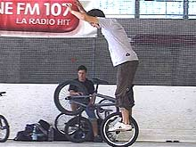

En ce qui concerne les Suisses, le flat était bien représenté puisque la majorité des riders de notre pays était présente pour la première fois au même endroit. La qualité du sol les a ravis car l’aire de flat (et de street) était une patinoire couverte, parfaite pour rouler. Il y avait donc les Zurichois avec Stefan "Lazer" et ses nouveaux tricks trop chauds dignes d’un pro comme backward-crakpaker-to-360-barwip-out directement sur les pédales, Marco Vetterli en pleine progression avec ses enchaînements breakless et qui a même rentré certains tricks pour la première fois et Olli le plus hardcore des riders présents avec des spinnings-cliffhangers, des hitchickers-wip et des cross-handed-hangfive.

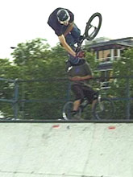

Du coté des Suisses romands, il y avait Grigori Singovski avec son tricotage façon Sommer sur la roue avant, Christian Wolf le fribourgeois avec ses tricks maîtrisés à la perfection et pour finir moi-même bien content d’avoir rentré plusieurs barwip-to-hitchiker et de voir enfin des riders Suisses rouler ensemble !

Les streeters Suisses nous ont montré que la motive est toujours bien là. On a pu voir tous les riders genevois et de bons gros tricks tels que : 360 ou backflip de Thomas Wullschleger, superman-seat-grab bien haut et stylé de Fred Borel, 360-x-up de Lanick Wenger et crankflip de Michaël Mettler. Même le Brésil était présent avec Santiago Toporcov toujours aussi haut sur les quarters, "chailafetche" quoi!

Une fois le soleil couché, SBF a invité tous les riders à manger et à se rafraîchir histoire de reprendre assez de forces pour faire une session de mini à l’extérieur aux lueurs des lampadaires, devant des concerts Ska et drum’n’bass.

L’association "Swiss BMX Freestyle" voudrait donc remercier tous les riders membres et non-membres ainsi que la Délégation à la Jeunesse qui ont fait de ce week-end une motivation pour organiser d’autres jams ou contests dans notre petit pays.

FAUT QUE CA BOUGE!!!!!!!!!!

Steven Blatter

Swiss BMX Freestyle

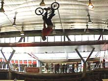
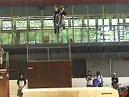
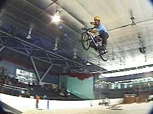
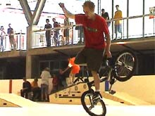
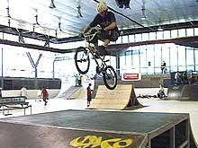
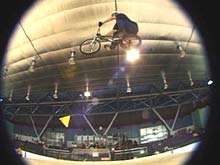
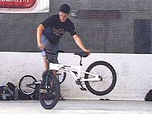
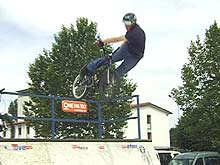
