# L’association Swiss BMX Freestyle aux Worlds 2002 à Cologne

Voici quelques photos et de bons souvenirs de l’un des "voyages" organisés par SBF. Toutes les photos (ou presque) ont été prises par Rodrigo Chechile du 4 au 8 juillet 2002.

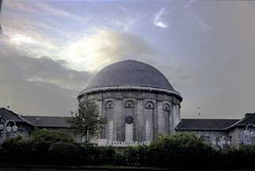
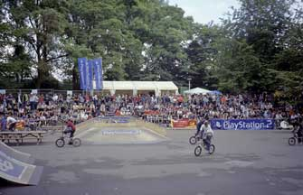
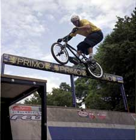
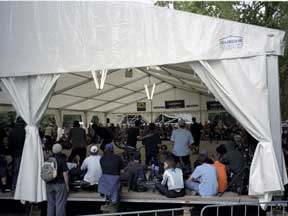
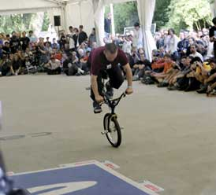
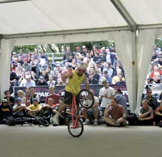
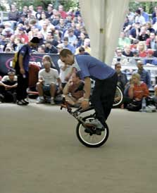
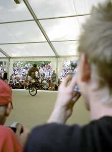
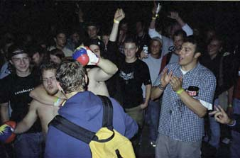
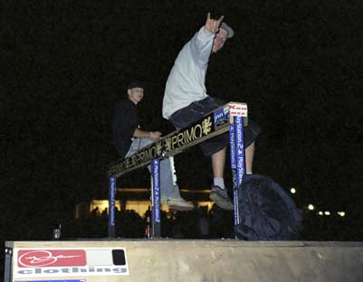
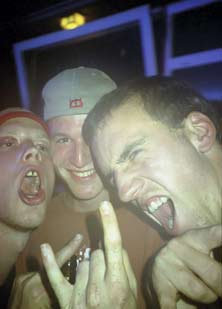
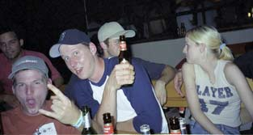
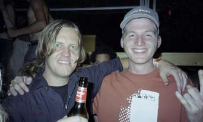
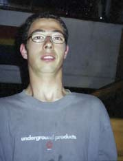
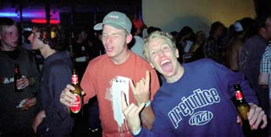
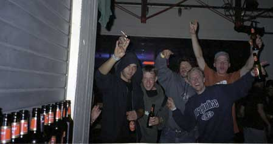
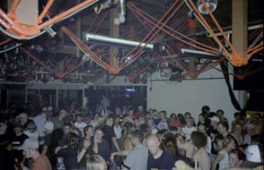
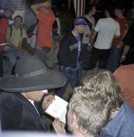
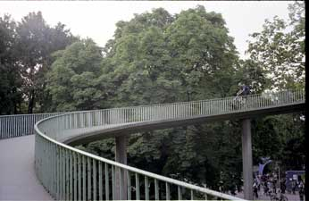
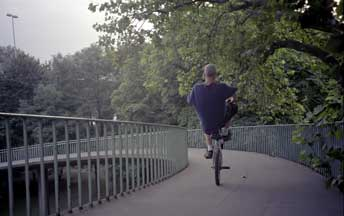
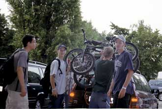
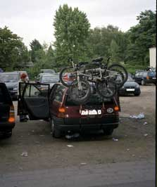
