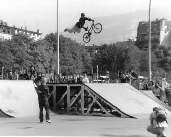
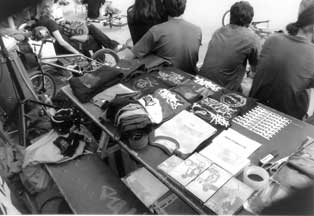
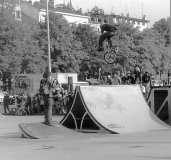
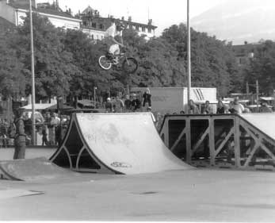
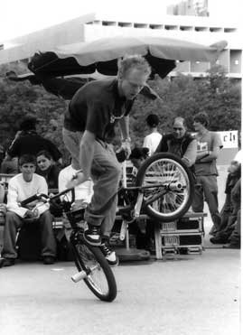
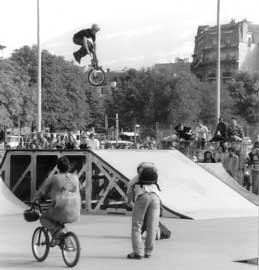

# BMXJAM 02 - Samedi 21 septembre 2002

Voici quelques photos de la première BMXJAM organisée par Swiss BMX Freestyle le samedi 20 septembre au skatepark de Plainpalais, Genève.

Merci à David Artz1 pour les photos.

