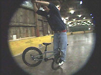
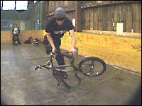
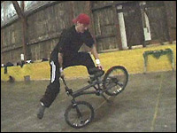
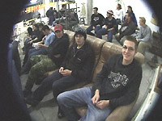
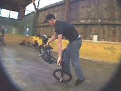
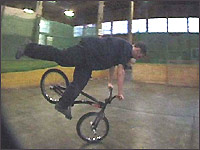
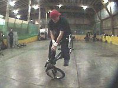

# Christmas Jam 2002

paru le 13/01/2003 sur [Agoride](http://bmx.agoride.com/)

Une jam? En hiver? Dans l’un des meilleurs sk8-park suisse?

Nous ne résistons pas, comme d’ailleurs la soixantaine de riders venus de la Suisse entière, d’Allemagne, de France et même d’Italie. En plus, le voyage était gratuit pour tous les membres de l’association Swiss BMX Freestyle. On a mis les huit membres intéressés dans un bus et c’est parti!

Après trois heures de route et une heure de bouchons peu avant Bâle, nous sommes tous bien contents de pouvoir nous défouler dans ce superbe sk8-park qui comprend deux gros hangars dont l’un à deux étages!!

Je vous explique : dans le premier une aire de flat, half-pipe, mini, bowl, fun-box, quarters et autres, et dans le deuxième, c’est carrément de la tuerie pour les purs streeters! Tout ce que vous pouvez vous imaginez en plans inclinés et curbs.

Le riding : si un jour vous décidez d’allez là-bas, vous ne serrez sûrement pas déçus des locaux enragés. Mais tout le monde a bien ridé, et surtout nous étions tous contents de nous retrouver et de rouler dans un sk8-parck couvert.

Les tricks en vrac : beau no-foot-cancan-one-hand, gros superman, gros airs, tail-tap-double-bus, 360/spine, look-down transfert table/table poussé à l’extrême, whip, bus-one-hand de notre ami Hannes "Hä" de Thun (qui était l’un des seuls à rider le half-pipe) et j’en passe...

Et les Italiens? Ils rident comment eux? Pour tout vous dire, j’ai pas tout pu voir, mais en deux mots : propre et original. Voilà pour le street.

Ah oui, j’oubliais le superbe 900-no-hands!!! Mais ça, c’était sur l’écran géant (un mur entier) que nous avait préparé l’organisation avec fauteuils et canapés, et surtout un petit shop, un bar pas trop cher et plein de place pour dormir (tout ça à l’intérieur du sk8-park). Que demander de plus? Un petit-déjeuner le matin? Bin y en avait un aussi!

Après avoir passé la soirée à rider puis à regarder toutes les nouvelles vidéos (Props/Etnies/Soul) et à boire, les plus courageux ont repris la route tandis que pour les autres, gros sommeil en perspective.

Voilà, le lendemain tout le monde quitte petit à petit le sk8-park avec de beaux souvenirs en tête et en se promettant d’y retourner au plus vite, car le park va être délocalisé au mois de mai 2003.

Pour le flat, je vais laisser Steven en parler :

Alors de notre coté, nous avions une superbe aire de flat bien lisse et plate. J’étais très étonné par le nombre de flateux présents (env. 25). Parmi eux, il y avait par exemple les Allemands : Roman Schied qui nous rentre son fameux spinning-upside-down-wheeling-crosshanded ; Sven Steinbach qui était pour moi le meilleur rider présent avec un style entre Michi et Kuoppa, et des figures genre pedaling upsidedown-megaspin ; et Moritz Edschimt avec ses tricotages sur la roue avant en inside, switch ou crossfooted. Les Suisses étaient aussi venus en force (je crois que tous les flatlanders suisses étaient là) avec par exemple Marco "Väti" (time-machine sur les pédales et nombreux barspin sans freins).

Oli "Stewart" qui progresse si rapidement que chaque fois que je le vois rouler, il plaque de nouveaux enchaînements comme halfhikers-g-turn-to-hitchiker ou hang-five sur la pédale ; et bien sur Stefan "Laser" qui a roulé sans freins parce qu’il l’avait cassé au début de la jam, mais je ne pense pas qu’il en ait besoin puisque il a rentré entre autre backward-crackpacker-180-bodyvarial-barspin-jump-to-pedal (!!!) ; Grigori "Russian Boy" qui nous a montré des hitchiker-g-turn et hangfive-to-crossfooted-steamroller. Et moi, je me suis contenté de rentrer strait-pedaling-upsidedown-wheeling. Il y avait aussi des Français des environs de Bâle et de Strasbourg, mais malheureusement je ne me souviens pas de leurs noms (sorry)... tout ce que je sais, c’est qu’ils ont bien roulé et qu’ils avaient chacun leur propre style.

Pour conclure, on aimerait remercier l’organisation : Michel Carmona, sa copine Karine (qui ride aussi) et le sk8-park de Bâle.

J’espère vous retrouver nombreux l’année prochaine à Bâle, mais aussi aux autres jams qui commencent à se faire un peu partout en Suisse.

Michaël Mettler et Steven Blatter

Swiss BMX Freestyle

