# L’association Swiss BMX Freestyle à Thun

C’est très dommage, mais le Rollorama, qui était l’un des meilleurs bmxpark en Suisse, a fermé ses portes fin juin 2003. Hannes Erb (un rider de Thun) a alors organisé l’après-midi du 14 juin une jam de dirt sur les bosses qu’il a creusées au beau milieu d’un paysage idyllique suisse et le soir une jam de flatland, de park et de rampe au park.

Des riders de toute la Suisse, de France et même de Cuba sont venus rider une dernière fois ce park qui comprend une verticale, une mini, plein de transitions, quarters, jumps et même une belle aire de flat. Question riding, on a eu droit à un beau spectacle qui s’est fini vers 23h avec une session mini-rampe accompagnée de rots monstrueux dans le mic! La soirée qui a suivi, a été l’une de mes meilleures soirées d’after-bmx avec un bar qui servait des bières d’un litre et un club au sous-sol avec du pur son all-style. La soirée s’est terminée avec une poursuite de flics (genre comme dans les films) et deux heures de planque dans un chantier et des jardins. En fait, la police cherchait des casseurs qui étaient venus tout détruire le weekend précédent. Nous, on n’avait rien à se reprocher de ce côté là! Mais bon, il faut bien les faire courir un peu ces flics ;-). Je voudrais remercier les riders Thunois pour le bed&breakfast, Damien et Michaël pour leur motive à se bouger sur ces événements avec SBF et Hannes pour cette jam.

Peace, Steven

Photos de Michel Carmona et Steven Blatter

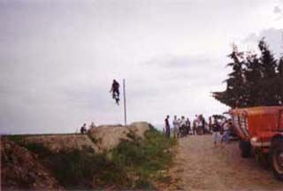
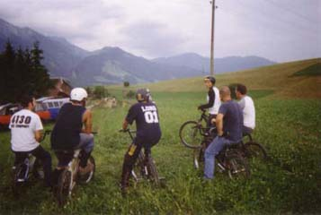
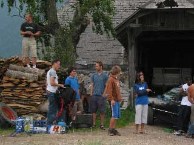
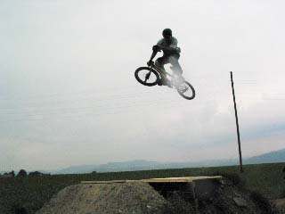
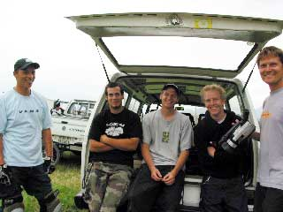
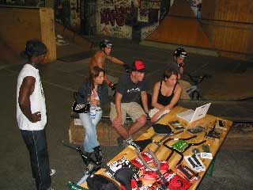
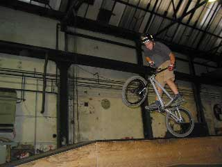
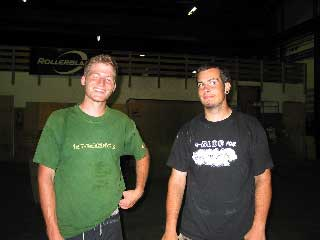
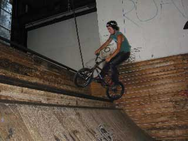

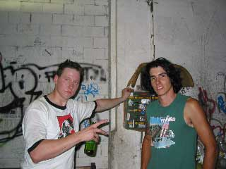
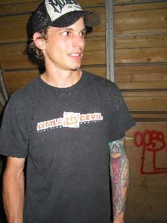
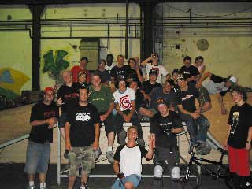
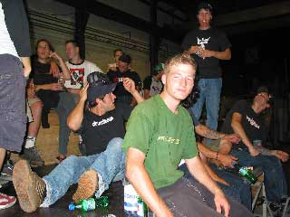
