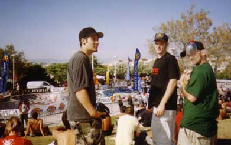
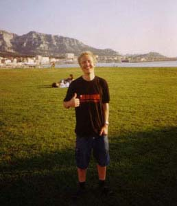
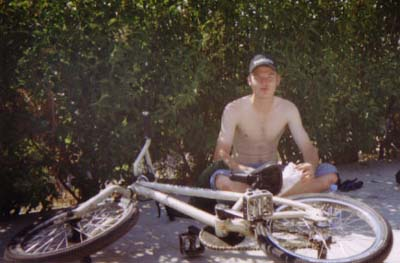
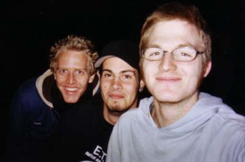
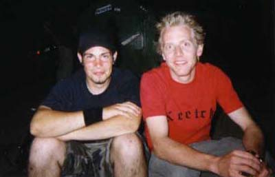
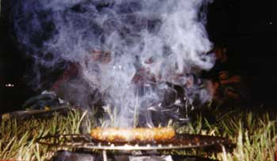

# L’association Swiss BMX Freestyle au King of Paca 2003

Quelques photos et de bons souvenirs du "voyage" de l’assoc à Marseille à l’occasion du King of Paca 2003. Pour les photos de BMX, on vous laisse feuilleter les magazines pro (qui, contrairement à nous, savent prendre des pics de ride) ou aller voir sur [agoride](http://bmx.agoride.com/article_15603_41_5.htm) par exemple!

