# BOWLaBMX 03, 9 et 10 août 2003

Un petit coin bien sympathique en Suisse, Genève et son lac. Un soleil qui fait mal aux neuils et à la peau.

Voilà, dans cadre d’Asphaltissimo 2003, le Bowlabmx organisé par Swiss BMX Freestyle.

Texte : Damien "El Froose" / Photos couleurs : Sol (Condor) / Photos NB : David Artz1

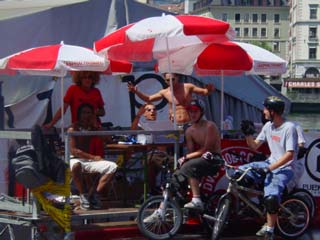

## Samedi 9 août

Démo Trust &amp; Ride sur la funbox que Bruno Guimil a amenée pour l’occasion. Les protagonistes : Stéphane Bachmann, Fred Borel, Marcelo "Gordo" Rigo.

Imaginez une table sans table justement (pas de plateforme), un éjecte sur-raide et une réception également bien raide. Honnêtement, peu de gens se seraient lancés dessus, mais cela n’a pas arrêté nos riders. On a quand même pu voir les gros-bus-to-x-up et les 360 de Gordo, un petit tchou-tchou de Gordo et Fred en superman, un tailwhip-to-pedal hallucinant de Fred ainsi que ses habituels superman-seat-grab. Mais le "malheureux" du jour ce fut certainement Bachmann, qui, pour faire honneur à sa réputation et à sa reprise après quelques mois d’arrêt, nous lance plusieurs backflips.

Malheureusement, il n’en posera aucun et cela lui coûtera un péroné cassé et encore trois mois d’arrêt (il posera quand même au passage un no-foot-to-x-up). Nous lui souhaitons un bon rétablissement.

En ce qui concerne le flat, on remercie le team Felt suisse avec Steven Blatter (qui nous pose son bike-flip-to-pedaling-upside-down-weeling et des barwip-to-forward-hitchiker) et son pote de Fribourg, Christian Wolf, qui nous fait de nouveaux enchaînements sur la roue avant, des hang-five-no-foot et des 360-barspin.

## Dimanche 10 août

L’heure du Bowlabmx est arrivée : une quinzaine de riders inscrits, avec des gens venus de loin (on les remercie), des riders locaux, des suisses-allemands, des lyonnais, des valenciens, des rumilliens, etc.

Passons donc en revue le classement (pas beaucoup de riders, alors allons-y, on va tous les citer).

- Sylvain Gautier finit 14e et nous fait péter un beau axel-to-180-to-axel sans pegs sur le sub-box.
- Michel Carmona, 13e, passe un petit mais joli 360-to-fackie et pose la plupart de ses tricks, riding hyper propre.
- Damien Fleur termine 12e avec des ptits tail-tap-bus sympatiques, 180-to-fackie sur le spine, des 360-to-fackie et même un 540! Saluons également sa tentative de 360 sur le spine.
- Onzième (comme à son habitude) : notre local, Michaël "Sixpack" Mettler, avec des bus-to-tailtap-to-bus et un très beau crank-flip-to-sprocket-to-axel sur le sub-box, aleyoop-pegs-grind sur le sub-box et plusieurs tentatives de 360-to-sprocket.
- Dixième : le client Koum avec des gros 360 sur le spine et un beau pedal-stall-to-270 sur le sub-box. Il est donc le premier à recevoir du prize-money.
- Gordo, encore un local (mais brésilien celui-là) plaque des bus nickel sur le spine, des nose-pick et un 360-tail-tap sur la plateforme du bowl avec redropage dans la mini qui lui vaudront la 9e place.
- Stefan Ahmala, un suisse-allemand qui fait peur (rire), envoie des tricks comme par exemple des 540-tail-tap sur le sub-box et des petites tricks à foison. Il finit 8e.
- Eric Rothenbusch impressionne vraiment avec ses 270-to-smith-stall et plein d’autres tricks super techniques. Il nous fait même péter du flat au fond du bowl. Il représente 23mag et finit 7e. Entre les deux manches, il fera même une petite démo de flat à côté du bowl avec Steven et Nicolas Penel. Merci à lui.
- Janick "Shorty" Wenger finit 6e avec des bus-to-tail-tap (qu’il posera même sur le sub- box!!!), des airs super hauts (les plus grosses hauteurs du week-end) et essayera aussi de poser un crank-flip-to-tail-tap sur le box.
- Hannes Erb, un local de Thun, arrive 5e avec seulement 30 secondes de practice dans le bowl (on l’attendait pour commencer le contest). Il nous rentre toutes ses tricks avec style : 360-spine, ice-pick sur le sub-box...
- Fred Borel, comme à son habitude, se lâche et envoie des tailwhips et des 360. Il finit 4e malgré un talon explosé et 2 crevaisons (il finira son premier run avec le bike de Bruno).

On rentre dans le top 3 avec 

- Bruno Guimil et du pur riding made in Brasil : whip, 360, 360-tail-tap-to-ice-pick sur le spine et des purs ice-pick-grind sur le box.
- Deuxième et 300.- CHF de plus dans son porte-monnaie : Shogun, venu en famille, envoie méchamment avec deux 540-tail-tap (dont un rentré de justesse) sur le box, whip-to-manual, tail-tap-x-up-one-foot sur le spine, no-foot-one-hand sur le spine, nose-pick sur le sub-box, nose-pick-to-facki sur le spine, tentative de 900-tail-tap, etc, etc....
- Premier (sans surprise) : Kevin Kalkoff défonce tout avec un style de malade, de pures hauteurs, no-foot-cancan, invert trop poussé, turndown dans tous les sens, wall-ride sur le sub-box, 270-tail-tap-to-pedal sur le sub-box to-pedal sur le coping to-fackie!!! Une tentative de over-pedal-grind-to-270, et attention mesdames et messieurs : huricane-540-to-ice-pick-bonk (bon, c’est pas fait exprès, mais ça passe et c’est magnifique). Il gagne donc logiquement le contest et repart avec 400.- CHF offerts par la Ville de Genève.

Avant la remise des prix, un petit contest de best trick sous forme de jam a eu lieu avec comme prix des habits offerts par le shop de skate Pulp68 et le DVD "Square one" offert par Michel Carmona et son shop 48spokes homeshop (y en a qui vont passer de bons moments devant la TV).

C’est Bruno qui gagne avec un énorme 360-to-ice-pick-bonk sur le spine!! Deuxième de ce best trick : Koum, qui envoie un 360 table sur le spine. Troisième : Damien Fleur avec son 540.

Voilà pour ce petit week-end helvétique.

On remercie Swiss BMX Freestyle pour l’organisation, la Délégation à la jeunesse pour les fonds, 48spokes et Pulp68 pour les lots, et évidemment toutes les personnes et les riders qui se sont bougés pour le contest.

Damien "El Froose"

Swiss BMX Freestyle

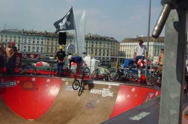
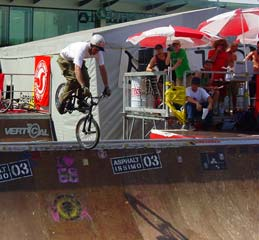
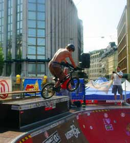
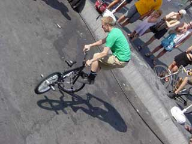
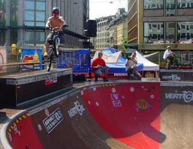
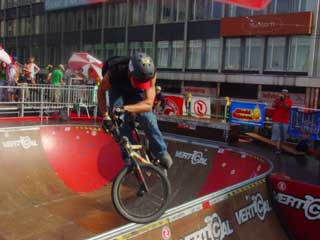
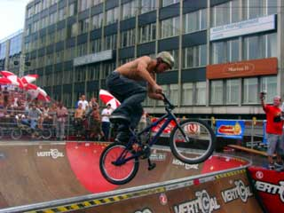
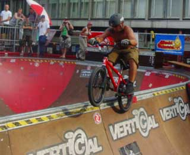
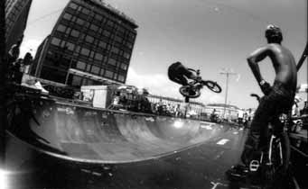
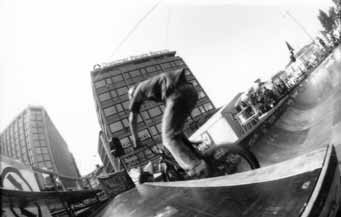
