# BMXJAM 03 - Samedi 20 septembre 2003 - Les photos

ENOOOOORME!!!

C’est ainsi que je pourrais résumer la BMXJAM 03 organisée par Stev... euh non, Swiss BMX Freestyle, car grâce au soleil, aux 65 inscrits, au public bien chaud et à l’ambiance tranquille, ce contest fut énorme en tout point de vue! Et le mieux dans tout ça, c’est que les seuls qui n’ont pas été débordés sont les samaritains ce qui est plutôt bon signe.

Je ne vous en dis pas plus pour l’instant : nous mettrons online l’article que Michaël et moi avons écrit pour Soul une semaine après la sortie du magazine (mi-novembre). Il y aura aussi des articles dans les mags Cream (merci à David@Artzone) et Freedom (merci à Carlo Viscione).

Swiss BMX Freestyle voudrait remercier tous les sponsors : Artzone, Boarderspark, Felt, Hotpoint, Keetch, Redbull, la Délégation à la Jeunesse et le Fonds Jeunesse. Un grand merci à Daniela Vassalli, Yannick Thirion, Manu@Agoride, Jean-Marie@Couleur3, TV Léman Bleu, Phil@Bellevue-Punx, le père de Damien "El Froose" pour les fruits frais, Bernard Blatter pour les grillades, Shirley Blatter pour le squat, ATB ainsi que les riders qui nous ont aidés à nettoyer le park! Et bien sûr, un énorme MERCI aux riders qui se sont bougés en masse à notre événement!! A l’année prochaine!

Et voici les résultats des contests flat/street amateur/pro de la BMXJAM 03.

Flat pro

1. Lionel Cardoso
1. Michaël Tapia Baró
1. Francis Bessière
1. Florent Guyennon
1. Christian Wolf
1. Oliver "Grenoblos"
1. Marco Vetterli
1. Jordan Bouasy

hors jugement : Steven Blatter

Flat amateur

1. Roman Meyer
1. Andreas Walter
1. Gionibek Kudaibergen
1. Vincent Lehrer
1. Paul Guyon
1. Rodrigo Chechile

Street pro

1. Kevin Kalkoff
1. Mickaël David
1. Fred Borel
1. Bruno Guimil
1. Thibault Lamarche
1. Stéphane "Shogun" Meneau
1. Michael Levebvre
1. Janick "Shorty" Wenger
1. Laurent "Koum" Kompaore
1. Marcelo "Gordo" Rigo
1. Denis Vinet
1. Peter Schleier
1. Alex Lamarche
1. Gabriel Meckl
1. Emerson Santiago
1. Stefan Ahmala
1. Daniel Aeberli
1. Germain Vellier
1. Markus Koller
1. Mathieu Hild
1. Sylvain Gautier
1. Matthieu Pierre

Street amateur

1. Michaël "Sixpack" Mettler
1. Quentin Bruyère
1. David Maillard
1. Alexandre Pittet
1. Maxime Charvéron
1. Joachim Dovat
1. Michaël Gilliand
1. François Willer
1. Jean-Marie Börtsch
1. Guillaume Lagunas
1. Rodrigo Chechile
1. Nonda Coutsicos
1. Timus Karadschajeur
1. Olivier Caregnato
1. Johann Cheneval
1. Clyde Dorion
1. Florent Humbert
1. Stephen Pohl
1. Alexandre Delbart
1. Go Go Go Go (?)
1. Thomas Benedetti
1. Carlo Viscione
1. Matthew Lencrerot
1. Douglas Gravrel
1. Renaud "Neurone" Julien
1. David Trotti
1. Cédric Mitaud

Steven Blatter

Swiss BMX Freesytle

Voici une partie des photos du contest mais d’autres suivront bientôt!

Photos de street : Rodrigo Chechile / Photos de flat : Marco Vetterli

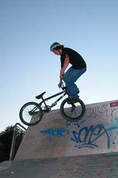
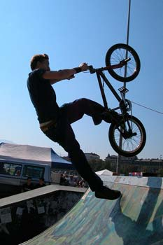

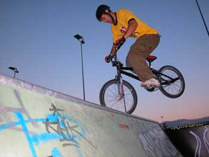
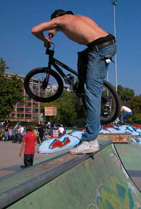
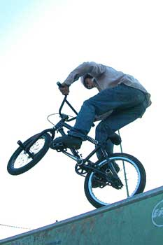
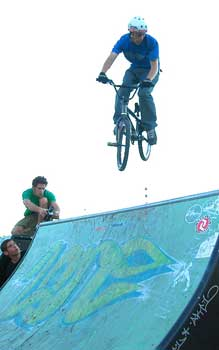

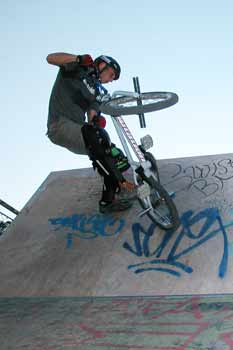
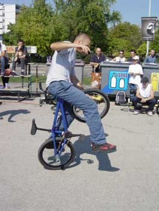
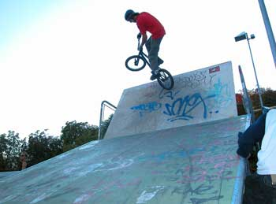
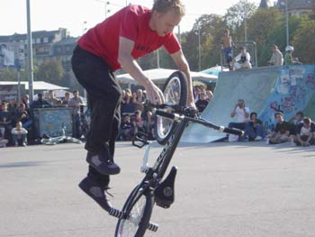
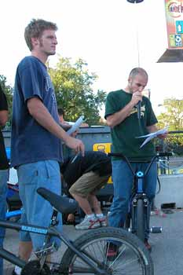
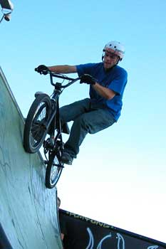
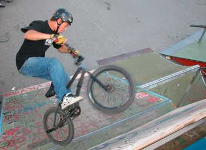
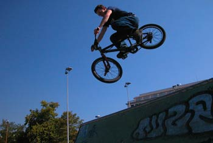
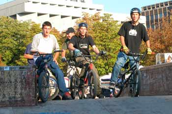
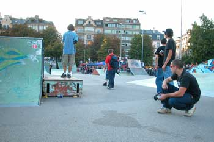
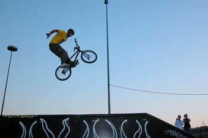
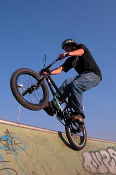
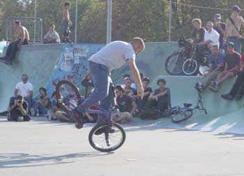
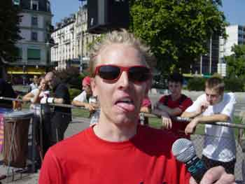
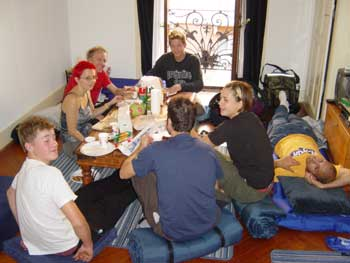
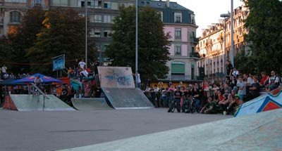
