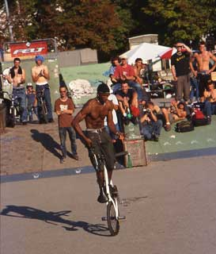
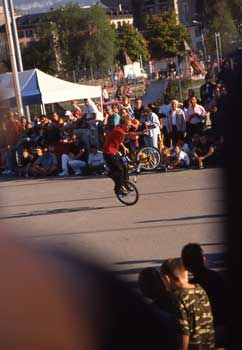

# BMXJAM 03 - Samedi 20 septembre 2003 - L’article

paru dans le Soul n° 28, octobre-novembre 2003

Difficile d’avoir un regard objectif sur un contest lorsqu’on en est l’organisateur… Je commencerai donc par un petit historique de l’association Swiss BMX Freestyle pour peut-être, qui sait, en motiver d’autres à faire pareil et passerai ensuite au "report" des contests de flat. Michaël Mettler, un de nos riders locaux, vous fera le récit des contests street.

Texte : Steven Blatter et Michaël Mettler / Photos : Rodrigo Chechile et David"Artz1"

En gros, tout a commencé en janvier 2002 lorsque l’association ATB, qui s’occupe du skatepark de Plainpalais à Genève, nous a proposé son aide à Santiago et moi (Steven Blatter) pour monter une association de BMX. Il commençait à y avoir de plus en plus de riders dans le park et l’idée que nous pourrions nous regrouper pour faire bouger la scène locale et pourquoi pas suisse nous a bien plu. De plus, il n’existait pas encore d’assoc’ de freestyle en Suisse. On a alors contacté quelques riders dont Thomas Wullschleger, Bruno Guimil, Stéphane Bachmann, Michaël Mettler et la future secrétaire de l’assoc’ Daniela Vassalli pour mettre sur pied les statuts et autre paperasse. Le 18 mars 2002, à la suite d’une assemblée générale constitutive, Swiss BMX Freestyle a officiellement vu le jour.

Et nous voilà en septembre 2003 avec à notre actif : 11 roadtrips en Europe, l’organisation de quatre contests, un site internet (www.swissbmx.ch), une grosse table et un spine pur BMX au park de Genève, des t-shirts, des pulls et le plus important : 48 membres qui nous soutiennent! Bien sûr, rien de tout cela n’aurait pu être réalisé sans l’aide financière de la Délégation à la Jeunesse de la Ville de Genève.

Le plus important des contests que nous avons organisés est justement la BMXJAM 03. Pour cette édition, j’ai choisi de diviser les contests de street et de flat en deux catégories : amateur et pro. Une bonne centaine de riders venant de Suisse, de France et même un Belge ont fait le déplacement pour rouler dans l’un des meilleurs BMXpark de Suisse avec une bonne sono ainsi que des fruits et du Redbull à volonté! Le temps était avec nous puisqu’il a fait super beau, sans un pet de vent du matin au soir. L’ambiance a gentiment chauffé vers 13h pour Daniela (la co-organisatrice) et Yannick Thirion (l’homme du jour) avec l’arrivée massive des riders qui se sont rués sur les feuilles d’inscription!

Le contest flat amateur a été le premier à démarrer et je crois bien que c’était aussi le premier contest pour tous les inscrits. On a eu droit à pas mal de tricks dont des spinning sur la roue arrière, des funkychicken, des hitchhikers, des caboose, etc. Les faits qui m’ont marqués sont le riding super smooth de Gionibek "Jonny" de Lausanne, Andreas Walter et ses hitchhikers bien stylés et Roman Meyer qui ne pensait pas finir premier et qui est rentré avant la remise des prix alors qu’il avait gagné un cadre Felt MR (récupéré une semaine plus tard)! Les participants au contest amateur n’étaient que six, alors ils sont tous partis avec des lots.

Les cafards sont ensuite allés rider sur un autre spot pour laisser la place au street amateur où là aussi un cadre Felt attendait l’un des 27 participants. Le module le plus utilisé était étonnamment le wall-ride (construit à l’arrache à quatre heure du mat’ trois semaines auparavant par les riders genevois) sur lequel on a pu voir pas mal de petites tricks car il était légèrement incliné, comme par exemple François "17" Willer avec ses fakie-wall-ride. La grosse table a vu passer beaucoup de tentatives de tailwhip mais aussi de gros x-up de Renaud "Neurone" Julien et one-hand à se déboîter l’élagomofibus. Autre local mais en plus trash, Cédric Mitaud nous a fait deux tentatives de whip en sautant toute la table et une autre de superman toutes les trois finies avec le vélo à 10m de lui. Celui qui m’a le plus surpris, c’est le tout jeune Lyonnais Maxime Charvéron avec un superman tout propre sur la petite table, un 360° et une tentative de 360°-no-foot, hé gamin! Juste après, on a pu voir un dreadlocks-man rentrer un foot-plant-whip sur le spine et des tentatives de rodeo-grind dont il n’arrive malheureusement pas à ressortir, mais ça fait plaisir de voir des tricks comme ça à Genève. Il y avait aussi un certain Rodrigo Chill(out) qui n’a pas été dans les dix premiers mais qui a bien roulé : 540°-tail-tap stylé presque posé, manual-to-180° presque posé, 180°-tail-tap-to-fakie sur le corner (sorte de spine qui s’agrandit) presque posé, tail-tap-one-hand presque posé et un abubaca sur le spine posé! Dommage qu’il n’a pas rentré ses tricks car ce jeune chauffard a vraiment du style. Et pour finir, c’est un Genevois qui a gagné (myself, Michaël Mettler) bien content d’avoir rentré un 180°-to-180°-bus sur le corner, un foot-plant-whip sur le wall!

En flat pro, on a eu droit à un beau spectacle avec des riders super motivés et j’espère pour eux que le contest s’est déroulé sans trop de pression. A la 8ème place, on retrouve le Grenoblos Jordan Bouasy avec de beaux hangfive-to-backpacker-to-hangfive et un halfhiker-to-crackpacker en rolling et tout ça sans frein. Juste devant, en 7ème position, Marco Vetterli de Zürich, que l’on avait pu voir à la Circle Cow en 2002, a rentré des barflips, hitchhikers et de longs links à base de steamroller et de barwhip le tout également sans frein.

Ensuite, l’un des riders qui m’a le plus motivé quand j’ai commencé le flat, Mr Oliver "Grenoblos" Moore qui, par manque d’entraînement, peine un peu sur ses enchaînements mais ses whiplashs-to-steamroller, ses funkychicken-to-tailwhip-to-funkychicken et son nose-wheele nous ont vite fait oublier son manque de training ; il finit 6ème.

En 5ème position, mon team-mate Christian Wolf, bien plus habitué aux démos qu’aux contests car c’était le premier pour lui après sept ans de flat. Il nous plaque des enchaînements bien à lui genre hang-ten pour ensuite passer d’un coté et de l’autre de la roue avant avec des steamrollers en normal ou en switch, des 180° et 360° barwhips, et aussi ses longs links sur la roue arrière.

Nos deux inséparables Florent Guyennon et Francis Bessière sont venus représenter la scène lyonnaise. Et ce n’était que du bon, puisque Florent qui finit 4ème nous a rentré ses superbes enchaînements à base de barwhip, hitchhiker-to-steamroller, spinning hitchhiker et souvent des sorties en barwhip. Ce que je peux dire pour Francis c’est qu’il a gagné du style et de la réussite dans ses enchaînements genre hangfive-to-backpacker ainsi que 200.- CHF de plus dans son porte-monnaie.

La 2ème place est une bonne surprise, puisque que c’est Michaël Tapia Baró de Cuba qui roule un peu oldschool. Ca fait toujours plaisir de voir de bonnes vielles tricks maîtrisées à la perfection. Muchas gracias Michaël!

La première place revient à notre "flatland guest star", DJ et speaker pour le street pro : Mr Cardoso en personne. J’imagine qu’il doit être content de son week-end chez les Helvètes, des 300.- CHF cash et des tricks (comme par exemple rolling-caboose-jump-to-upside-down-weeling en avant) qu’il a rentrées devant un public bien chaud.

Etant juge, speaker et organisateur, j’ai roulé hors jugement et, malgré le manque d’échauffement, j’étais bien content de mon run! (Steven Blatter)

Juste après le flat pro et un show de beatbox et de scratch, place au contest street pro. Les riders envahissent le park en commençant par Santiago (15ème) qui, après quelques crashs, rentre son 540° sur le gros quarter. Vient ensuite Marcelo "Gordo" Rigo (10ème) qui, une semaine avant son retour au Brésil, nous rentre un barspin-to-x-up sur la box et un bon chuk sur le spine. Autre traveller tout droit revenu d’une semaine à Woodward, c’est le client Koum (9ème) qui nous plaque un 360°-table sur la box et, après une chute, passe en full speed le spine d’1m50 de long et de 2m de haut pour atterrir dans la mini!

Venu de loin, Mike le Belge (7ème) s’est fait plaisir : il rentre un whip sur la table (plaqué pour la première fois au pays de la "Triple Leffe" un mois avant) et un tire-slide qu’il continue dans la courbe pour se retrouver en fakie…et bien dautres figures bien grasses!

En parlant de gras, son pote Mik de Rumilly (2ème) a vraiment tout fait péter avec une exploitation du park à 100%, jump-to-ice-pik sur le rail, wall-to-wall-tape, il saute la grosse table, atterrit en manual pour finir en sproket sur le spine et ressortir en 180°. Pour moi, il a fait le plus beau manual du contest, c’est-à-dire en haut du quarter-wall avec plus d’un mètre de verticale!

Autre frontalier, Thibault Lamarche (5ème) a fait pleins de tricks avec un pure style genre tire-slide-to-180°-manual-to-drop sur le gros quarter (son frère a fait ice-pic-to-fakie dessus!), abubaca-wall-tape et a presque rentré axel-to-manual-to-180° Janick "Shorty" Wenger (8ème) nous a fait de belles hauteurs sur les quarters, en look back suivi en plus d’un bus sur la table et a bien exploité tout le park à bord de son K2.

Quant au père de famille Stéphane "Shogun" Meneau, il fait péter un bunny-hop-whip et no-foot-cancan depuis le curb de la pyramide!! Ainsi qu’un superman-seat-grab sur la box et un tail-tap-x-up-one-hand sur le spine, beaucoup d’originalité qui l’amène à la 6ème place. Le Brésilien Bruno Guimil (4ème) a vraiment bien roulé malgré une blessure au dos : jump-to-grind sur le rail, superman-seat-grab, whip sur le spine et la meilleure trick du contest, également sur le spine : un 360°-to-ice-pic-stall-to-revient dans la courbe de départ…ça promet pour lui.

Le 3ème n’est autre que le Neuchâtelois Fred Borel de "Trust & Ride". Après un superman-seat-grab trop poussé, un whip sur la grosse table puis sur le spine, Fred essaie le transfert le plus chaud de ce contest : il part depuis un petit kick qui se trouve dans le plan incliné atterrit en grind en haut du gros quarter qui se trouve à côté puis veut atterrir dans la mini qui se trouve encore plus loin! Malheureusement, il reste bloqué en haut du quarter (à noter qu’un mois auparavant, il a rentré ce transfert en utilisant le quarter comme wall). Finalement, dans la catégorie des moins de 17 ans (mais comme on est cool en suisse on l’a laissé rouler en pro) on retrouve Kevin Kalkoff qui a tout fait péter! Après avoir gagné le Bowlabmx le 10 août dernier à Genève, il raffle la victoire ici aussi avec un 360°-nose-bump et un 360°-turndown sur le corner. Viennent ensuite un 540°-tail-tap-hurricane, wall-to-360°-turndown-to-fakie et un wall-ride-to-whip, bravo!

La soirée s’est terminée tranquillement (pour certains) avec des bières et du chocolat offerts pendant la projection sur écran géant de la vidéo "Square One". Swiss BMX Freestyle voudrait d’abord remercier tous les sponsors : Artzone, Boarderspark, Felt, Hotpoint, Keetch, Redbull, la Délégation à la Jeunesse et le Fonds Jeunesse. Un grand merci à Daniela Vassalli, Yannick Thirion, Manu@Agoride, Jean-Marie@Couleur3, TV Léman Bleu, Phil@Bellevue-Punx, le père de Damien P. pour les fruits frais, ATB ainsi que les riders qui nous ont aidés à nettoyer le park!

See you next year!

Steven Blatter et Michaël Mettler

Swiss BMX Freestyle

