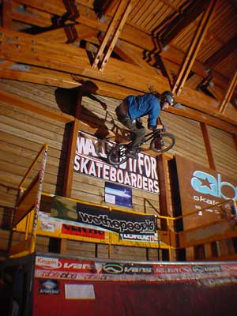
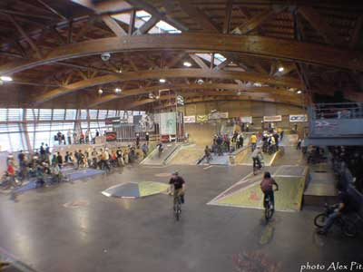
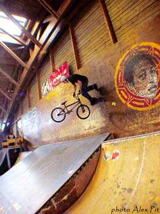
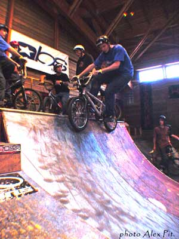
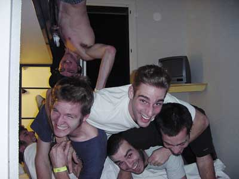
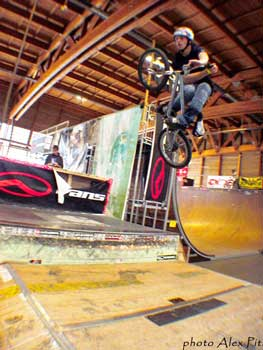

# SBF à la Vrac 03, samedi 13 et dimanche 14 décembre 2003

Ayant manqué le rdv de l’an dernier pour la vrac, je ne pouvais pas rater celui ci. C’est donc en ce samedi d’hiver 2003 que je me rends à 10h30 au skatepark de Plainpalais où nous avions rendez-vous. Yannick Wenger est déjà là. Seul parmi les gouttes de rosée matinale. Il s’interroge directement quant à la présence de mon sac de couchage. L’an denier, la sortie n’était que d’un jour, il croyait qu’il en était de même cette année. Le voyage ne sera que de moitié pour lui, il rentrera le soir même avec sa voiture. Après quelques minutes d’attente, c’est l’arrivée de notre merveilleux organisateur Michael "voleur de sous" Mettler et le "pilote" du week-end Adrien.

Texte : Damien "ElFroose" / Photos : Alex Pittet

Je découvre le camion loué au centre protestant de………..(trop la classe !!)dans lequel nous voyagerons (c’est un peu ptit non ??). Quand soudain un événement imprévu mais totalement normal arrive ! Un appel téléphonique, c’est l’ami Fanfuego qui stress de ne pas nous voir au skatepark. Je lui dis que nous sommes juste en face de lui, tout s’arrange. Un membre de plus (avec un magnifique vélo de Noël) est donc présent pour le départ. Il ne manque plus que "l’inconnu suisse allemand" David "Mirra" Trotti et Alex "Dj" Pittet. Carlo notre ami suisse allemand arrive, (on observera un énorme sourire de François voyant un compatriote breakless présent au rassemblement). Dave et Alex ne tardent pas à arriver. Nous sommes près à partir.

Notre président passe en coup de vent pour voir si tout se passe bien (bon à la base c’était pour apporter un porte vélo qui ne servira pas, mais bon, on va dire qu’il faisait son travail d’inspection prédépartal…(vous êtes surs que çà se dit prédépartal ?). Yannick et Alex partent de leurs côtés chercher la voiture de Yannick et nous, nous préparons nos vélos pour les enfourner dans le bus. Tout est en place et nous pouvons partir. Direction la patinoire pour rejoindre Yannick et Alex, puis direction l’autoroute puis redirection Lyon ! Enfin c’est ce que nous croyons…puisque à peine 1km après notre départ le chauffeur se trompe de route (le copilote aura sans doute mal fait son travail…)sortage d’autoroute puis rerentrage d’autoroute, et c ‘est enfin partie ! (ça aussi ça ce dit ?Vous êtes vraiment sure ?).

Le voyage se passe sans trop de galère. Petite halte sur une aire d’autoroute pour la collation de midi (aire où nous commençons à découvrir le phénomène Carlo, sa première sortie en France fut quelque peu mémorable pour nous……). Nous repartons ensuite, chaux comme des cadres qui sortent de l’atelier de soudure et impatient de découvrir (ou redécouvrir pour certain…) le park de Gerland. Nous arrivons enfin à Lyon, et l’expédition ayant pour but de trouvé le park démarre. Nous remercions Michael et Carlo de leur dévouement à demander la direction du park…Oui, en suisse allemand c’est vrai que c’est plus pratique pour demander sa route en France… Après avoir traversé tout Lyon nous trouvons enfin le park, déjà une bonne centaine de personne est présente. Le week-end s’annonce sympathique !!!Tout le monde ce chauffe tranquillement. Les tricks commencent à fusée, mais trop de monde dans si peu d’espace handicape pas mal les practice, c’est pourquoi nous décidons avec Fuego, Carlo, David et notre guide lyonnais d’allé streeter. Je ne pourrais donc pas trop raconter ce qu’il s’est passé au park…pour notre pars sa sera grinds, wall, 360 et même 540 tail tap !!!!!(Oui, je mets tous ces points d’exclamation pars que c moi qui faisait des 540 tail tap ! Je le fais en toute modestie bien sure !)Et sprocket bien sur (je vous rappelle qu’il y avait Fanfuego !!!…).On déplorera juste le manque de gap…après avoir traversé la gare de perrache (ou l’on s’est perdue au passage…) nous devions arriver devant un pire spot avec pleins de curbs. Malheureusement notre guide aura oublié le marché de Noël…trop de monde !!! Donc demi-tour, et retour au park…arrivée là on assiste à un festival de back flip/back flip no hand/back flip turndown etc. etc.….yannick est là pour représenté le ramp riding suisse et monte tranquillement sur la vertical…..Six pack fait péter la hauteur sur le wall et Alex continue à envoyer les 540 tail tap et les passages de table bien stylé…

On ride un peu et là une voix shogunéeuse (ah si ! Sa je vous assure que sa ce dit !) Anormalement puissante nous interpelle : "SVP ARRETEZ DE ROULER LES MEC ON VA PROCEDER AUX TIRAGES AU SORT" donc tout le monde (ou presque….) arête de rouler et nous attendons avec impatience l’annonce de notre numéro…. "ET LE 257" "Ouais, c’est moi !!"et on voit un chauffeur américain courir en direction de la grosse table ou était remis les lots…Adrien revient donc avec une belle casquette…(alors qu’il en avait acheté une dans la journée…..) Les swiss ont beaucoup de chance puisque Michael, Carlo et Alex reparte avec quelque chose .Mais soudain notre amie shogun prononce ces quelque mots : "BON ALORS MAINTENANT TOUT LE MONDE SE DIRIGE VERS LA FUNBOX ,ON VA LANCER LES DERNIERS LOTS !…" , et la c’est le drame, tout s’enchaîne…..Tout le monde court en direction des lanceurs, les t-shirts ,chemises, casquettes et autre porte-clefs fusent dans tous les sens. Pratiquement chacun d’entre nous repartira avec quelque chose. Adrien arrive à choper encore une autre casquette…. François utilise sa force de bunny hoper pour arracher des mains d’un innocent une chemise little devil et les autre reparte en tout cas avec des porte-clefs carharrt… ensuite le riding recommence un petit moment jusqu’à la projection des vidéos. Au programme : les 4éditions de la vrac (dont celle du jour même monté pendants le tirage au sort…) un bout de la props 50(le meilleur bout d’ailleurs…) et la vidéo qui nique tout pour Michael : la (je sais plus faut que je demande…..) avec des bonnes grosses sections de Mirra, vidéo a voir ! pendant la diffusion de nombreux OUbIEN seront crié (je me demande d’où ils provenaient…).

Après s’être nettoyé les yeux a cou de bunny hop crank flip barspin to fackie(!!!) nous nous dirigeons tranquillement vers la sortie et nous essayons de trouver un endroit ou boire et manger après cette journée éreintante. Visiblement le seul endroit ou nous pouvions trouver notre bonheur et un bar/restaurant/boite de nuit nommé le ninkasi ou ….nous nous faisons refouler…(et oui, forcément, 7 gars aux futes déchiré et sans filles arrivant dans une boite ne font pas forcément bonne impression…) nous partons donc en quête de fille susceptible de nous faire entrer notre attente ne sera pas bien longue et nous trouvons deux charmante demoiselle venu fêté l’anniversaire de SEB….nous entrons donc pour fêté anniversaire de notre nouvelle ami Seb que nous ne verrons pas du tout de la soirée… A l’intérieur nous découvrons cet endroit assez spéciale ou la music et vraiment bonne( un putain de Dj !!!) et ou les personne semble être possédé par la musique diffusée…en particulier une jeune fille vêtu de noir que nous observerons pendant plusieurs minute tant le spectacle et drôle (rire).je vous conseil de passé au ninkasi si vous êtes à Lyon, rien que pour la voir, c’était vraiment énOOOrme !!après avoir attendu environ 30 minutes nous pouvons enfin passer commande et nous attablé. Sympa les sandwich…….. ensuite passionné par les animations proposées par le ninkasi nous décidons de partir. Il reste un problème à régler. Réglé la note !!!il nous fallu environ 15min pour faire cet tache (il faut également dire que les serveur n’était pas très efficace…c’était pas que de notre faute !!!)"hé !hé ! je dois combien moi ???" .une fois les comptes réglés nous nous dirigeons vers l’hôtel loué dans l’après-midi par mike. oui, très belle hôtel, magnifique, 3 étoiles, mais malgré les 3 étoiles, la nuits ne sera pas aussi agréable que l’on pouvait l’espérer…"Hé, Les gars, pourquoi on est 7 dans une chambre pour trois ?". une magnifique nuits nous attend avec évidemment très peu d’heure de sommeil… il ne valait mieux pas s’endormir en 1er…..("Alex, pousse tes pieds !!!,t’es chiant !!!").tout le monde fini tout de même par s’endormir…….le lendemain, levé aux aurores(10h,10h30….) petit passage aux stand de petit déjeuné de l’hôtel(ou nous n’avions bien évidemment pas pris de supplément déjeuné…).

Après s’être rempli l’estomac nous repartons en direction du park pour encore une belle journée de riding…et sa envoie. les frère Cools on fait le déplacement de Belgique et ne sont pas venu en touriste… Hannu, qui roulait tout le 1er jour sans chaîne ni couronne…, décide de prendre d’assaut, avec une couronne cet fois, un des quarter, non pas pour faire des airs , mai des wall tap contre le mur du park, a peu près 2 ou 3 m au-dessus de la plate-forme…rentré au bout de 4 essaies… et environ 15sec plus tard on voit arrivé Sig comme un fou sur le wall et envoi un wall to 540 turndown….(ridicule la famille……….)sinon shogun envoi la hauteur et les tricks sur la vert les amies keviniens (?) envois aussi quelque peu…Michael David pètes tout. Après avoir vu 2 ou 3 personnes faire transfert petite table atterrissage feeble dans la descente de la grande arrive tous naturellement et fais de même en ice pick, normal…des tailwhip to manual sont posé un peu partout, wall to manual également, courbe à courbe aussi, et c’est toujours un festival de back flip…. Un 720 aura également posé !…après quelque heure de riding (et après avoir attendu un collègue ghanéen chez qui nous devions a la base squatter durant plusieurs heures) nous décidons de partir vers 15,15h30… la route reprend à 7 dans le bus cet foi, une petite halte sur une aire d’autoroute pour se restaurer et c’est repartit, avec finalement 7membres…un membre a failli être abandonné lâchement sur cette air, accroché à un poteau…la restauration se continue dans la voiture grâce à Alex "L’ogre" pittet qui passe son temps à manger.(Mais comment fait il pour garder une tel ligne ?!)encore une ou deux heure de voyage et nous commençons à reconnaître le paysage. Nous devons déposer François a Bellegarde, nous sortons donc de l’autoroute, petit passage au paysage ou François décide de testé son cadeau de noël (un natel appareil photo tout confort avec la clim et tout !)en prenant en photo la paysage (?) et manque de se faire "éclater la gueule"(selon les propres terme de notre hôtesse…).nous arrivons quelque minute plus tard a Genève et Adrien reprend les bonnes habitudes de conduite….(vive le klaxon !!) mai il reste civil et ce permet de faire remarquer aux passants de ne pas traversé en dehors de passage piétons…"mais t’es complètement inconscient ou quoi "? ta des enfants !! fais gaffe un peu bord**,pov’ NAz?. Déposage (?) et c’est à la gare que se termine le voyage pour nous tous. Les au revoir se font dans les pleurs et les cris. Tout le monde a hâte de reprendre la route pour de nouvelles aventures…..

See you soon

Damien "El froose"

Veuillez me pardonner pour tous ces mots pas tellement français, mais c’est ce qui fait mon charme après tout, non ? bon d’accord c’est peut être pas sa, roooolala vous pourriez être sympa de temps en temps !!
