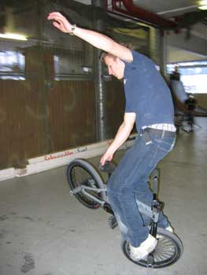

# SBF à la Christmas Jam 03 - samedi 27 décembre 2003

Yeah! Juste après Noël, en route pour la Xmas Jam qui est l’une des meilleures de Suisse. Elle se déroulait normalement chaque année à Bâle, mais vu que le park de Bâle a dû fermer ses portes cette année, c’est à Einsiedeln, dans le fin fond de la vraie Suisse qu’elle prend place.

Texte : Steven Blatter et Michaël Mettler / Photos : Steven Blatter

Comme à notre petite habitude Steven (ouais le Bachelor là) gère le voyage. Après 4 heures de route et un arrêt au "Cindy’s", sorte de drive in à l’américaine complètement kitsch, nous voilà arrivés dans ce petit village montagnard enneigé.

On en profite pour visiter le couvent d’Einsiedeln (le plus grand de Suisse) mais un park chauffé nous attend, alors direction le hangar qui en plus d’abriter le saktepark, abrite aussi une brocante?!? Pourquoi pas, d’autant qu’il y a des canapés et un petit bar pour la restauration. En fait, tout y est. Une bonne partie des riders suisses sont là et ça fait plaisir de se revoir, d’autant que le park est bien cool avec des hips à gauche et à droite, des modules assez originaux pour rouler! Ca change donc ça motive à fond!

Et à voir, on l’est tous! "El Froose" représente le "OUbIEN" style, c’est-à-dire roue crevée, roue cassée donc caméra à la main! Tout le team "Trust & Ride" est là, même Black Jack et "The Swiss Beast" Thomas Wullschleger qui s’envole bien avec du style sur les hips Janick Wenger, l’aiglois qui roule pour K2, vole bien haut et pose abubaca sur le sub-box. Stefan Ahmala de Bâle rentre 540-tail-tap bien rapide sur le sub-box, mais celui qui a tout déchiré ce week-end et en particulier sur le sub, c’est Peter Schleier de Zürich. Il rentre fufanu, funfanu-to-fakie, foot-plant-(en restant face à la courbe)-to-fakie et un bus-to-ice-pick rentré nickel et sur le hip 270-bus... Sur ce même module, Martin se fait un peu mal mais rentre un no-foot-cancan à moitié superman bien cool à voir, et "Hää" Erb fraîchement rentré de San Diego nous montre ses nouvelles tricks, wip sur le hip, 270-turndown sur le hip et j’en passe.

Mais je ne vais pas vous expliquer toutes les tricks de tout le monde. En gros, on a tous pris plaisir à rouler ces hips et le reste du park! Et du côté flat, Steven, ça a autant assuré que chez nous?

C’est clair! Parce qu’on était aussi tous là! "On" c’est-à-dire le crew suisse des flatlanders. Et malgré un sol hyper glissant, on a tous passé un après-midi de riding dans les règles de l’art! Il y a eu les hitchhikers et les halfhiker-barflip d’Andreas Walter, la motive et les spinnings de Marco Vetterli, les longs links de Stefan Löber qui, malgré sa facilité à apprendre des tricks, roule moins et s’occupe un peu trop de sa voiture!! Un autre rider qui a tout fait péter est notre star montante Oli Müller. Il nous a rentré tous ses enchaînements comme son backpacker-jump-to-hitchhiker, spining-backpaker, hitchhiker-wip, backpaker-wip et je peux vous assurer que sur cette "patinoire" c’était pas évident… genre de mon côté, je me lance à froid pour ma première tricks et VLAN je m’étale sur mon bike! En début de soirée, Karin Bleile nous a rejoints pour practicer ses backward-hitchhikers et autres enchaînements sur la roue avant!!

En fin de journée, tandis que certains continuent à rider, d’autres sont posés tranquillement devant la projection des dernières Props et autres vidéos. Dès que du flat se présente sur l’écran, les streeters tournent la tête pour mater leurs potes rouler tandis que les "patineurs" se jettent sur les canaps! Malheureusement, les sessions de flat ne sont jamais très longues dans ces Props… bon on a quand même pu apercevoir Yohann Krapule ridant au Canada! De dieu la classe!

A 22h et après une grosse journée de ride (10h) rien de tel qu’une grosse bouffe tous ensemble au resto de l’autoroute. La photo de groupe et les au-revoir nous dispersent. Peter et Petra (sa copine) nous font découvrir un club bien rock’n’roll métal pour finir cette journée et commencer la prochaine l’estomac bien rempli de malt!

Swiss BMX Freestyle voudrait remercier Michel Carmona pour l’organisation, Peter et Petra pour le squatt et l’after-bmx. We will be back next year!!

Michaël Mettler et Steven Blatter

