# Swiss BMX Freestyle au Braun Flatground du 27 au 29 février 2004

6 avions, 4 jours, 6 membres de Swiss BMX Freestyle, un sol parfait, une ambiance des plus décontractée et un riding de fou avec la crème des flatlanders mondiaux , Voilà en résumé le Braun Flatground qui prenait place à Amsterdam!!

Voilà les résultats des membres SBF au contest :

- Karin Bleile (18ème en expert)
- Oli Müller (9ème en master) !!
- Steven Blatter (15ème en master)
- Marco Vetterli (17ème en master)

Steven Blatter

Swiss BMX Freesytle

Photos: Steven Blatter

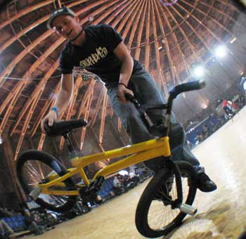
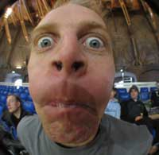
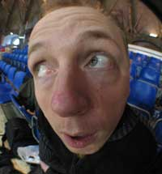
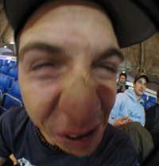
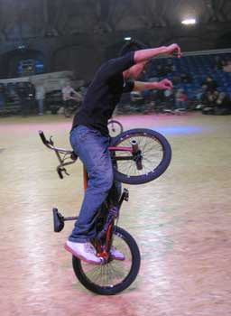
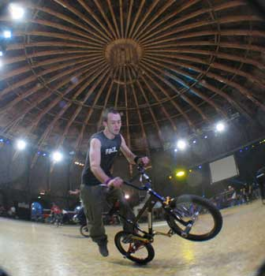
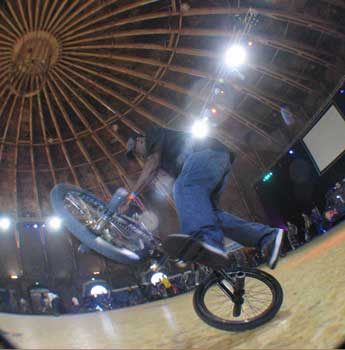
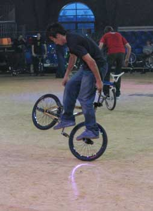
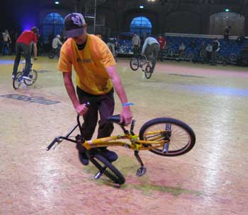
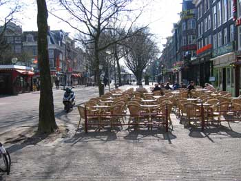

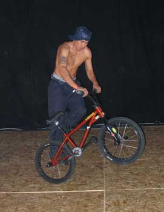
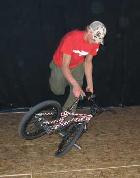
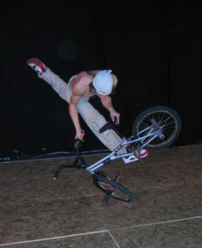
