# La AIRPORT BMX JAM, 3 et 4 Avril 2004, Genève

Envie de retrouver la bonne ambiance suisse, telle la Christmas Jam? Il était clair que la Airport BMX Jam s’imposait. Steven Blatter me posa clairement le décor : un week-end dans l’aéroport de Genève avec du beau monde sur une aire quelque peu restreinte mais au sol parfait et un grosse bouffe avec projection vidéo dans un énorme squat. On arrive!

Texte : Michael Husser

Photos : [Olivier Beroud](http://www.actuafilms.com/), Steven Blatter, Mathieu Chenut, Florian Sallin, Daniela Vassalli, Marco Vetterli.

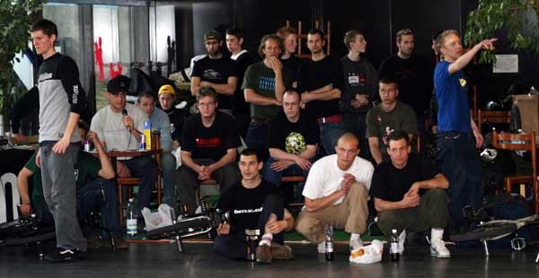

Samedi 10h30, bloqué dans un énorme embouteillage à la douane de Bâle, la tension monte... Après avoir poussé ma super5 au-delà de ses limites, on se retrouve enfin à l’aéroport vers 13h. Au moment où les portes sont franchies, on découvre des galeries commerciales prisent d’assaut par une flopée de riders. Les shops Felt, 48sBMX et l’Artillerie nous exposent leurs nouveautés, les DJ’s assurent l’ambiance tout comme les riders!

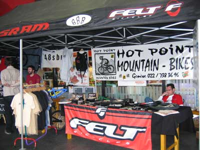

On retrouve donc parmi les Suisses toutes la crew de Zürich, dont Oli Müller qui, exploitant l’aire à son maximum, continue de prouver que son style ne réside pas dans la spécificité de son vélo mais bien dans ses longs enchaînements techniques tel un jump backpacker à hitchhicker qui mérite un grand respect. Sur sa nouvelle monture, Marco Vetterli, et son style brakeless, volait sur l’aire en mélangeant nervosité et fluidité. Très calmement mais sûrement, son collègue Stefan Loeber enchaîne en backward et met tout le monde d’accord en barwhip. On a aussi pu repérer Fabian Müller, très consistant. Toujours présente, Karine Bleile qui gérait à la fois les practices et son stand avec Michel Carmona, ce qui ne l’a pas empêchée de rentrer des enchaînements bien propres. Dans le même genre : "J’assure autant dans l’organisation que sur mon petit vélo", j’annonce Steven Blatter. Entièrement à l’aise sur ce sol tant apprécié, il nous déballe de longs enchaînements où le replaquage confirme la maîtrise.

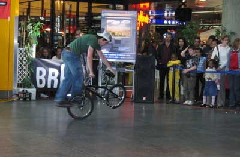

C’est avec plaisir que je découvre que nos voisins allemands ont eux aussi fait le déplacement, comme nos deux acolytes Sven Steinbach et Philip Früh qui n’étaient pas là que pour chasser l’oeuf. Nos deux "KingfromMallorca" nous lâchent du technique pour notre plus grand plaisir. Dans la famille Felt, j’appelle la machine allemande : Matti Röse, qui, une fois rodé et bien graissé, enchaîne tous ses mécanismes à une vitesse incroyable. Voilà comment il nous a mis une grosse claque, tout comme son coéquipier Michaël Sommer qui exploite son vélo au-delà de ses capacités en alliant rapidité, technique et pumping.

La scène française a bien prouvé qu’elle est toujours motivée lorsqu’il s’agit de se bouger à une jam. C’est alors qu’on retrouve pratiquement toute la famille grenobloise, mais aussi Lyon avec l’originalité de Rémy Dunoyer à l’appui, ou encore l’Alsace représentée par moi-même. On n’oubliera pas la vitesse d’Etienne Giraud ou la grande maîtrise de Johan Krapule.

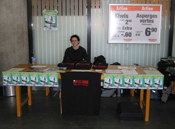

La journée se déroule dans une très bonne ambiance de famille. Des rencontres, des échanges, de l’émotion, de la motivation, des RedBull offerts par l’association, bref tous y est pour assurer la qualité de cette jam. Mais ça ne s’arrête pas là, le soir venu, Steven paraît confiant alors qu’il doit nourrir et héberger la moitié des riders soit 25 personnes. Nous suivons alors le guide jusqu’à une énorme maison abandonnée au milieu de nulle part. L’aspect "maison hantée" nous fascine tous mais pas autant que la mini rampe se trouvant dans une des nombreuses pièces qu’offre ce squat paradisiaque. Après avoir mangé comme des ogres, on se retrouve devant un concert mémorable donné par le trio Sommer, Parano garage et Vetterli. Ce véritable chaos entraîna les streeters dans la piscine aménagée en mini rampe. Puis vidéo et dodo.

Le dimanche matin, retour à l’aéroport. L’absence excusée des Français se voit rattrapée par de nouveaux venus. Nous décidons alors d’organiser le contest sous forme de jam. Avec 14 inscrits et un public ébahi, le contest se déroule à merveille. A la suite de ça, des breakeurs tapent le battle avec les flatlanders. Après la remise des prix, ce week-end touche à sa fin.

Merci à Swiss BMX Freestyle, Steven Blatter, Daniela Vassalli, Phil et à tous les riders pour cette excellente organisation. Comptez sur moi pour la prochaine.

Michael HUSSER

Swiss BMX Freestyle tient à remercier spécialement : Les Galeries de l’Aéroport, Felt Bicycles, BRAUN, l’association ATB, Phil@Bellevue Punx, 48sBMX, Keetch Clothing, RedBull et tous les riders pour leur présence!

Airport BMX JAM contest results :

1. Matti Röse (Allemagne)
1. Michaël Sommer (Autriche)
1. Stefan Loeber (Suisse)
1. Michaël Husser (France) (4. hors jugement, Steven Blatter (Suisse))
1. Oli Müller (Suisse)
1. Sven Steinbach (Allemagne)
1. Philip Früh (allemagne)
1. Marco Vetterli (Suisse)
1. Karin Bleile (Suisse)
1. Etienne Giraud (France)
1. Robert Martinovic (Allemagne)
1. Armin Azadpour (Allemagne)
1. Raphaël Santos (Suisse)

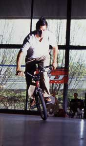
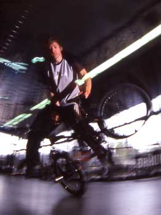
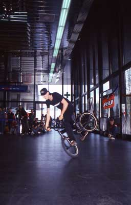
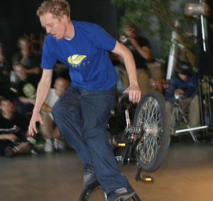
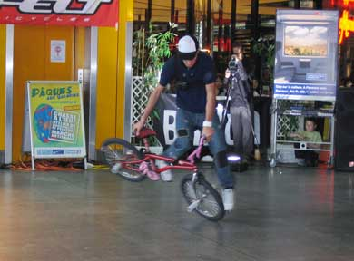
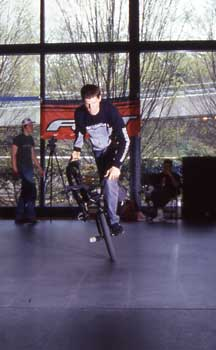
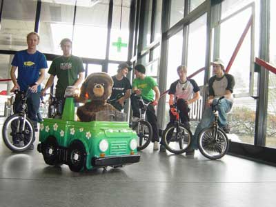
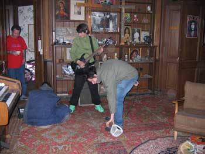
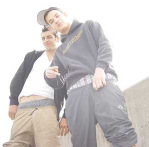
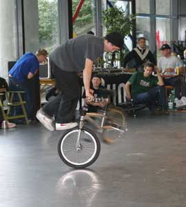
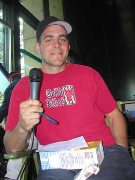
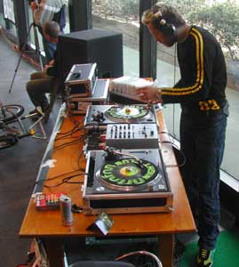
