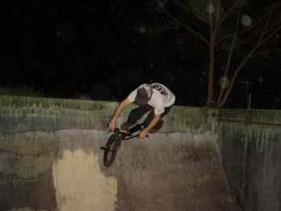

# Die AIRPORT BMX JAM in Genf, 3. und 4. April 2004

Im Rahmen von „Pâques aux Galeries“, der Osterausstellung im Bahnhof des Genfer Flughafens, lud die Swiss BMX Freestyle Association am 3. / 4. April dieses Jahres zu einem kleinen aber feinen Flatland-Contest ein, wobei ein sehr smoother Boden, friedliche Jam-Sessions und zu wenig Platz die Hauptrolle spielten.

Texte : Marco Vetterli / Photos : [Olivier Beroud](http://www.actuafilms.com/), Steven Blatter, Mathieu Chenut, Marco Vetterli.

Flughafen Genf – Anlaufstelle der Touristen, Buisnessmen und Pendler. Wie an jedem modernen Flughafen sollte hier die Verbindung von A nach B kein Problem darstellen. Entgegen dem Klischee der Schweizer-Präzision war jedoch der Weg zum Parkhaus P33 nur mit Glück, Risikofreude oder Know-How zu erreichen. Hier wurde der Orientierungssinn eines jeden Besucher auf die Probe gestellt. Nichtsdestotrotz fanden an diesem Wochenende um die 30 Anhänger des Kinderfahrrades den Weg nach Genf. Aus Deutschland kamen Sven Steinbach, Philip Früh und auch Felt-Teamfahrer Matti Röse angereist. Michael Sommer, ebenso für Felt unterwegs, repräsentierte Österreich. Die Franzosen Johann «Krapule», Michaël Husser und Etienne Giraud waren ebenfalls vor Ort. Mit Karin Bleile, Stefan »Lazer» Löber, Ollii «Stewart» Müller, Fabian Müller, Dani Cacavo, Andreas Walter, Kilian Stocker, mir selber (Marco Vetterli) und natürlich dem Organisator Steven Blatter war auch die gesamte Schweizer-Flatlandszene am Start.

Der Samstag sollte chillig verlaufen. Aufgrund der relativ kleinen Fläche entschied man sich für eine Jamsession. Einigen war der Boden etwas zu glatt und so rutschte man bei zu kräftigen Spins gerne mal weg. Umso smoother waren natürlich die Rolling-Tricks anzusehen. Für hungrige Fahrer war der Spot perfekt, so lag er doch direkt vor der Migros (jawoll, der überall bekannte Schweizer-Lebensmittel-Gigant) und während sich manche an faden Billigsandwiches aus dem Kühlschrank erfreuten, genossen andere einen Fresh-take-it-shake-it-mix-it-enjoy-it-Salat. Ein DJ untermalte das ganze Geschehen mit Hiphop und vor allem Ragga-Musik, welche mir persönlich dann doch zuviel wurde. Trotzdem waren alle bei bester Laune und spinten, rollten, switchten und flippten die Kinderfahrräder den ganzen Tag lang über den Marmorboden des Genfer Flughafens.

Um acht Uhr abends wollte man aufbrechen um gemeinsam «Znacht» zu essen. Nach einer kurzen Aufräumaktion wurden die Räder verstaut und die Rucksäcke gepackt. Schliesslich zwängten sich sämtliche Fahrer in fünf Autos und so machten wir im Konvoi (inklusive Warnblinker) die Strassen unsicher. Während es langsam immer dunkler und die Gegend immer verlassener wurde, führte uns eine kleine Schotterstrasse durch einen finsteren Wald. Blair Witch Project – Style. Angekommen, ausgestiegen und hier trauten einige ihren Augen nicht mehr. Vor uns stand eine riesige Villa, durch deren Eingang wir sogleich eintraten. Hier lief wohl einigen ein Schauer über den Rücken. Sicher sind in diesem Haus schon einige Menschen auf unerklärliche Art und Weise verschwunden. Und das ein Fluch über diesem Haus hängt, ist gar keine Frage. Naja egal. Phil von den «Bellevue Punx», der schon acht Jahre in diesem Haus wohnt, lud zum Dinner ein. Vorher jedoch kamen wir in den Genuss einer professionellen Hausbesichtigungstour.

Leider konnten wir uns nicht alle der 30 Zimmer ansehen, trotzdem waren wir äusserst beeindruckt. Ein Highlight war auf jeden Fall die Minirampe, welche direkt in ein Erdgeschosszimmer gebaut worden war. Ebenfalls äusserst spektakulär war der Garten, ja es war schon eher ein Park. Hier wurde (glaube ich zumindest) ein früherer Betonpool wiederum in eine Minirampe umgewandelt. Zudem hatten die Leute hier einige Dirthügel aufgeschüttet, welche uns aber aufgrund der totalen Dunkelheit verborgen blieben. Nachdem sich einige noch fast im Haus verliefen, fand man sich an einem grossen Tisch wieder und genoss einen Teller Spaghetti. Sogar Dessert gab’s, Vanillecrème, Schoggicrème und Früchte. Hier noch einmal ein grosses Dankeschön an Phil und Daniela die gekocht haben. Merci beaucoup!

Da nach dem Essen niemand wirklich Lust hatte, auszugehen und wir uns ja im Haus der unbegrenzten Möglichkeiten befanden, entschied man sich, hier zu bleiben. Einige gingen weiter auf Hausbesichtigung und provozierten die hier hausenden Geister. Anderswo wurden lustige Unterhaltungsmaterialien wie Mikrofon, E-Gitarre oder Keyboard missbraucht, wobei einige Anwesende ihr musikalisches Talent unter Beweis stellten. Andere wiederum vergewaltigten die Zimmer-Mini mit Skateboard-Skills, die Streetfahrer rockten die Rampe im Garten und der Rest erfreute sich an Flatland-Videos. Da relativ wenig Alkohol oder andere flüssige und kräuterartige Muntermacher im Spiel waren, kam es zu keinen grösseren Drogen-Exzessen. Der Abend fand somit schon relativ früh ein Ende und die Meisten schliefen in einem Matratzenlager in der Gruselvilla ein.

Sonntag war Contesttag. Schon um 10Uhr morgens traf man im Genfer Flughafen wieder auf Kinderfahrradfahrer. Die Deutschen Robert Martinovic und Amrin Azadpour rollten zusammen mit Etienne Giraud schon fleissig über den Boden als wir zusammen mit Steven Blatter, dem Präsidenten der Swiss BMX Freestyle Association, ankamen. Wiederum wurde die ganze Musikanlage installiert, Lautsprecher aufgestellt und Werbeblahchen aufgehängt. Nach und nach trudelten alle Fahrer ein und die Jam-Session begann von neuem. Um halb 3 sollte dann der Contest beginnen und das tat er auch – tja, Schweizer Präzision… Auf Wunsch vieler Fahrer wurde aber nicht im üblichen Contestformat gefahren. Eine Stunde lang fuhren die 14 Contestteilnehmer eine fette Jamsession und sollten danach selber entscheiden, wer wie gut gefahren ist. Gute Entscheidung finde ich, denn die Stimmung war verdammt gut; wenig Conteststress und die Fahrer pushten sich gegenseitig. Natürlich waren es Matti Röse und Michael Sommer, die mit absolut unverständlichen Switches und G-Turn-Sachen das Haus rockten. Die Schweizer Stefan Löber, Ollii Müller und Steven Blatter gingen ebenfalls gut ab. Und da war auch noch Michaël Husser, der mit fast schon kriminell smoothen Rollings überzeugte. Nach dem Contest machte aber niemand schlapp, sondern fuhr vor dem Publikum weiter. Und plötzlich waren da noch fünf kleine kranke Gangster-Asiaten auf dem Platz, welche mit sehr stylischem Breakdance einfuhren. Respekt, diese Jungs hatten’s wirklich ganz dick hinter den Ohren! Aus der Breakdanceshow entwickelte sich dann ein kleiner „BMX vs. Breakdance“-Battle, welcher weiterhin für ausgelassene Stimmung sorgte.

Nach der Preisübergabe, die von einem komischen Stoffhasen und einem sprechenden Teddybären begleitet wurde, schüttelte man sich die Hände, packte die Räder und Rucksäcke ins Auto (ja, oder man stieg in den Zug ein…) und machte sich langsam aber sicher auf den Heimweg. Hier will ich mich noch einmal dick bei Steven Blatter bedanken, der dieses gemütliche und fette BMX-Weekend organisiert hatte und für alle ein Nachtessen und bequeme Schlafplätze bereithielt. Merci Steven!!!

Bis zum nächsten Mal. Peace!

Marco Vetterli

Swiss BMX Freestyle

Swiss BMX Freestyle would like to thank : Les Galeries de l’Aéroport, Felt Bicycles, BRAUN, l’association ATB, Phil@Bellevue punx, 48sBMX, Keetch Clothing, RedBull and all the riders for showing up!!

Airport BMX JAM contest results :

1. Matti Röse (Allemagne)
1. Michaël Sommer (Autriche)
1. Stefan Loeber (Suisse)
1. Michaël Husser (France) (4. hors jugement, Steven Blatter (Suisse))
1. Oli Müller (Suisse)
1. Sven Steinbach (Allemagne)
1. Philip Früh (allemagne)
1. Marco Vetterli (Suisse)
1. Karin Bleile (Fille Suisse)
1. Etienne Giraud (France)
1. Robert Martinovic (Allemagne)
1. Armin Azadpour (Allemagne)
1. Raphaël Santos (Suisse)

