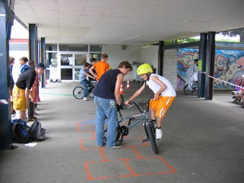
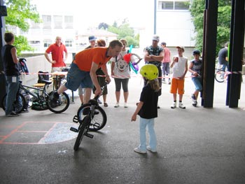
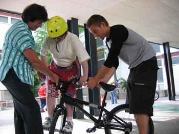
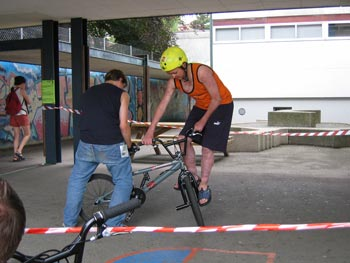
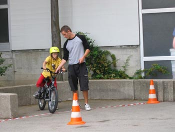
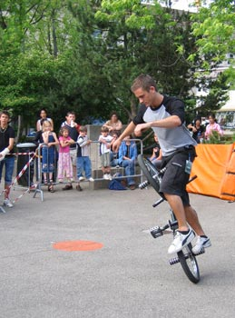
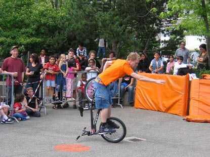
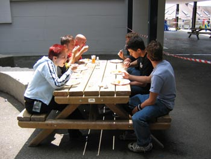

# Atelier SBF d’initiation au flatland@Chailly Raid 4 Fun

Une journée de riding?! Certes, mais pas comme les autres!

Texte : Steven Blatter

Photos : Daniela Vassalli

L’un des buts que l’on s’était donnés avec Swiss BMX Freestyle était d’organiser des journées d’initiation au BMX. Ce but a enfin pu être réalisé grâce au projet de "raid" qu’Ubaldo Martella de l’association Funky Chill nous a présenté. Il nous a proposé de tenir un poste (atelier) de BMX flatland afin que des jeunes, et moins jeunes, puissent s’essayer à notre sport. L’idée nous a tout de suite plu, d’autant plus que nous n’avions encore jamais organisé de manifestation en région lausannoise.

Après de multiples réflexions sur le choix des figures que nous allions demander aux participants, nous étions prêts pour le Chailly Raid 4 Fun!

Pour tenir le poste, nous étions cinq : Christian Wolf, David (de Chailly) et moi-même comme "profs" d’initiation au flat ainsi que Daniela Vassalli aidée par Ubaldo Martella pour tenir le stand SBF, gérer l’ordre de passage et les points des nombreux participants! Nous avons été très étonnés par la motivation des inscrits qui revenaient même plusieurs fois faire les exercices. Tout au long de la journée, nous n’avons vu que des sourires et des visages pleins de concentration! J’espère que cette journée motivera au moins un ou deux des participants à s’acheter un BMX et à commencer ce fabuleux sport (ou art pour ceux qui préfèrent).

Pour finir l’après-midi avec une touche de street, Thomas Wullschleger et Michaël Mettler sont venus nous rejoindre pour une bonne démo de jump/flat devant un [public hyper motivé](./media/mvi_1019.avi)!

Merci à Ubaldo Martella, David (de Chailly), Daniela Vassalli, Christian Wolf, Thomas Wullschleger, Michaël Mettler et aux bénévoles du raid pour cette super organisation!

Steven Blatter

