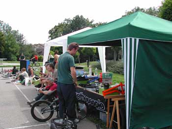

# La Xpress Flatland Jam, samedi 10 Juillet 2004

Durant toute l’année, et ce depuis quatre ans, le terrain de basket du centre sportif Les Morettes à Prangins a été marqué par des traces bizarres! Elles ressemblent à des ailes d’oiseaux qui parfois se finissent en cercles! Certains pensent qu’un artiste s’exerce pour son prochain numéro de cirque tandis que d’autres pensent simplement qu’un fou essaye toute la journée la même figure sur son petit vélo. Je pense que dans d’autres villes ou villages la même scène se produit au même moment.

Quand on roule 99% du temps seul sur un spot proche de chez soi, j’imagine que l’on peut dire que c’est "mon spot". Et j’ai toujours voulu organiser une jam sur "mon spot" car pour moi le goudron est parfait et y voir rouler d’autres flatlanders crée un effet toujours un peu spécial.

Je me suis alors mis derrière mon PC pour taper encore une de ces satanées lettres commerciales qui sont pour moi la tâche la plus difficile dans l’organisation d’une manifestation! Quatre jours plus tard et après avoir reçu une réponse positive de la Commune de Prangins, je confirme à tous les riders de la mailing-liste de SBF que Swiss BMX Freestyle organise la Xpress Flatland Jam (xpress parce que vite organisée et xpress pour l’expression du flat sur son vélo) le samedi 10 juillet.

A mon grand étonnement, ce ne sont pas dix riders qui ont fait le déplacement mais vingt-cinq riders de toute la Suisse : Zürich, Lucerne, Bâle, Le Loce, Lausanne et Genève. Ah oui, y en avait même de France voisine! La journée s’est déroulée dans une ambiance super tranquille sans qu’aucun voisin ne se plaigne du bruit de la sono. Michel est venu avec son stand 48sBMX pour le bonheur des BMXers mais le malheur de nos porte-monnaie et nous avions aussi notre stand SBF avec des fruits et des boissons gratuites pour les riders.

Le soir venu, le BBQ a redonné quelques forces aux riders encore présents pour une jam oldskool ou plutôt premières tricks apprisent!!

En gros, cette journée fut excellente de toutes parts et j’imagine que l’année prochaine, il y aura de nouveau l’Xpress Flatand Jam mais peut-être un peu moins xpress!!

Bonne vacances,

Steven Blatter

Photos: Steven Blatter, Marco Vetterli et Flox "Oubien"

