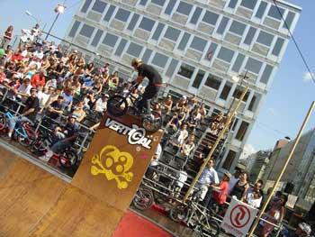

# BOWLaBMX 04 - Samedi 8 et dimanche 9 août 2004 - Les photos

Voici un petite sélection de photos du Bowlabmx 04 organisé par Swiss BMX Freestyle dans le cadre d’Asphaltissimo. Vous pouvez voir la totalité des pics + des vidéos sur [www.igeneve.ch](http://www.igeneve.ch)!!

Résultats du Bowlabmx 04

1. Kevin Kalkoff
1. Fred Borel
1. Vincent Garreau
1. Frank Soulier
1. Janick "Shorty" Wenger
1. Stéphane "Shogun" Meneau
1. Hannes Erb
1. Rémi Blanchant
1. Marcelo "Gordo" Rigo
1. Shem Lempin

Merci & ENJOY!

Steven Blatter

Swiss BMX Freesytle

Photos : [www.igeneve.ch](http://www.igeneve.ch)

