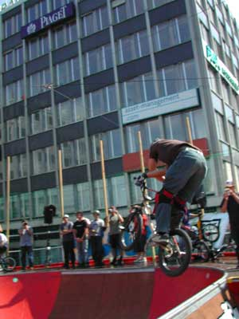

# BOWLaBMX 04 : 8 et 9 août 2004

Okay, ben c’est parti pour le ‘report’ du Bowlabmx à Asphaltissimo 2004 !

Pour moi tout à commencé avec l’ouverture du bar Trustandride / Swiss BMX Freestyle le jeudi 29 juillet, sur ce joli spot qu’est la place du Rhone. En plus, le fameux bowl « Vertical », une scène pour des concerts, Street-Basket, et autres trucs sont dans le coin pour 11 jours de folies…

Texte : Thomas Wullschleger / Photos : Flox "Oubien-Wear"

Free session pour tous sur le bowl tous les jours, et malgré un planning skate bien chargé, les bmx ont toujours pu pegs’er ici et là. D’ailleurs big up à eux de ne pas avoir fait les « relous » et de nous laisser bmx’er pratiquement tout le temps.

La semaine se passe paisiblement, mais je dois malheureusement reporter la malchance d’ « Elvis » aka Adrien M., qui s’es cassé la clavicule gauche… Bonne chance à toi !!!

Vient le Ve-Sa et voilà les motivés qui arrivent pour le training. Hannes et shem, les Grenoblois avec Omar B. et Victor V. au volant, avec bien sûr le « oubien-crew » avec les vélos et les appareils numériques. Sans oublier le koum, les Annecy-kids, le Borel, Gordo, M.et K. Carmona …

C’est aussi démo skate + bmx, les Trust and Ride’ers on monté la « bosse » et on a pu voir Florian Guyannon et Christian Wolf faire une Démo de Flat. A eux deux ils ont bien représenté, et ils nous ont montré du bon !!! Pour la démo de jump, y avait Gordo Borel et Thomas W. Nous avons fait du basic mais on a quand même pu faire deux trois tricks, 360 pour Gordo, Superman ou tailwhip de Borel, et j’ai fait mon premier flip sur « labosse ».

Puis, ben, c’est samedi soir, et c’est la fête !!!

Tous les riders ont enjoyé le feux d’artifice, le cocktail T &amp; R et c’était la Jam à foizon !!! Les Grenoblois debout sur les sièges, hurlants de joie, nous impôts en fumée, ah, c’était un régal…

Dimanche 8 août

Contest day. Tous sont là, a peu près réveillés… Training pendant deux heures et ceci malgré la chaleur… 19 riders inscrits, 2’500 de price money,…et c’est go pour une journée de pur ride.

Yavait cinq groupe de qualifs à trois riders et un sixième avec quatre. Une heure 15 de riding bien tech, dans ce petit mais joli bowl… Env. dix min. par groupes et tous les gars ont bien ridé. Pour la finale 10 riders de qualifiés, et voici deux trois lignes en ordre décroissant :

1. Kalkoff Kevin : Du made in Kalkoff et cela faisait plaisir à voir !!! Du tech et de la vitesse, ca marche !! Des air’s trop bons, avec son style maison…360 sur le spine et son 540 to tail tap. Hand-plant 180 sur le spine, ice-pick grinds, et son trop fat 540 to sprocket to 180… Trop gros..
1. Borel Fred : Le borel des grands jours, avec des ice-picks/fufanu’s un peu partout, des airs, et c’était le seul rider à faire peg’s stall sur l’extension-wall. Aussi de bonnes hauteurs, et tailwhips pas tous posés. Encore l’immense ice-pick sur le Wall-extension… respect brother…
1. Gareau Vincent : Il à trop repésenté ! Du drop-in barspin, tailwhips, manuals, ice-picks partout, 360 sur le spine et des long et bons runs. Il nous a aussi fait un 180-abubaca-to 360 in ou le Ryan Jordan/Marcus Wilke tricks et pour finir il a fait péter un 540 over le spine, qu’il n’a juste pas posé !!!
1. Soulier Franck : Venu de Montpellier, il a représenté avec de bonnes lignes, tentative de ice-pick sur l’extension, 360, 360 table sur le spine, et des bons airs. Du gros et à donf !!!
1. Wenger Yannick : Le Yannick nous a envoyé des hauteurs comme personne, avec des big tables, look-backs. Highest air pour lui et du grind, du manual et du tech sur le coping. Aussi 2-3 tailwhip attemps sur la courbe.
1. Menau « Shogun » Stéphane : Shogun était en grande forme et nous à fait des tailwhips tail-taps, barspins partout et aussi en tail-tap, des grinds et il a bien killé le sub avec des 540 dont un avec un nose tap sur la rembarde, de down-side whips, sproket’s varials, etc…
1. Erb Hannes : Il a bcp ridé le bowl, et nous à fait des bons barspins et 360 sur le spine. Peg’s-bonk sur l’extention, fufanu’s,+ le sub.and 540’s.
1. Blanchant Rémi : Yéé, notre Fit_bike_Co boy nous a fait des super-lignes, des air’s énormes, avec des nose-wheelie to manual sur le sub-box, pedal grinds, sprokets to 270 sur le sub et un joli manual sous le wall-extension.+ over pedal stall to 180 sur le spine
1. Gordo : Le gordo a eu le prix du run le plus long dans le bol. Des lignes de marathonien tout en gardant la précision sur le tuyau. Avec des barspins, et autres sur le spine et le quarter, aussi avec du front brake stuff.
1. Shem lampin : De Lucerne et motivé, il nous à fait des belles lignes, manual sur le sub-box, des air’s, avec deux trois tricks comme x-up, table en spine aussi.

Pour finir, le best-trick à été rempoté par Michael “Mick” David pour son big fufanu sur la rembarde.. Yeeee, il fallait le faire, surtout avec la longeur de la deck !!!

Ca y est ! Asphaltissimo 04 est déjà un souvenir, mais thanks à tous d’avoir été là, de rider, et on vous revois tous pour le 05 !!!

Merci à la Délégation à la Jeunesse (C.Deuel, A. Mathieu, C. Molo and crew), Keetch clothing, Oubien-Wear…

Yéééééé !!!!

Thomas Wullschleger

Trust and Ride/Swiss BMX Freestyle
