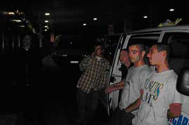
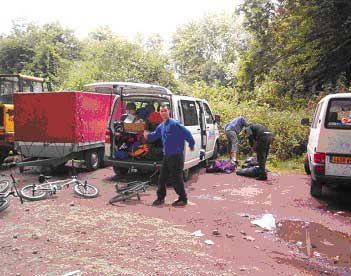
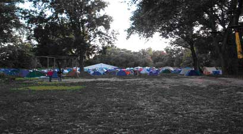
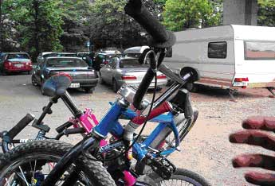
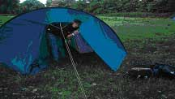
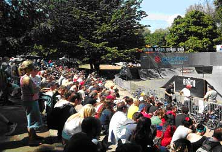
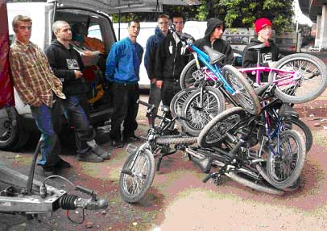
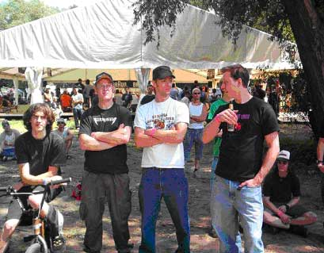

# SBFs Reise nach Köln für Worldchampionships 2004

Ich weiss nicht einmal mehr, wie ich auf die Idee gekommen bin, dass Bern nicht auf der Strecke Genf-Köln liegen würde. Aber das macht auch nichts, denn ich konnte es kaum erwarten, nach Köln zu fahren. So stieg ich um ca. 22:00 Uhr in Bern in den InterCity um dann wie abgemacht um 23:00 Uhr in Basel zu sein.

Bilder und Text : Carlo "Kater" Viscione

Aus dem 23:00 Uhr Treffen wurde irgend was mit halb Eins in der Nacht, weil die Reisegefährten wohl ihren Autoanhänger, Fahrgäste, Fahrräder, Pässe oder sonst was, nicht gefunden haben. Naja, dass ich mit den Jungs sehr viel Zeit mit Warten verbringen könnte, hat sich später schnell herausgestellt. Als mich Alex und Michael endlich vom Bahnhof abholten, machte ich mich mit denen bekannt, die mir (was für ein Wortspiel) noch nicht bekannt waren. Sogleich untersuchten sie mein Fahrrad und fuhren es fast eine Stunde lang Probe. In dieser Zeit hörte ich Gerüchte über einen in Genf "ausgeliehenen" Anhänger, der auf höchst mysteriöse Weise verschwand. Da hier unmöglich ein Zusammenhang mit uns bestehen konnte, gehe ich hier nicht weiter darauf ein...

Wir hatten eigentlich vor, zwei bis drei Stunden zu fahren und dann eine Schlafpause einzulegen, da unser Busfahrer Matthieu einen halben Tag arbeiten musste und dazu noch die Strecke von Genf bis Basel erledigt hat. Nach ein paar hundert Kilometer und grüner/blonder Stärkungen haben wir an irgend einer Raststätte beschlossen, die ganze Strecke in einem Stück zu fahren (sehr zum Leidwesen von Matthieu, im Bild ganz rechts, der sich aber nie beklagte...).

Um ungefähr 08:00 Uhr kamen wir total erschöpft in Köln an. Ich glaube, dass niemand so richtig schlafen konnte, denn wenn mal keiner über irgendwelche weltergreifende, hochphilosophische Themen, sachlich diskutiert hat (Edwin vs. Vic, SB vs. BB, Paris vs. Hillary, ...), liess Michael satanische Botschaften über CD laufen. Sodomie!

Bis wir den Jugendpark fanden, in welchem die BMX-WM ’04 ausgetragen wurde, verging sicher eine Stunde. Doch so lernten wir Stadt und Volk kennen (leckere Frauen an jeder Ecke und noch bessere Streetspots) und da wir sowieso so früh dran waren, spielte die Zeit gar keine Rolle. Nachdem wir mit einem waghalsigen Manöver, bei dem der Anhänger einen Smithgrind über einen Bürgerstein machte, die Zoobrücke überquerten, entdeckten wir endlich ein paar Wegweiser: Autos, Busse und Menschen mit BMX-Rädern im Gepäck. Hier musste es sein, da war der richtige Weg und kurze Zeit später befanden wir uns unter der Autobahnbrücke, welche sich als offizieller Parkplatz und illegaler Zeltplatz entpuppte. Illegal deshalb, weil die Polizei alle Falschcamper diktatorisch wegräumte. Naja, ein offizieller Zeltplatz gab es ja...

Ungeduldig wie wir nun mal sind, wollten wir gleich in den Park und uns alles ein wenig ansehen. Doch der Türsteher meinte (bitte hier einen sehr ausgeprägten Kölnerdialekt vorstellen): "Ey Junge, hier is’ erst um Zehn auf!".

Aber unsere Pfadfinder Damien und Francois (aka Luzifer) fanden schnell den verborgenen Pfad vom Dschungel in die Arena. Und wahrhaftig, es war eine Arena! Vor uns befand sich der "Streetpark" (das "Street" konnte man getrost weglassen) der dem Park von vor zwei Jahren sehr ähnlich sah. Weiter gings zur Miniramp und Halfpipe und ganz am Ende das Flatlandzelt mit Parkettboden und Turntables! Am Ufer des Rheins erstreckte sich ein langer Landgürtel, welcher der Zeltplatz war.

Mit der Zeit begann sich der Parkplatz zu füllen und wir beschlossen uns anzumelden. Nach etwa einer halben Stunde Warten waren wir stolze Besitzer von silbernen und lila Armbändern. Hier muss ich ein grosses Lob an die Sicherheitsleute aussprechen, denn die Armbänder waren numeriert und selbst das Fahrrad erhielt ein Band, welches beim Eintreten und Verlassen des Geländes restriktiv kontrolliert wurde. Somit war ein Fahrradklau praktisch unmöglich.

Gegen Acht Uhr abends kam auch Urs aus Bern an, der bei uns im Bus leider keinen Platz mehr ergattern konnte. Ich und zwei deutsche Bekannte holten ihn nach einer Streetsession bei der Philharmonie (legendär!) am Bahnhof ab und richteten dann unser Zelt auf.

Nachdem wir es uns gemütlich gemacht haben gesellten wir uns wieder zu den anderen aus dem SBF-Team und liessen den Abend gemeinsam ausklingen.

Mat Hoffman las noch ein paar Kapitel aus seiner Biographie vor und später hatten wir die Möglichkeit, die Premiere von der Props Megatour 3 und dem Video über den Circle of Balance zu bestaunen (leider ver... schlafen).

Irgendwann war ich aber so müde und wollte nur noch ins Bett.

Freitagmorgen, die Sonne schien und das erste, was mir in den Kopf kam: Duschen. Gesagt getan, die Duschen habe ich schnell gefunden, doch wo war das warme Wasser? Jedenfalls war ich dann wach um mich dem Frühstücksbuffet zu widmen. Die Preise waren zwar hoch, aber das Essen war stets zufriedenstellend.

Um halb Elf hatten die Pros/Street ihr Training, was ich aber nicht ganz mitbekommen habe. Am Nachmittag fand ausserdem der Carhartt Best Trick Spine statt und wer diesen gewonnen habe, kann ich leider auch nicht sagen. Irgendwie rauschten die Vorläufe und Trainings ohne direkten Kontakt mit mir an mir vorbei. Ich konzentrierte mich eher auf Kölns Streetspots, die Leute und natürlich das Bier.

Am Abend fand im grossen Verpflegungszelt die RambaZamba Party statt, die irgendwie in die Hose ging. Irgendwann wurde nämlich der Bierausschank eingestellt, was vielen sauer aufstiess und eine "Protestaktion" hervorrief. Ich war nicht anwesend, sondern wieder mal mit Locals in Kölns Strassen für eine Nightsession unterwegs. Gerüchten zufolge haben sich selbst Pros die Köpfe eingeschlagen und es gab ein respektables Polizeiaufgebot inklusive Titelstory in der Klatschpresse am Tag danach. Wie gesagt, ich kam um zwei Uhr am Morgen zurück zum Zelt, wo das berühmt-berüchtigte Team Planlos (allen voran Lalle) eifrig Europaletten, Einkaufswagen und Zelte verbrannten. Feurio!

Am Samstag fuhren die Girls um ihre fünf Plätze (mehr haben sich nicht angemeldet) und ich denke, dass jeder nur enttäuscht über die Darbietung der Mädels war. Ich meine, es ist ja schön und gut, wenn sie BMX fahren, aber ausser bei Corey Coffey hatte das Ganze nicht viel mit BMX zutun...

Die Worlds-Party im Bootshaus habe ich auch nicht gesehen, da ich mit Urs und den Deutschen Zeltnachbarn unsere eigene Grillparty hatte. Alex kam mitten in der Nacht auf die Idee, auf seinem Campingkocher Rösti zu machen und liess es sich neben unserem Feuer schmecken.

Sonntag war der Tag der Finale! Es war ein sehr schönes Gefühl, die Pros so nah erleben zu können. Mir persönlich gefiel Cory Martinez’ Barspin to Icepick von der Quarter an den Container, der Fufanu to Nosepick über das Subrail der Spine vom Wicke und der Wallride to Tailwhip out von Ruben (?) am besten. Chris Doyle fuhr wie gewohnt mit hohem Tempo und katapultierte sich in Höhen, in der die Luft wohl schon sehr dünn sein musste und auch der bremsenlose Bruce Chrisman beweiste mit seinem Strassenstil, dass man Park auch anders fahren kann. Es gab soviele schöne Tricks und so viele gute Fahrer, ich kann mich kaum noch an Details erinnern. Am meisten hat mich das Dirtfinale begeistert, denn erstens waren die Sprünge sehr hoch und weit und zweitens gingen Bibi, Ruben, Wessel und alle anderen dermassen steil, dass es manchmal richtig Angst machte, ihnen zuzusehen. Angst machte auch ein übler Sturz eines Dirt-Pros, welcher nach langen 15min Wartezeit von der Sanität hospitalisiert werden musste. Hoffentlich ist er wieder auf den Beinen!

Es war eine sehr schöne WM und ich konnte nur positive Erinnerungen mit nach Hause nehmen. Das Essen und Trinken war gut, das Wetter war genügend sonnig, die sanitären Anlagen nicht so katastrophal wie erwartet, das fahrerische Level astronomisch und die Leute einfach nur entspannt.

Nebst den Genfern, Urs und mir waren noch Michel Carmona samt Karin Bleyle, die Luzerner Brigade, Jean-Marie und wenn ich mich nicht irre auch ein paar Zürcher dabei.

Ich möchte an dieser Stelle nochmals allen danken, die diese Reise ermöglicht haben. Entschuldigen möchte ich mich für diesen lückenhaften Bericht, aber es ist schon ein wenig lange her, was Michael...? Genau. OUBIEN, EDWIN, NIPPEL!

Bis zur nächsten WM...

Carlo "Kater" Viscione

Swiss BMX Freestyle
