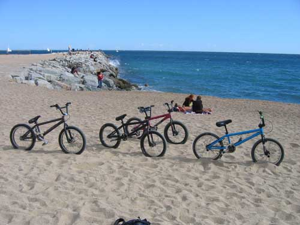
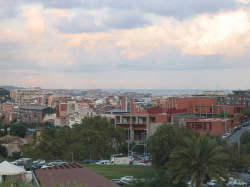
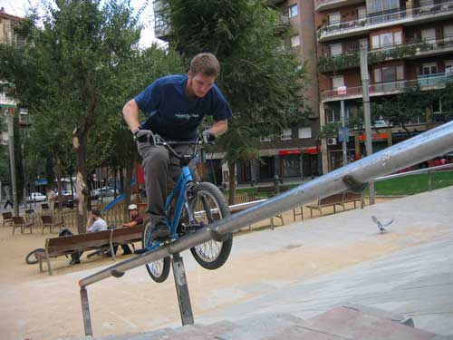
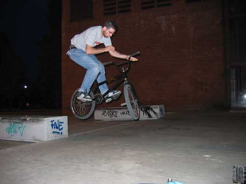
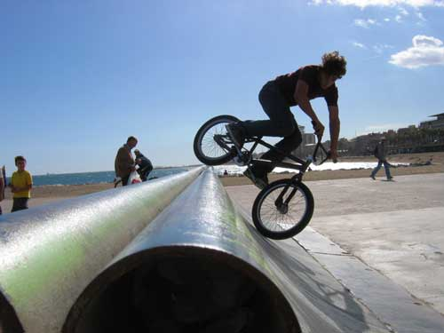
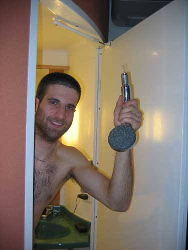
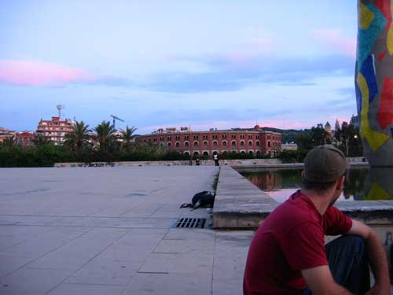

# SBF roadtrip : Barcelona, España

El viaje des hermanos locos de BMX en España!

Holà hombres! Es war vielleicht kurz nach Mitternacht, als mich Michael Mettler durch das Aktivieren des Klingeltons meines Handys aus den Träumen weckte. Michael klang völlig überdreht und als ich herausfand, warum, war ich es kurzerhand auch: Eine Reise nach Barcelona/Spanien sollte es werden!

Texte : Carlo “Kater” Viscione

Photos : Gefähtren

Nachdem ich mich beruhigt und (logischerweise) zugesagt hatte, ging das grosse Organisieren los. Wer kauft was, wo schlafen wir, welchen Flug nehmen wir, etc... Alles in allem hat uns die Reise über fünf Tage mit allem Drum und Drann 800.- CHF gekostet. Michael hat uns die Flugtickets reserviert und ich habe mich um das Hotel gekümmert, welches sich mit 76€ pro Nacht als ziemlich teuer herausstellte. Dazu komme ich aber später.

Die Gefährten:

**Michael Mettler**

ein lustiger Mensch und dazu der unordentlichste Langschläfer, mit welchem ich je ein Zimmer geteilt habe.

**François el fuego**

genoss die Zeit mit Schmerzen im Knie nach dem zweitem Tag. Ghettocamper Nummer eins.

**Mounky el loco**

hatte stets den Drang, jedes Objekt, welches sich mehr als zwei Meter über den Boden erstreckte, zu besteigen. Ausserdem verstand ihn fast niemand, wenn er sprach... Lustiger Typ! Ghettocamper Nummer zwei.

**Carlo “Kater” Viscione**

der wohl ängstlichste Fluggast, den Iberia Airlines je gesehen haben. Ausserdem der, der die Karten lesen konnte und mit einem Wortschatz von ungefähr 20 Worten Spanisch über das grösste Vokabular verfügte.

Nachdem wir uns alle in Genf am Flughafen getroffen haben, mussten wir zuerst unsere Fahrräder flugtauglich machen, was sich als einfacher als zuerst gedacht, herausstellte. Michael und ich hatten Fahrradtaschen, in welche wir Karton legten, damit unsere Bewegungsinstrumente keinen Schaden nahmen. Fuego und Mounky dagegen gingen das Ganze sehr professionell an und besorgten sich riesige Kartons, in welche sie ihre Bikes mehr oder weniger komplett legten. Nach dem Verlegen von etwa 200m Klebestreifen fühlten wir uns dem Check-In gewachsen und suchten den Schalter auf. Als die Frau am Schalter unsere Gepäckswagen erblickte, wollte sie am liebsten schreiend weglaufen. Vier 20-jährige, unrasierte, überdrehte und völlig ahnlose BMX-Fahrer mit vier völlig unförmigen Fahrradverpackungen sind anscheinend zuviel des Guten.

Doch die gute Frau bewies noch sogar die Ruhe, als wir dann noch insgesamt 20Kg Übergewicht hatten. Sie liess und die Fahrräder am Schalter für “spezielles Transportgut” einchecken und wir “checkten” ein. Michael traute den spanischen Zigaretten nicht und genoss den Dutyfree-Shop den er mit zwei Stangen Parisienne “mild” verliess. Zu Rauchen hatten wir wenigstens was bewährtes.

Wir mussten nach dem Zoll, den wir ungehindert passierten, nicht lange warten, bis wir ins ziemlich gut besetzte Flugzeug einsteigen konnten. Es erwartete uns die kühle, alle drei Minuten erneuerte Flugkabinenluft, angereichert vom Parfum der wohl schönsten Stewardess, welche wir je gesehen hatten. Der Start verlief planmässig, mir wurde wie befürchtet hundselend und konnte nur mit grösster Anstrengung der Kotztüte wiederstehen. Wir flogen von Genf richtung Marseille/Frankreich, später entlang der Costa Brava um schlussendlich die Küste von Spanien, etwa 100Km von Barcelona zu erreichen. Schnell durch den Zoll und zu den Förderbändern, die unser Gepäck lieferte. Wir mussten nicht einmal lange warten und schon kamen uns unsere Rucksäcke samt Fahrrädern entgegen. Wir suchten uns vor dem Flughafen auf einem Rasenstreifen ein ruhiges Plätzchen, um die Fahrräder auszupacken.

Ich nutzte die Zeit, um Postkarten und einen Stadtplan von Barcelona zu kaufen. Dann stellte sich uns die Frage, wie wir zu dem 120Km weit entfernten Hotel Ibis Meridiana kommen... Nun, wir wollten zuerst kein Taxi nehmen, da dies teurer als der Zug oder ein Bus wäre. Doch als wir nach einer halben Stunde trotz ungenauer Wegbeschreibung den Bahnhof immer noch nicht gefunden hatten, entschlossen wir uns, ein Taxi zu nehmen. Wir fanden bald jemanden, der uns vier mit Fahrrädern mitnehmen wollte. Für 60€. Lasst euch diese Zahl auf der Zunge zergehen... Sechzig Euro. Das sind 90 Schweizer Franken! Wir wussten uns nicht anders zu helfen und nahmen das Angebot mehr oder weniger dankend an. Auf dem Weg zum Hotel sprach der Typ ununterbrochen in italienisch über die Sehenswürdigkeiten und das Leben in Barcelona. Nach einer Stunde Fahrt in den Gassen von Barcelona erblickten wir einen grossen, modernen Neubaukomplex, mit Bling-Bling Buntlichtern, Wasserspiel und Discos, Bars, Kinos und Schnellimbissbuden. Ein richtiges Paradies für den zeitgemässen Touristen.

Ich teilte mein Zimmer mit Michael (Doppelbett) und Fuego und Mounky ein anderes, jedoch nur für eine Nacht, da es für sie einfach zuviel kostete (was ihnen eine Ghettocamp-Nacht einhandelte). Als wir uns im Zimmer ein wenig eingerichtet haben, beschlossen wir, die nähere Umgebung zu kundschaften.

Das Hotel lag nordöstlich vom Zentrum von Barcelona und lag im Stadtteil “Nou Barris”. Schon nur 50m von unserem Hotel befanden sich Ledges aus sehr glattem und hartem Stein, welche wir sofort in Angriff nahmen. Als wir dann weiterfuhren, trauten wir unseren Augen nicht: Nou Barris ist ziemlich neu und die Architekten mussten auf irgendwelchen Drogen gewesen sein, denn das Quartier ist voller Banks mit Wallrides und Subrails/-boxes! An jeder Ecke trafen wir auf kleine, mittlere und teilweise riesige Banks und Hips, welche sich perfekt fürs Fahren eigneten.

Ungefähr um Mitternacht gingen wir zurück ins Hotel um etwas zu essen und danach dem Kopfkissen zu horchen. Michael hatte einen aufblasbaren Baseballschläger, den er sofort nach dem Aufblasen an François austestete... ausgiebig.

Nach und nach gesellten sich noch Salamischeiben, die einfach ungeniessbar waren, als Waffenupdate zum Baseballschläger. Ich konnte nicht recht erkennen, wer der Gewinner von dieser Schlacht war, denn mittlerweilen war es etwa halb Zwei Uhr morgens und der Zimmernachbar schlug mit seinem vehementen Hämmern unsere Wand ein.

Irgendwann kehrte dann doch die langersehnte Ruhe ein und wir schliefen bis um etwa zwölf Uhr mittags und beschlossen, die Sagrera Familia zu besuchen, um von dort aus dann unsere erste ausgedehnte Spotsuche zu starten.

Die Sagrera Familia ist eine sehr alte und äusserst schöne Kathedrale. Der Erbauer starb leider mitten in den Aufbauarbeiten und so wurde von ihm nur eine Front fertiggestellt. Die andere Seite wurde erst später weitergebaut. Leider standen sehr viele Touristen vor der Kasse und somit entschieden wir, richtung Meer zu fahren.Links die alte Seite der Sagrera und rechts Michael, der sich gleich nach dem Foto von einer Taube auf die Schulter... Ihr wisst schon. Enculé!

Der erste Spot, den wir fanden, bestand aus einer Treppe mit beidseitigen Ledges und einem Handrail. Nicht besonders hoch, aber dennoch ein schöner Spot. Er befindet sich etwa 200m Richtung Meer von der Sagrera Familia aus gesehen.

Bald wollten alle nur noch ans Meer und sich ein wenig ausruhen. Wir gingen an den Strand, wo wir einen Herrn mit einem sehr kutligen Fahrrad antrafen.

Am Strand angekommen, assen wir zum ersten Mall Tapas. Das ist für die Spanier sowas wie die Rösti. Sehr schmackhaft und nährend. Eigentlich besteht es aus Eiern und Kartoffeln, dazu gibts Weissbrot mit Olivenoel und Tomaten. Michael und François versuchten sich an einer gemeinsamen Paella und Mounky, der Affe, nahm einen Crevettenteller für fast 20€... Da wir kleine Kinder sind, hatten wir an den Riesencrevetten unseren Spass. Ich möchte an dieser Stelle anmerken, dass die Tiere bereits tot waren und somit keine weiteren Schäden genommen haben.

Nach dem guten Essen legten wir uns an den Strand, um der Verdauung ihre benötigte Zeit zu geben. Das Meer war überraschend kalt und so verzichteten alle auf den Wellenplausch. Stattdessen genossen wir die strahlende Sonne und die schönen Frauen.

So manche künstlerische Ader machte sich bemerkbar, nachdem jemand sein Fahrrad wortwörtlich in den Sand setzte. Als wir dann Fuegos BMX so tief in den Sand vergraben hatten, dass man darauf ein paar Tricks machen konnte, verhielten wir uns wie kleine Kinder (“...ich bin drann!”, “ich will auch mal...!”).

Michael machte ein paar schöne No-footed Cancans, Fuego einen Nothen und Mounky einen No-handed no-footed Cancan.

Ich habe im Fit Barcelona Vacation Video ein paar Spots gesehen, die ich unbedingt besuchen wollte. So fuhren wir auf der Suche nach einem Betonpark die östliche Küste entlang und fanden einen anderen Spot und 20m weiter vorne einen anderen kleinen Park. Der Spot war eigentlich das Heck von einem grossen Schiff und war zu etwa einem Viertel im Boden eingelassen. Da die Schiffsschraube noch etwa zur Hälfte aus dem Boden schaute, getraute sich niemand, das Ding zu fahren.

Der Betonpark bestand aus einem sehr kleinen und nicht tiefen Pool mit zwei hochgezogenen Ecken und einer Miniramp mit Spine, Extension und Bank. Michael und Mounky hatten sichtlich ihren Spass, mal wieder etwas rundes fahren zu können. Nach etwa zwei Stunden trafen wir beim Schiffsspot auf “Fernando” und das ist ein Local, der aus Barcelona kommt und auch im Fit Barcelona Vacation Video zu sehen ist. Leider waren unsere Spanischkenntnisse sehr beschränkt und somit waren unsere Gespräche eher visueller Art. Er zeigte uns später aber enorm viele gute Spots und bewies uns gutes Fahrkönnen. Als erstes gingen wir zu einem Spot, der sich “les ondas” nennt. Auch dieser Spot war mir aus dem Video bekannt, sah dort aber viel kleiner

aus. Er bestand aus einer Linie von Wellen die progressif grösser wurden. Nach der letzten Welle befand sich ein Geländer, welches ich vergeblich versucht habe, zu überspringen.

Fuego fand diese Wellen auch sehr toll und sprang von uns allen am höchsten, was ihm bei der letzten Welle zum Verhängnis wurde. Er stürtzte schwer und zog sich eine Knieverletzung zu, welche ihn für den Rest unseren Aufenthaltes auf die Reservebank versetzte. An dieser Stelle gute Besserung! Nach der Welle wollten alle das Gap (wieder bekannt aus dem Video) sehen, doch dort angekommen war die Enttäuschung gross. Der gesamte Spot wurde mit Maschendrahtzaun eingezäunt und somit unfahrbar gemacht. Selbst Fernando wusste noch nichts davon. Es ist traurig, aber selbst in einer Stadt wie Barcelona, die einen regelrechten BMX-/Skateboardtourismus besitzt, wird Opfer von Skatetoppers.

Wir liessen uns nicht beirren und fuhren weiter zum Pl. Espanya, wo uns eine riesige Hip/Bankkonstruktion erwartete. Alle fuhren wie wild, Mounky whippte sich fast auf die sehr stark befahrene Strasse, Michael machte unverschämte Vorderradbremstricks und Fuego... schaute zu.

Wir fuhren etwas weiter und entdeckten einen haufen lange Curbs, die aus sehr hartem, glattem schwarzen Stein bestanden und von uns sofort gefahren wurden. Michael zauberte einen Manual to Feeble to Manuel to 50/50-Grind, nachdem ich einen Manual to Smithgrind hingelegt habe. Fernando versuchte sich die ganze Zeit an einem 180-Barspin und nachdem ich einen Manual to Barspin geworfen habe, beschlossen wir, weiter zu gehen. Irgendwann sind wir am Pl. Catalunya angekommen, wo es eine grosse Kirche mit Bank und Wallride gab. Wir waren alle schon ziemlich müde und nur Michael versuchte sich ein paar mal umzubringen. Fuego und Mounky suchten sich stattdessen ein Hotel und wurde fündig: 30€ pro Nacht für zwei Personen, direkt an der “La Rambla”, der Vergnügungsstrasse schlechthin. Wieso sie aber nicht direkt ein Zimmer nahmen, war mir ein Rätsel, denn nachdem wir die Metro genommen haben, um in unser (Michael und ich) Hotel zurück zu gehen, war es zu spät für die Metro. Fuego und Mounky konnten nicht in unserem Zimmer schlafen und so packten sie ihre sieben Sachen und gingen nach Nou Barris ghettocampen. Um sechs Uhr morgens hatten sie einen warmen Hauseingang gefunden, in welchem sie nächtigten. Am nächsten Morgen waren wir sehr müde und ausgehungert. Fuego und Mounky sind schon früher los, um ihr Zimmer zu reservieren und ich hatte eine heftige Auseinandersetzung mit dem Manager und Direktor des Hotels Iibis Meridiana. Denn mir wurde, während wir in der Stadt waren, 100€ aus dem Porte-Monnaie, welches sich im geschlossenen (!) Rucksack befand, gestohlen. Nach drei Tagen bekam ich dann 76€ zurückerstatten (= eine Nacht gutgeschrieben). Nun gut, nach dieser Aufregung trafen wir uns mit den anderen zwei am Strand um einen ruhigen Tag zu verbringen. Wir guckten uns die Frauen an, Mounky bestieg mal wieder etwas Hohes und blödelten einfach nur herum.

Fuego und Michael philosophieren über die wichtigsten Nebensächlichkeiten des Lebens, während Mounky am Klettern war.

Um etwa vier Uhr nachmittags gingen wir in den südöstlichen Teil von Barcelona, welches mehr oder weniger die Altstadt war. Dort war unter anderem das Quartier, in welchem Picasso aufgewachsen ist – glaube ich jedenfalls. Denn überall gab es Souvenirs von Picasso zu kaufen und man konnte das Museum von selbigen bewundern. Wir gingen dann wieder zu der Bank/Hip auf dem Pl. Espanya und trafen zwei weitere Locals, die uns ins “Ghetto” von Barcelona führten, wo es eine wunderschöne Ledge gab, die so rutschig war, dass man fast immer von ihr abrutschte.

Nach einer Weile fuhren wir weiter Richtung Pl. Catalunya um dort auf einem Platz zu fahren, der eine gerade Ledge mit einem Gap hatte. Ich war der einzige, der fuhr, die anderen fanden es nicht so interessant. Gegen ach Uhr waren wir ausgebrannt und brauchten etwas zu Essen. Wir verabschiedeten uns von den zwei Locals und gingen in den Pans Schnellimbiss. Pans gibts überall in der Stadt und er zeichnet sich durch mittelmässige Sandwiches aus, die man beliebig zusammenstellen kann. Dazu gibts Salate und Getränke. Total müde gingen wir zurück ins Hotel und dort in die Franky’s Bar um ein paar Cervecas zu geniessen. Mounky spendierte allen einen Banansplit. Danke! Hundemüde legten sich Michael und ich ins Bett und die anderen zwei musste die Metro zu ihrem Hotel nehmen.

Am nächsten Tag haben wir uns bei unserem Hotel mit Fuego und Mounky getroffen, um den Norden der Stadt zu erkunden. Wir fanden nicht weit von unserem Hotel diesen kleinen Spot, der eher für Techniker als Grobmotoriker war.

Auch das wurde schnell langweilig und so zogen wir weiter und fanden einen ausgezeichneten Spot: Banks mit Subrails! Michael machte ein paar schöne 50/50ies to fakie und ich hatte nicht genügend Mumm, um das Handrail, welches sich rechts bei einer Treppe erstreckte, in Angriff zu nehmen. Enculé! Mounky besorgte sich was zu Essen und Fuego vergnügte sich, die Tauben mit Mounkys Essen zu füttern. Bis wir auf die Idee kamen, Tauben zu fangen. Und das geht so: Lasst ein paar Brotkrumen auf den Boden fallen, bis sich ein paar Tauben zwischen euren Füssen zum Essen einfinden. Wenn sie essen, sind Tauben alles andere als vorsichtig und ihr könnt sie, wenn ihr schnell genug seid, einfach mit beiden händen sanft packen.

Wir fuhren eine Zeit lang weiter und trafen auf eine sehr lange, aber nicht hohe Ledge, die nur ich fahren konnte, da die anderen auf der falschen Seite grinden. Es war ein Doubleset mit einem kurzen Kink am Ende und rutschte trotz dem rauhen Beton erstaunlich gut.

Wir zogen immer weiter Richtung Norden und trafen auf eine Skulptur, die für vulgäre Scherze einfach geschaffen war. So liess ich es mir nicht nehmen, mich in ordniärer Pose abzulichten.

In der Nähe dieser Skulptur befindet sich eine grosse Turnhalle und vor dieser ein paar Curbs, die wir für eine halbe Stunde fuhren. Nach einem Hin-und-Her-wo-gehts-lang fanden wir schliesslich ein Spital am Fusse eines Berges und trafen keine Spots mehr an. Wir beschlossen daher, wieder in unsere Hotels zu gehen. Es war noch früh und wir wollten unbedingt noch die “La Rambla” besuchen. So nahmen Michael und ich eine Dusche, assen etwas und trafen uns mit Fuego und Mounky bei ihrem Hotel.

Die Rambla ist eine lange Touristenstrasse mit vielen Bars und Cafès, Restaurants, Kios, illegalen Bierverkäufern und Artisten. Es gab manche, die mit Spraydosen schöne Bilder malten, oder ein Mann, der sich ziemlich gruftig verkleidete, in eine Truhe setzte und sich nicht rührte. Wirklich, der Typ hat nicht mal mit den Augen geblinzelt und zuerst dachten wir, er wäre tot. War er aber nicht, wie sich später herausstellte. Wir strandeten in einer Cerveceria wo wir Bier und Calamares bestellten. Fuego traf auf ein paar dubiose Marokkaner, mit welchen er noch dubiosere Geschäfte abschloss... Ich hab nichts gesehen. Wir gingen dann noch ein wenig an den Strand um den Abend zu genissen. Im Hotel angekommen verspührte Michael den Drang, mit dem BMX auf dem Bett zu fahren. Was dem Herrn von nebenan wieder nicht so gefiel...

Der letzte Tag war angebrochen und wir wollten unbedingt noch das Maximum an Fahrspass herausholen. Wir gingen wieder an den Strand, da wir am vortag einen Spot gesehen haben, der aus einer Linie von Hügeln (Titten) bestand.

Wir gingen dann wieder ins Zentrum und von dort aus in die Altstadt, wo wir irgendwann am “Arc de Triomf” ankamen. Ich dachte, der wäre in Frankreich? Egal, das Ding war imposant und hatte Spottechnisch nichts zu bieten. Also weiter.

Das nächste, war wir sahen, war der Parc de Guell. Selbiger war ein bekannter Künstler und experimentierte viel mit Farben. Er erinnerte mich ein wenig an F. Hundertwasser. Sehr schön! Mounky konnte nicht wiederstehen und bestieg den riesigen Kunsthügel aus Platten und Farbe sofort. Oben angekommen bekam er es aber mit der Angst zu tun, denn er war sehr schnell wieder unten.

Der zweitletzte Spot war etwas wie ein Curb. Naja, im entferntesten Sinn, denn es war eher ein Kunstobjekt. Oder sowas in der Richtung. Wir fuhren das Ding ziemlich lange, weil es nicht einfach zu fahren war. Michael und ich scheiterten an einem Manual bis zur Spitze und gaben auf, um dem Meer einen letzten Besuch zu statten.

Am Meer war es friedlich, alle hatten etwas zu Trinken, wir schauten dem Wellengang zu, rätselten ob nun Ebbe oder Flut war und schauten der nackten, jungen Frau zu, die mitten in der Nacht baden ging. Halt. Stopp. Nackt?! Ja, genau. Leider waren wir zu feige, es ihr gleich zu tun und sowieso... Es war kalt!

Wir nahmen die letzte Metro um in unser Hotel zurück zu kehren und stellten unsere Wecker auf 06:00h morgens, die uns auch genau dann weckten. Wir waren viel zu aufgeregt und konnten nur etwa eine Stunde schlafen und waren überhaupt nicht wach, als wir ins Taxi stiegen und zum Flughafen fuhren. Dort angekommen mussten wir die Fahrräder wieder flugtauglich verpacken und dann das Traritrara um einzuchecken.

Wir fanden glücklicherweise für Fuego noch eine intakte Fahrradtransportschachtel, denn seine war dermassen zerrissen... Da wäre alles herausgeflogen.

Der Flug hatte schlussendlich über eine Stunde verspätung und wir flogen vom sonnigen, warmen Barcelona in die regnerische, kalte Schweiz zurück. 55min Flug und wir landeten ohne Probleme in Genf, wo wir uns alle verabschiedeten und ich den Zug für nach Bern nahm.
