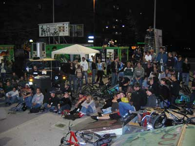

# BMXJAM 04 - Samedi 18 septembre 2004 - Les résultats

Voici les résultats de la BMXJAM 04, organisée par Swiss BMX Freestyle, qui s’est déroulée dans une ambiance de riding et de fiesta hors du commun pour le skatepark de Plainpalais!!

Merci à tous d’être venu si nombreux et j’espère que "comme moi" vous avez passé une bonne journée de bmx freestyle à Genève!

Swiss BMX Freestyle tient à remercier tout spécialement les sponsors qui nous ont soutenu pour cet événement :

- La [Délégation à la Jeunesse](http://www.dej.ch/) et le Département des affaires sociales, des écoles et de l’environnement de la Ville de Genève
- Redbull
- [Felt Bicycles](http://www.feltbmx.com/)
- [Keetch Clothing](http://www.keetch.ch/)
- [48sbmx Shop](http://www.48sbmx.com/)
- Trust&Ride Clothing
- [ActuaNews](http://www.actuafilms.com/) (production audiovisuelle)

Steven Blatter

Swiss BMX Freesytle

Street pro

1. Fred Borel (Suisse)
1. Kevin Guerdmer (France)
1. Kevin Kalkoff (France)
1. Mickaël David (France)
1. Vincent Garreau (France)
1. Laurent "Koum" Kompaore (France)
1. Franck Soulier (France)
1. Hannes Erb (Suisse)
1. Michael Lefebure (Belgique)
1. Stéphane "Shogun" Meneau (France)
1. Arthur Dietrich
1. Sylvain Gautier
1. Bano Danso
1. Santiago
1. Thibaut Lamarche
1. Janik Wenger
1. Gabriel Meckl
1. Timur Karadshajew
1. Marcelo Gordo
1. Marcus Koller
1. Jean-Marie Bartsch

Street amateur

1. Maxime Charvéron (France)
1. Mouky (France)
1. Manu Stemper (France)
1. David Lefebvre (France)
1. François Willer (France)
1. Alex Pittet (Suisse)
1. Clyde Dorion (France)
1. Carlo "Kater" Viscione (Suisse)
1. Nonda Coutsicos (Suisse)
1. Joachim Dovat (Suisse)
1. Nicolas Werle
1. Sebastien Sigillo
1. Rémi El Gouffa
1. Lucas Kneubuhler
1. Cedric Mitaud
1. Selim Dumair
1. Trifon
1. Yohann Cheneval
1. Alban Minon
1. Fred De Haro
1. Actien Steinig
1. Loïc Zbinden
1. Florent Humbert
1. Felix Coelho
1. Olivier Senn
1. Mathieu Chenut
1. Stephen A. Pohl
1. Phillip Heiniger
1. Gogo Gogo
1. Michi Gujer
1. Thomas Bemedetti
1. David Trotti
1. Anthony Iannacore
1. Guillaume Lagunas
1. Michaël Ochsenbein
