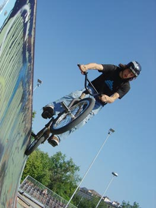

# BMXJAM 04 - STREET - Samedi 18 septembre 2004

Welcome in Switzerland !!! Ca y est, on est le 18 septembre et le joli soleil de fin de matinée m’annonce une superbe journée à venir.

Texte : Thomas Wullschleger. / Photos : Pierre Sirdey et [igeneve.ch](http://www.igeneve.ch/)

Je prend mon bike, quelques minutes de descente et me voilà à la plaine de Plainpalais au centre de Genève, pour cette bmx jam 04. Tous les gars sont là, et y a tellement de riders sur l’aire de street que c’est limite « l’inquiétude»… Mais bon… Le DJ M-A envoie, il est sur le toit du Hummer Redbull, Steven Blatter gère l’organisation et Daniela Vassalli ainsi que Yannick Thirion et Malorie (merci beaucoup pour leur support) gèrent le stand Swiss BMX Freestyle avec les inscriptions, le bar et les nombreuses questions des riders!! Pour moi, ce sera mic en main! Merci aux sponsors comme Redbull, Keetch Cloting, Felt Bicycles, ActuaNews, 48 Spokes bmx shop, Trust and Ride, Oubien Wear, Antishop, Alias-one et bien sûr Swiss Bmx Freestyle, La Délégation à la jeunesse et le Département des affaires socials, des écoles et de l’environnement de la Ville de Genève.

Je dirais qu’il y avait des riders de toute la Suisse, comme Bâle, Thoune, Zürich, St Gall etc, et des riders venus de Grenoble ou de Strasbourg en passant par Lyon… et même un Belge!

L’aire de street est un peu le chaos, mais je vois des smiles et des gars qui s’amusent bien… Il y avait aussi Aurélien et Stephanie de Volx, Franck S. de montpell’, papa G. de St-Etienne, shogun de Lyon. Les Grenoblois n’étaient pas loin, avec des folies ici et la entre le magma de streeters…Sans oublier le crew de locaux , le poissonnier, coquille, mouky, rémi el-g, enfin, tout le oubien-crew quoi !!!

On a eu 35 inscrits en amateur et 21 en pros… On commence le contest avec des pools de 3 avec deux runs pour les amateurs et trois pour les pros.

Pour les amateurs, on était content de voir du bon stuff dont deux riders de 11-12 ans et c’était nice de voir tout le public derrière eux… Pour les dix premiers :

1. Charveron Maxime, une bon petit (13ans!!) avec plein de tricks dont un backflip, et un bon flow !!! Première place bien méritée, et c’est un petit qui est plein d’avenir !!!
1. Blanchant « Mouky » Rémy, il a représenté et fait de lignes variées et bien longues avec un énorme air-over pedal-grind back sur le street-spine et plein d’autres jolies choses…
1. Stemper Manu
1. Lefebure David, du bon stuff! 
1. François « le poissonnier » Fouego, il nous a cramé toutes les arrêtes et copings du coin, en plus il était avec son fan club, alors il nous à mis l’ambiance ! 
1. Pittet Alex de Veyrier, nous à fait des bonnes lignes avec des manuals, pedal grinds et des aérials
1. Dorion Clyde
1. Viscione « Kater » Carlo motivé et breakless il nous à fait deux-trois beaux manuals.
1. Coutsicos Nonda ride avec sa casquette de cheminot et trouve quelques lignes realstreet. Il est aussi le fondateur du new mag suisse « Ilame » ! 
1. Dovat Joaquim

Suite à ça une très bonne démo de Flat au cœur du park avec du beau- monde. C’était cool d’avoir fait entrer le public, avec un big cercle autour des riders, et y avait une très bonne vibe. Je vous laisse lire les détails de la démo flat avec les words d’Alexis Desolneux.

Petit practice et cela va être reparti pour le contest pro !!! Tous ont l air bien motivés et contents de pouvoir rider la place avec moins de monde…

21 riders :

1. Mon Borel Fred à bien représenté ave des ice-picks en haut du vertwall, de la box, ice-pick to over et d’autres trick qu’il aime bien. Il ma aussi étonné avec 3-4 whips sur le spine et un immense superman sur le spine… Aussi un long ice-pick grind attemp sur le vertwall… Du gros F. Borel…
1. Guerdner Kevin, lui aussi nous à tous claqués avec des runs bien sympas.. il commencait « tranquille » et d’un coup nous envoyait du gros voir de l’immense avec des 3.6 whips et autres spécialités lyonnaises…
1. Kalkoff Kevin, avec du rapide, du tech et un style qui donne envie…Du fast plant one hand, des airs, 540 to tailtap to 180, et aussi une sorte de « motocross air nose wheelie dans la courbe »…Merci à toi !!! C’est du bon !!!
1. Mickael David, ah ! ça fait plaisir... des bonnes lignes de la hauteur et surtout l’envie… Du wall, du air et du fufanu … Aussi un nice air to over la barrière latérale du quarter to manual sur la deck du vertical wall et drop dans 1.20 m. de vert… Respect. 
1. Garreau « papa » Vincent , bien représenté lui aussi avec du drill dans différents coins du park et bien sur du gros comme back-flip sur le spine, et ce genre de folies…
1. Le Koum , il représente avec du tech et deux trois big gaps ici et là… un bon 3.6 sur la box ! 
1. Soulier Franck, avec de longueur lignes et un bon style en 3.6 table sur le spine, du aérial, une très bonne routine pour lui…
1. Erb hannes de Thune, avec 3.6 sur le spine, toboggan sur la box, courbe tailwhip attempt…
1. Le belge Lefébure Michael
1. Menau »shogun » Stephane, 900(?) tail tap, barspin to x-up sur la box, tailwhip to tail tap… du grand shogun !!! 
1. Dietrich Athur, il a tout claqué avec un 720 sur la box, et des folies en courbes ! 
1. Gauthier Sylvain
1. Danso bano, libéré exceptionnellement d’Alcatraz
1. Santiago
1. Lamarche Thibaut
1. Wenger Yannick
1. Meckl Gabriel
1. Karadshajew Timur
1. Gordo Marcelo
1. Koller Markus
1. Bartsch J-Marie

Suit de nouveau une démo de flat avec du bon stuff !

Puis un best-trick contest « Attempt » parce que c’était le merdier et on sentait la collision proche… On a quand même laissé les riders s’exprimer 20’min et tellement y avait de bikes que l’on distinguait plus très bien…

Des immenses back-flips d’Omar B. sur la box, du stuff des deux Kevin’s, aussi des deux « papa’s ». Je pense quand même que la plus grande performance à été de ne pas avoir vu arriver les lumières bleues et la sirène…

Première place ex-aequo pour Mickael David et Arthur Dietrich. Pour l’un M. David, cela à été 29 attemps de fufanu sur la barrière latérale du gros quarter et pour l’autre cela à été un 720° en courbe (gros quarter également) voilà !

Ensuite grillades, hang-out, et party time… Pas mal de monde était resté pour enjoyer, et mater la première de la vidéo ETC. de We the Peope en CH. D’autres vidéos ont suivi et cette journée s’est vraiment bien terminée dans la bonne vibes et les riders ont bien festoyé.

Big up à tous ceux de SWISS BMX FREESTYLE qui ont assuré, les sponsors : Redbull, Keetch Cloting, Felt Bicycles, ActuaNews, 48 Spokes bmx shop, Trust and Ride, Oubien Wear et bien sûr La Délégation à la jeunesse et le Département des affaires socials, des écoles et de l’environnement de la Ville de Genève!!!!

See u next year !!!!

Thomas Wullschleger

Swiss BMX Freestyle

Sponsors: La Délégation à la Jeunesse et le Département des affaires sociales, des écoles et de l’environnement de la Ville de Genève, Redbull, Felt Bicycles, Keetch Clothing, 48sbmx Shop, Trust&Ride et ActuaFilms.

