# BMXJAM 04 - STREET - Samstag 18. September 2004

Genau vor einem Jahr bin ich am BMXJAM03 den ersten Contest mitgefahren. Nun ist ein Jahr vergangen und schon stand wieder der nächste BMXJAM im Terminkalender. Doch dieses mal war es anders; es war besser.

Texte : Carlo “Kater” Viscione / Photos : Pierre Sirdey et [igeneve.ch](http://www.igeneve.ch/)

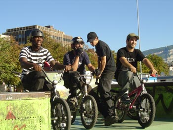

Ich wollte eigentlich schon früh in Genf ankommen, damit ich den Park ein wenig fahren konnte. Doch erstens kommt es anders, und zweitens als man denkt. Denn ich schlief tief und fest bis um 11:00h und ging erst um 12:30h in Bern auf den Zug. Als ich in Genf ankam, war es bereits 14:30h und der Contest der AMs/Street war schon im vollen Gange. Ich war positiv überrascht, die Stände von Swiss BMX Freesytle, Keetch, Oubien, 48spokes und die Verpflegung waren besser platziert als letztes Jahr. Doch Michel musste dennoch seine Teile aus der Flugzone nehmen...Zuerst noch schnell alle begrüsst, dann das Formular ausgefüllt damit ich mich doch noch in die letzte Grupper der AMs/Street quetschen konnte. Nun, es bestand Helmpflicht und da ich keinen dabei hatte, lieh ich mir selbigen von François/Lucifer. Als ich das Level, auf welchem die AMs fuhren sah, stockte mir der Atem: Tailwhips waren der de facto-Standard und wurden teilweise in beide Richtungen gewhippt. Leider war es wieder so, dass sich die meisten Teilnehmer eher der Spine und der Jumpbox widmeten, obschon es immer wieder Gegen-den-Strom-Schwimmer gab, die keine Berührungsängste mit den Ledges, dem Rail oder einem Wallride hatten. Gut so!

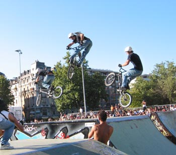

Irgendwann kam ich an die Reihe und ich hatte bis dahin gerade einen Trick gemacht: Bunnyhop den Bürgersteig rauf. Ich war daher überhaupt nicht eingefahren, hatte Hunger und war erst das Dritte mal im Park. Was solls, ich war für den Spass da und “schlechter” als der letzte Platz konnte es nicht werden.

Doch wie ich oben bereits geschrieben habe... Erstens kommt es anders und zweitens als man denkt.

Ich habe nicht mal gesehen, mit wem ich alles in der Gruppe war. Jedenfalls achtete ich nicht auf die anderen, ich fuhr locker durch den Park und machte hier und da einen Grind, ein paar Barspins, 180ies, Crankflips, usw... Im zweiten Run hatte ich absolut keine Puste mehr und rollte völlig planlos über die Fläche.Danach gab es eine kurze “open session” und ich holte mir etwas zu Essen und zu Trinken. Die Preise waren angenehm doch leider war das Essen ein wenig mager. Denn der Hotdog sah lecker aus, aber das Fleisch war dem Geschmack nach eher syntethischer Natur... Dafür gab es sehr leckere Früchte, die zudem noch umsonst waren! Für jeden Teilnehmer gab es zwei Gratis-Redbulls die den Koffeinspiegel schön hoch hielten. Gabe aus Zürich fand den Hotdog auch nicht so toll und spendete ihn Lukas aus Basel, welcher uns zuerst beschuldigte, etwas mit dem Würstchen angestellt zu haben. Wir doch nicht! Egal, endlich mal was im Magen gehabt und nun gabs eine Flatland-Demo die ich mehr oder weniger mitverfolgt habe. Ich fand es viel interessanter, neue Fahrer kennen zu lernen oder alte Bekannte mal wieder zu treffen. Es geht einiges in Genf! Oubien ist nur ein Beispiel von vielem. Tricktechnisch hat sich seit dem letzten Jahr einiges getan, es ist unglaublich, auf welchem Level die Schweiz fährt. Ich hätte es nicht gedacht. Der DJ war ziemlich gut der Moderator hatte teilweise keine Ahnung, wie die Tricks heissen und brachte die Herkunftsstadt der Fahrer meistens durcheinander – aber was solls.

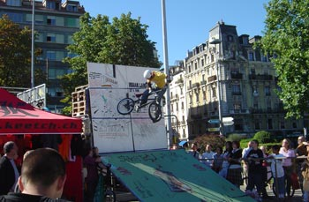

Es hat niemanden gestört und manchmal war es wirklich lustig, was er da ins Mikrophon gesagt hat. Ich könnte mich als Moderator auch nicht konzentrieren, wenn ich so eine Freundin hätte, die mich mitten im Contest besuchen kommen würde...Nach der Flat-Demo konnten die PROs/Street sich einfahren und nach etwa einer halben Stunde gings auch mit dieser Klasse los. Echt, ich habe keinen Schimmer mehr, wer was wo gemacht hat (das weiss ich anscheinend nie nach einem Contest) aber es waren verdammt gute Maneuver dabei. So zum Beispiel der Fufanu von der “kleinen” (schon die kleine ist riesig!) Quarter an das Geländer der grossen Vertquarter. Leider nicht gestanden aber schon nur der Versuch sollte für eine Sprechstunde beim Psychiater reichen... Oder der Tranfser von der Spine in die Pyramide. Das geht doch gar nicht! Doch, es ging nach ein paar Versuchen sogar ziemlich locker! Hätte er dicke lange Dreadlocks gehabt, hätte ich sofort an Nate Wessel gedacht. Ferner gab es sehr schöne und hohe Backflips über die grosse Jumpbox, 360-Whips (scheisse waren die schön!), Truckdrivers und noch vieles mehr.

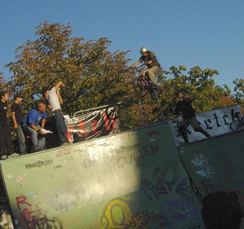

Dann fand natürlich der Flatlandcontest statt, über den wohl besser jemand anderes etwas schreibt.Nicht gut waren die Zwischenfälle mit den Leuten, die meinten, mitten im Contest den Platz zu überqueren und zwar ohne sich umzusehen oder zumindest sich zu beeilen. So flog dann ein Mädchen sicherlich zwei Meter weit, als ein Fahrer sie regelrecht umnietete. Hoffentlich hat sie sich nicht verletzt, denn obschon es eigentlich ihre Schuld gewesen wäre, hätte sowas nicht sein müssen. Zumal der Kommentar vom Moderator sehr deplaziert war. Der andere Zwischenfall lief glimpflicher aus, ein Mann verübelte einem Fahrer die Vollendung seines Tricks. Ist ärgerlich aber zumindest ist nichts schlimmeres geschehen. Schlimmer sah es für Jean-Marie aus, der übel auf die Schulter und den Kopf gestürzt ist. Gute Besserung an dieser Stelle!

Irgendwann entschieden sich dann die Leute entweder weiter den Park zu fahren oder sich dem Bier zu widmen. Zwischendurch gab es noch einen Best-Trick-Contest, der jedoch soweit ich weiss ziemlich im Sand verlief.

Die Videopremiere habe ich leider nicht gesehen, da ich ansonsten nicht mehr nach Hause gekomen wäre – schade!

Insgesamt ein sehr gelungener Contest mit vielen Überraschungen, vielen Leuten, sehr schönes Wetter und angenehme Temperaturen. Lediglich das Essen hätte besser und vielfältiger sein können.

Ich möchte an dieser Stelle allen Beteiligten Danken, vor allem Steven Blatter und Daniela Vassalli, der Stadt Genf, den vielen Fahrern, den Helfern, dem Petrus für das schöne Wetter und allen, die irgendwie etwas für die Realisation des Contests beigetragen haben. Danke vielmals und bis nächstes Jahr!

Carlo “Kater” Viscione

Swiss BMX Freestyle

Sponsors: La Délégation à la Jeunesse et le Département des affaires sociales, des écoles et de l''environnement de la Ville de Genève, Redbull, Felt Bicycles, Keetch Clothing, 48sbmx Shop, Trust&Ride et ActuaFilms.

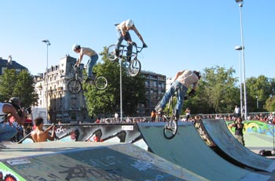
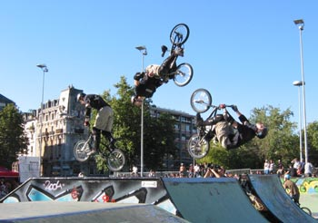
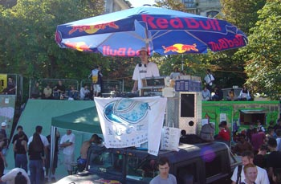
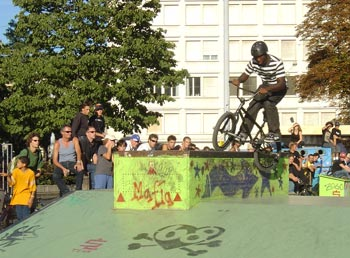
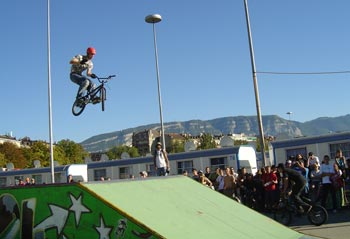
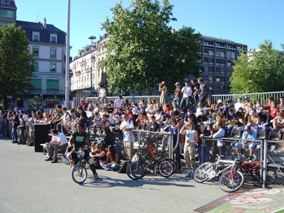
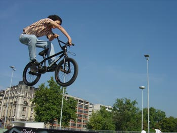
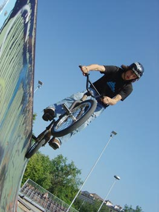

