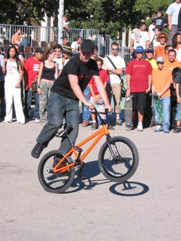

# BMXJAM 04 - FLATLAND - Samstag 18. September 2004

Neben dem Streetcontest fanden auch noch zwei Flatland-Shows statt. Weltmeisterin Karin Bleile aus Basel, Felt-Teamrider Steven „El Presidente“ Blatter aus Nyon und Christian Wolf aus Fribourg, Oli Müller, Stefan "Lazer“ Löber und ich selber aus Zürich repräsentierten gemeinsam mit Monsieur Alexis Desolneux aus Frankreich die Flatlander auf dem Platz.

Texte : Marco Vetterli / Photos : Pierre Sirdey et igeneve.ch

Die zahlreichen Zuschauer bildeten einen grossen Kreis um das Geschehen und so konnten wir einen richtigen Circle-Jam fahren. Pumpender Funk und Hiphop aus den tiefsten Untergründen der grossen weiten Welt versorgten uns mit der nötigen Energie. Während Karin, Steven und Christian lange Runs rollten und dabei so sicher schienen, als würden sie solche Shows jeden Tag zum Frühstück fahren, waren wir aus Zürich eher etwas zappelig unterwegs. Nichtsdestotrotz hatten wir unseren Spass. Karin rollte smoothe backwards-Hitchikers, Steven pedalierte im upside-down-Wheelie durch die Gegend, Christian switchte sich ohne Ende um sein Rad, Oli killte die Fläche mit Hang5-G-Turns, Stefan pushte backwards-no-handed-Crackpackers, ich selber versuchte mit tausend und einem Spin die Zuschauer zu hypnotisieren und Alexis rockte mit brutalen Whiplash-G-Turn-Sachen den Zuschauerkreis und kämpfte bis zum Ende der Show mit diesem Run. Die Zuschauer applaudierten ohne Ende, die jungen weiblichen Groupie-Fans kreischten hysterisch um sich und wir konnten unzählige Autogramme auf ihre nackten Bäuche kritzeln…

Die richtig guten Jams fuhren wir aber vor und nach den Shows. Gemeinsam mit der ganzen Show-Crew, Andy Walter und Kili Stocker aus Stans/Luzern tourten wir quer durch ganz Genève-City. So lud uns ein Schulhausplatz in der Nähe des Contests ein, auf ihm zu rollen und zu jammen. Und auch auf einem weiteren Platz, welcher tief im Untergrund eines modernen Schulgebäudes eingebettet war, wurden unsere Reifenspuren ebenfalls fett eingraviert. Alle gingen gut ab und es war richtig fett, mit so vielen Leuten eine Session fahren zu können – dies kommt in der Schweiz leider eher selten vor.

Merci beaucoup an Steven für die Organisation dieses Hammer-Contests, wo auch das Flatlandfahren nicht zu kurz kam!

Peace

Marco Vetterli

Swiss BMX Freestyle

Sponsors: La Délégation à la Jeunesse et le Département des affaires sociales, des écoles et de l''environnement de la Ville de Genève, Redbull, Felt Bicycles, Keetch Clothing, 48sbmx Shop, Trust&Ride et ActuaFilms.

