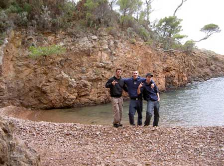
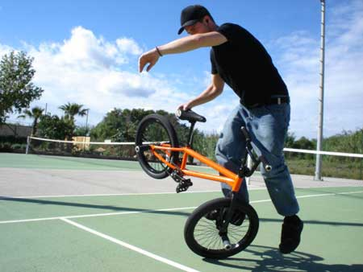
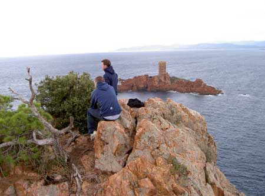
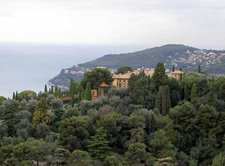
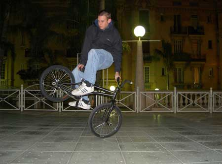
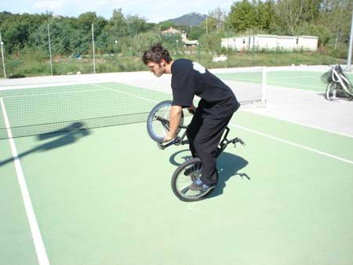
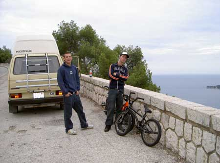
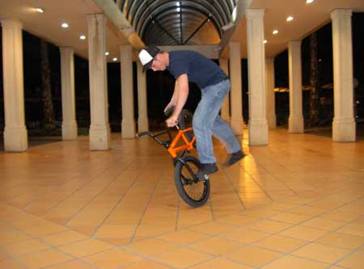

# Zürich flatland crew roadtrip : Côte d’Azur 13-17.10.2004

Drei Zürcher (Oli Müller aka Oulioulzn, Stefan Löber aka Mister Däbzn Schtil und ich selbst), drei Kinderfahrräder und ein 20 Jahre alter VW-Bus namens Westfalia Joker… doch, das muss gut kommen.

Texte : Marco Vetterli

Photos : Drei Zürcher

Mittwoch:

Als wir uns am Mittwochmorgen am Zürich Hauptbahnhof trafen, erhielt unser Reisemobil bereits Unmengen von Sympathiepunkte. Schon beim ersten Betrachten versprach es mit den 4 Gängen und einem extrem schwachen Motor (maximal 120kmh bergab, maximal 80kmh bergauf - im 3ten Gang) abenteuerliche Fahrten. Unsere erste Strecke war aber nur sehr kurz. In Stans/Luzern trafen wir spontan auf Andy Walter und fuhren gemeinsam eine lockere Session auf seinem Spot. Dann lag die erste grosse Route vor uns: über Milano bis nach Genua, wo wir bis nach Monaco der Küste entlang cruisten. Schöne Landschaften, pumpender Hiphop aus den kaputten Boxen und kleine Probleme mit unserem Gefährt prägten die Fahrt. Vor unserem Ziel kam es zu einem heftigen Kampf zwischen starkem Seitenwind und Mister Oulioulzn als Steuermann des Büsslis. Oli meisterte die Herausforderung glanzvoll, das Büssli jedoch gab fast den Geist auf. Kurz danach merkten wir auch noch, dass sein Motor furztrocken war. Richtig spannend wurde es aber erst, als der Tachozeiger auf einer Autobahn ohne Pannenstreifen immer mehr in Richtung 0 zuckte… Doch Geduld, Optimismus und frisches Motorenöl retteten uns. Kurz den Schweiss von der Stirn gewischt und schon spürten wir wieder den Asphalt unter den Rädern. Im luxuriösen Monaco angekommen, entdeckten wir einen scheinbar perfekten Spot und fuhren dort eine erste Nightsession – bis die Gabel von Däbzn brach… Naja, der Platz hielt eh nicht, wonach er aussah… Und so entschieden wir uns, die Reichtümer von Monaco zu besichtigen, sprich Casino, Jachten und Autos… blingbling… RollsRoyce, Ferrari, Porsche und Lamborghini wohin das Auge reicht. Und die Jachten erst… muss man gesehen haben. So viel Reichtum auf einmal macht arme Kinderfahrradfahrer natürlich müde und so parkten wir wenig später direkt neben einer Hauptstrasse, um dort im Inneren des Büsslis zu übernachten. Good Night…

Donnerstag:

Nach einer unruhigen Nacht (wir waren ja auch direkt an einer Hauptstrasse) merkten wir erst am nächsten Morgen, was für eine Aussicht wir von unserem Schlafplatz hatten. Bevor wir aber überhaupt richtig wach waren, fuhren wir weiter in Richtung Nizza. Die Nachtruhe hatte dem Büssli gut getan und so fuhr es vergnügt und ohne Probleme über die Strassen. In Nizza angekommen erfreuten wir uns zuerst eines dicken petit déjeuners. Danach verpassten wir Däbzns Baby eine neue Gabel während Oli zeigte, was wahres Radgefühl ist. Er rollte auf Däbzns losem 20-Zoll-Rad mit Pegs und drehte dabei 2 G-Turns! Hesch gsee dr Olllli… Und dann gings zur ersten fetten Session dieses Trips. Direkt vor der wunderschönen Kulisse des Meeres auf der breiten Strandpromenade rollten wir – vor allem Mister Däbzn Schtil. Dies war seine Session und er pushte unter anderem einen fetten Crackpacker-G-Turn. Stylisch! Gerade als wir zu unserem Büssli zurückwollten, setzte der Regen ein. War uns aber egal, da wir schon wieder auf dem Weg nach Cannes waren. Leider durchquerten wir dieselbe Stadt nur kurz und konnten keine Spots checken. Unser nächstes Ziel hiess St. Raphael. Als die Gegend verlassener wurde und das Gefälle der Strasse langsam anstieg, gönnten wir dem Büssli und uns selbst eine Verschnaufpause. Wir waren nun mitten in der Provence, die Felsen waren feuerrot und der Himmel stahlblau – perfekt um einige Fotos zu machen. Nach einer verspielten Klettertour jagte Mister Däbzn Schtil unser Büssli gnadenlos den Berg hinauf- und hinunter. Er kannte kein Pardon, auch wenn das Büssli vor Erschöpfung stöhnte und mir sich auf dem Rücksitz fast der Magen umdrehte. Viele Kurven später parkten wir schliesslich in St. Raphael. Hier war kein Mensch auf der Strasse zu sehen. Von sämtlichen Bars und Restaurants, welche im Sommer wahrscheinlich übervoll sind, war nur ein Bruchteil geöffnet. Diese Tatsache störte uns aber nicht im Geringsten. Wir kauften uns eine gute Lektüre (Cream) und wärmten uns in einer extrem gemütlichen Bar auf. Hier wurde gefachsimpelt, gechillt und natürlich auch ein bisschen getrunken. Und wir hatten Zeit im Übermass! Schöne Sache! Ein-zwei Stunden später ging’s von diesem Ort des Friedens wieder hinaus auf die leeren Strassen, wo wir nach langem Verhandeln mit zwei nicht-systemkonformen Menschen aus der kriminellen Szenen schliesslich zwei lustige kleine braune Platten «erhaschten». Jetzt mussten wir nur noch einen Platz zum schlafen finden. Zum Glück kannte sich Oli in der Gegend aus uns lotste uns an eine kleine Hafenbucht ausserhalb von St. Raphael. Dort richteten wir unser Schlaflager ein und nach einem kleinen kräuterartigen «Guätnachtmümpfeli» schwebten wir unseren Träumen entgegen.

Freitag:

Der Freitag-Morgen war schön, richtig schön. Die Sonne weckte uns und wieder sahen wir, wie idyllisch unsere Umgebung war. Ein kleiner Fischerhafen (le Port de Poussai) und «l’Ile d’or» (die Goldinsel) lagen direkt vor unserem Parkplatz. Den Morgenhunger stillten wir in einer Zmörgeli-Börgeli-Bar und nach einer Partie Billard kehrten wir nochmals an den Port de Poussai zurück. Dort führte uns Oli, der sich hier besser auskannte als ich in meiner linken Hosentasche, durch einen dichten Wald zu wunderschönen Klippen direkt am Meer. Wieder erklimmten wir die Felsen bis wir ganz oben die fantastische Aussicht auf das Meer geniessen konnten. Hammermässig! Auf dem Rückweg zu unserem treuen Büssli begann es von neuem zu regnen. So konnten wir den vorher entdeckten Hart-Tennisplatz nicht mehr checken, schade… Mit dem Ziel St. Tropez vor den Augen drehten wir den Schlüssel im Zündschloss des Büsslis und nach einigen Versuchen bewegten wir es wieder on the road. Und es regnete und es regnete und… Nach einer feucht-fröhlichen Fahrt kamen wir schliesslich in St. Tropez an und machten uns auf die Suche nach einem Parkplatz. Diese sind dort aber nur für Autos bis 1.70 Meter Höhe gebaut, es sei denn man parkt auf dem Busparkplatz und zahlt 7 Euro pro Stunde… Leider gehören wir aber nicht zum Porsche-Club St. Tropez, welcher hin- und wieder an uns vorbeiraste und so parkten wir auf einem riesigen Supermarkt-Parking ausserhalb von St. Tropez. Der Eingangsbereich des Supermarkts war überdacht und belichtet, der Boden war auch nicht schlecht…doch dazu später mehr.

Der Regen liess langsam aber sicher nach und wir machten uns auf die Suche nach einem Campingplatz und einer Duschmöglichkeit. Gesagt, getan, und wir fanden den Übervater aller Campingplätze. 6’000 Wohnmobile können sich dort verteilen. Bei unserer Ankunft waren aber nur etwa 200 am Start. So konnten wir uns einen gemütlichen Platz für unser Büssli aussuchen. Wieder waren wir direkt am Meer und weil uns jetzt eine warme Dusche bevorstand, gaben wir dem Drang, noch schnell ins Meer zu hüpfen, nach. Und ja, es war etwa sooo kalt. Nach einer laaangen Aufwärm-Dusche und einem Kampf gegen den «Chappächäs» waren wir wieder richtig fresh unterwegs und genossen im Camping-Restaurant ein fettes Nachtessen. Nach dem Essen wollten wir unbedingt flatlandfahren, doch es war überall nass. Hm, da war doch ein Supermarkt-Eingangbereich… Keine Frage, ab geht’s… Bevor wir aber die Fläche einnehmen konnten, mussten wir noch warten, bis der Laden dichtmachte. Und dann, endlich, wurden die Türen geschlossen und der Platz leer. Es war bereits 22Uhr als wir die ersten Runs über die Fläche rockten. Dies war unsere Zeit. Gemeinsam fuhren wir eine Hammersession im Untergrund-Style deluxe. Oli wütete G-Turn-Stuff auf die Fläche, welche stiltechnisch kaum überboten werden können. Stefan hatte etwas mit dem Belag zu kämpfen, trotzdem rollte er minutenlange Runs. Und ich erfreute mich am schnellen Boden, welcher perfekt für schnelle Spins war… Auch Polizei und Security hatten ihre Freude an unseren kleinen Kunsträdern und hatten nichts gegen unsere Präsenz einzuwenden. Wieso kann die Polizei nicht auch in der Schweiz so tolerant sein… Nach drei Stunden Hardcore-Riding mussten wir zum Camping zurück, da dort die Tore schlossen. Am Strand noch gemütlich ein Räucherstäbchen angezündet und dann lagen wir auch schon in unserem treuen Weggefährten und packten uns in die Schlafsäcke…

Samstag:

Wie immer fing der Morgen wunderschön an. Heute war der Himmel wirklich stahlblau und wir konnten die Sonne bereits beim Frühstück in vollen Zügen geniessen. Da wir um 16.00Uhr den Campingplatz verlassen mussten, checkten wir noch die Harttennisplätze auf dem Camping-eigenen Multi-Sport-Terrain. Der Platz war nicht schlecht und so rollten wir eine letzte Session im Sonnenschein. Oulioulzn pushte mittlerweile seine Backpacker-G-Turns in beide Richtungen richtig fett und wütete unaufhaltsam alles in Grund in Boden (han ä vollä Schaadä, wiät alläs aabä). Nach ein paar Stunden rollen, spinnen und switchen verschloss Petrus die Himmelspforten und drohte mit Regen. Grund genug für uns, noch einmal dem Genuss einer frischen Dusche zu frönen und uns langsam aber sicher auf unseren Heimweg zu machen. Also alles reisetüchtig zusammengepackt, dem Büssli noch etwas Öl gegeben und schon cruisten wir weg vom Meer ins Landesinnere. Zu diesem Zeitpunkt wussten wir noch nicht, welche Abenteuer uns noch erwarteten… Wir wählten die «Route de Napoléon», welche sich von der Côte d’Azur bis nach Grenoble zieht. Doch was auf der Landkarte wie eine schöne dreispurige Autostrasse aussah, entpuppte sich als winzige, äusserst kurvenreiche Raserstrecke, welche hoch über unzivilisiertes Gebirge führte. Ein Traum für jedes Auto mit genügend Leistung unter der Haube. Da wir ja mit unserem 70PS starken, fast zwei Tonnen schweren und Öl verlierenden Büssli unterwegs waren, mussten wir gehörig das Gaspedal drücken, damit wir vorwärts kamen. Aber wir hatten ja genügend Zeit und nahmen uns diese auch. Gemütlich tuckerten wir über das Gebirge und bewunderten die wilde Landschaft. Gegenverkehr hatten wir bis auf eine riesige Schafsherde praktisch keinen. Das Büssli wurde zwischendurch immer wieder mit viel Öl versorgt und so fuhren wir in die Nacht hinein. Es war schon richtig dunkel, begann von neuem zu regnen und wir waren fernab von jeglicher Zivilisation. Der Strassebelag war extrem glitschig und wir mussten aufpassen, dass wir nicht vom rechten Weg abkamen. Und wir waren nicht die Einzigen. So konnten wir im letzten Moment noch anhalten, als wir einen BMW sahen, der direkt aus der Kurve auf eine Steilwand zuschleuderte und dort fast senkrecht hängen blieb. Sofort stiegen wir aus und halfen dem französischen Ehepaar aus ihrem Fahrzeug. Zum Glück waren beide unverletzt, doch aus eigener Kraft hätten sie es kaum aus dem Auto geschafft. Nun mussten wir bei stockdunkler Nacht und prasselndem Regen auf den Abschleppdienst warten. Nach fast zwei Stunden war alles geregelt und wir machten wir uns um 80 Euro reicher (die verunfallte Frau war überglücklich und dankte uns für unsere kompetente Hilfe…) auf den Weg ins nächste Restaurant. Nach einem dicken Nachtessen und wieder aufgewärmt cruisten wir noch einige Kilometer und parkten kurz vor Grenoble auf einer unheimlichen Raststätte. Es war so dunkel, dass wir bis auf zwei weisse Geisterhäuser und eine stillgelegte Cafeteria nichts erkennen konnten. Steven King lässt grüssen. Doch wir waren ziemlich geschafft und so schliefen wir nach einem gemütlichen traditionellen Doobie schnell ein.

Sonntag:

Dreimal darf man raten; ja der Morgenhimmel war wieder strahlend blau und ja, unsere Umgebung war nicht mehr Steven-King-like, sondern wieder malerisch ländlich. Und es war verdammt kalt heute. Bevor wir weiterfahren konnten, mussten wir unsere gefrorenen Körper an der Sonne auftauen. Als wir uns wieder bewegen konnten, fuhren wir bis zum nächsten Dorf und frühstückten gemütlich. Nun mussten wir bereits die zweite Etappe unserer Heimreise in Angriff nehmen. Wir überquerten Berge, durchbrachen sogar die Schneefallgrenze und schliesslich waren wir wieder mitten in der Zivilisation. Die kurvige abenteuerliche Landstrasse wurde zur Autobahn und wir cruisten der Schweiz entgegen. Nach einem letzten französischen Mahl passierten wir schliesslich den Zoll. Den Katzensprung von Genève nach Zürich war schnell geschafft und ehe wir uns versahen, standen wir auch schon wieder vor unseren Haustüren…

Retrospektive

Faszinierend, wie schnell man sich frei fühlen kann. Für mich persönlich ist ein solcher Road-Trip immer ein Losreissen von der Gesellschaft, ein paar Tage völlige Freiheit und Zeit, mit der man machen kann, was man will. Immer wieder wird mir so bewusst, dass es die Zeit ist, welche wir manchmal vielleicht zu wenig schätzen.

Ganz klar wurde der Road-Trip auch geprägt von unserem VW-Westfalia-Joker-Bus. Er ist mindestens so sympatisch wie er alt ist. Ja, er trank literweise teures Öl, doch solche Macken machen’s ja bekanntlich aus. Deshalb gibt’s fette Props von mir an unser Büssli! Und noch fettere Props möchte ich meinen Weggefährten Mister Däbzn Schtil und Oulioulzn widmen! Ihr wisst was zählt: Hesch gsee di andärä; Undrgrund-Schteil! Rrrrä, wiänä Uzzi, nää wot nit du si…

Peace

09.11.2004
