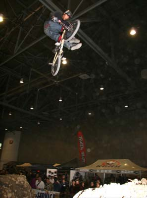
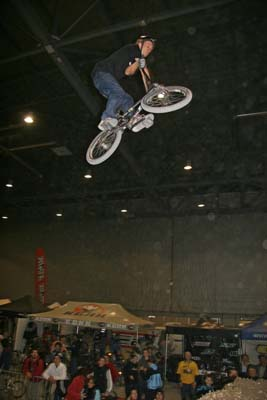
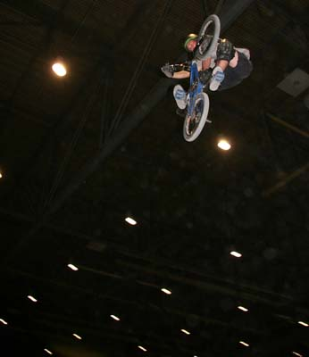
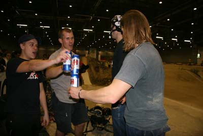
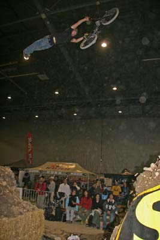
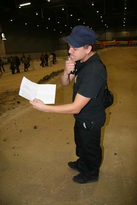
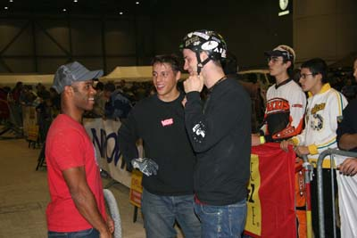
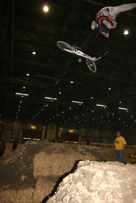

# Dirt Contest au Palexpo, 3 décembre 2004

Texte : Thomas Wullschleger / Photos : D. Frei

Yeeeeez, that’s it !

Voilà enfin le report du K.O.D de Palexpo, lors du premier Indoor bmx race de Genève. Cet event à été initié par le bmx club de Genève, et il ont demandé à SBF d’organiser un contest de dirt.

C’était un peu « mission » parce que il y avait trop de trucs incertains (lieux de la bosse, terre, …) et 1 semaine avant c’était pas sûr que cela aurait lieux. Au niveau sponsoring, c’était aussi dernière minute, mais finalement la Délégation à la jeunesse de la Ville de Genève, le bmx club gva, et le magasin « sold » nous ont soutenus.

Pour la première édition, ce sera malheureusement qu’une seule bosse « old school ». Je l’ai préparée toute la semaine, et un « yeee » pour Stephane Bachmann, coquille et mouky pour avoir donné de la sueur pour le jump…En plus, c’était la galère car il fallait mettre de la paille sous le jump, car il y avait un poids/m 2 à respecter et ce genre de manœuvre c’est la doffe.

Samedi 4th décembre, ca y est on va sessionner. Pas mal de monde était là, du Genève, les Suisses-Allemands, et 2-3 Français. Tout le monde se rassemble autour de la K.O.D’euse. Le training se passe et on va rider deux séries de trois jumps, entre les ¼ et ½ de race. Ah ouais, thanks au juges pour avoir été là, et après délibération, d’avoir donné la sentence. Ils sont : Cédric Coquille, Elvis Meury, et Marco de ZH. Le contest démarre avec un décollage bien attaqué par les pneus et avec une terre trop humide, seul des planches (fait chier…) fera faire rouler le truc.

Ranking :

13. Ben c’est moi même ! Après un condor, et un 3-6 to ruine, c’était déjà l’heure de poser le vélo…Aie…
12. Sven de ZH, il était bien à bloc et avec un vélo monté plutot street, il à bien envoyé avec du basic et il s’est acharné avec 10 tentatives de superman trop strechés, mais il l’a tout juste pas posé. Mais avec trop l’envie de rider.
11. Adrien « clap » était présent et malgré peu de training il a pu envoyer deux trois bons trucs comme des no hands, can-can et avec des nothing’s. Et d’ailleurs il s’est pris un vilain crash sur un de ces derniers. Il a tout de même continué la session et respect !
10. C’est alex Gilson. Rider de France mais je dois dire que je me souviens pas trop si c’est lui le « jeunot » qui à participé au contest ou 
9. Joaquim Do lui aussi de F. Mais bon riding et certainement un bon petit trail derrière eux.
8. C’est le Gordo ! Des jumps bien nices, avec des barspin’s , to-x, no-hands, x-up one hand. 
7. Hannes Herb. De Thoune et se déplace toujours à la moindre occasion nous sors du bon avec des bonnes hauteurs, du stylé et à aussi fait des can-can no-foot, des gros 3-6. 
6. Schmucky. Yé, il a bien représenté et lui aussi il a fait des big’s 3-6’s et avec une maniere bien a lui et ça faisait bien plaisir à voir.. Avec des autres tricks il a bien représenté. 
5. Marvin Rahin. Français lui aussi et il nous a tous impressionnés je pense. Des pires hauteurs, des turndowns trop poussés et des bons table’s. Il a été vaillant tout du long et il ne s’est pas découragé malgré un « jeter de bête » pdt le training. En plus il s’est élancé pour un backflip en fin de contest et il est monté trop haut !, mais juste trop tourné.
4. Stephan Meyer. De Zh de son spot de Ilnau il est venu et à bien performé. Des fat’s un-Turndowns, turndowns, one-hand, can-can, du no-hand’s et bien plus encore. Du grand S. Meyer !!
3. Laurent Koum. Il était bien chaud aussi avec des 360’s , du x-up ou no-hands, et du stuff. 
2. Bachmann Stephane. Ah ! il était là!! Avec des un-turndowns, nac-nac’s bien old school, et deux trois jumps de stéphane dont il est le seul à avoir le secret. Du bon riding !
1. Borel Frederic. Une fois de plus il nous a impressionnés avec ses tricks stretchés, mais bien, …hein ! Tailwhip, s-m seat grab, et tout le reste. Deux trois glissades ici et la, mais ça l’a pas découragé pour remporter ce premier king of Dirt à Palexpo.

Merci encore à la Délégation à la Jeunesse de la ville de Genève, le Bmx Club Genève et le magasin « SOLD » pour leur sponsoring. Yes à tout ceux de plainp’ et environs d’être venus soutenir les riders ! See you next year !!!

Thomas Wullschleger

Swiss BMX Freestyle

