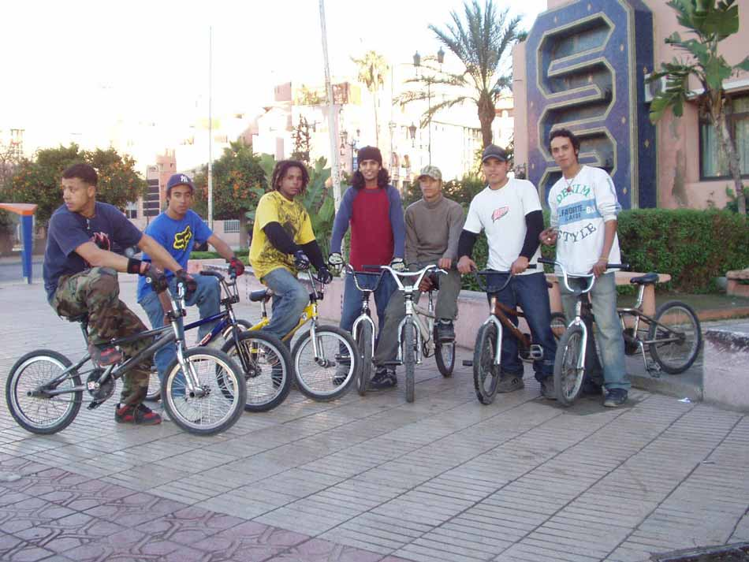
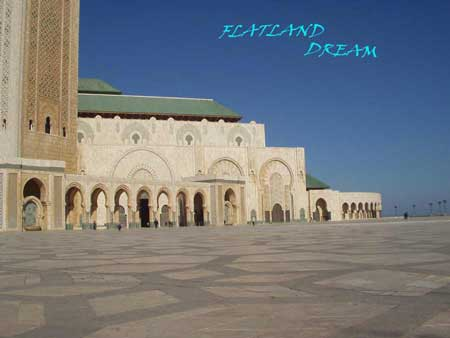
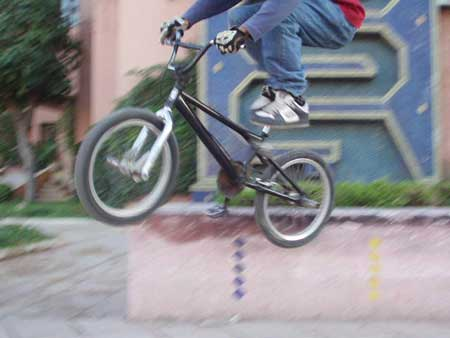

# Un flatlander lausannois au Maroc

Pendant les vacances de Noël je suis parti au Maroc. J’ai visité différentes villes comme Casablanca, El-Jadida, Marrakech, Essaouira, Ouarzazate, etc. En traversant toutes ces villes mon vœu était de rencontrer des gens qui pratiquent le BMX flat, comme moi, ou juste quelqu’un qui fait du BMX : street, flat ou dirt. Mais bon, pour que mon vœu s’accomplisse j’ai dû attendre longtemps.

Texte et photos : Kudaibergen Gionibek

3 jours avant mon retour en Suisse, mon rêve s’est réalisé, ce à quoi je ne m’attendais pas du tout. A Marrakech, près de la Poste principale, où je passais au moins 3-4 fois par jour pendant presque 2 semaines, je les ai enfin rencontrés. En plus c’était un grand groupe de riders, il y avait au moins 10-14 personnes, qui faisaient du BMX.

Après avoir fait chaleureusement connaissance, ils m’ont montré leur style. Ils faisaient du street et ils avaient un bon niveau, j’ai beaucoup aimé. Malheureusement comme je pratique plutôt le flat que le street, je ne connais pas bien les noms des figures de street. Mais ils faisaient du genre: barspin, double grind-no hand, nose grind, smith, x-up grind, wheeling, etc.

Après avoir pris quelques photos d’eux. J’ai voulu rider un peu, mais je n’avais pas pris mon vélo, alors ils m’en ont prêté un et je leur ai montré un peu de flat, mais avec un Bmx de street, surtout sans freins, je n’ai pas pu poser mes tricks à moi que je sais faire. Mais ils ont quand même aimé, car il n’y avait personne qui faisait du flat !

Après quelques discussions avec ces riders j’ai appris que dans tout le Maroc, qui est au moins 10 fois plus grand que la Suisse, il n’y a pas un skatepark. En plus les riders marocains disent qu’ils ont de petits problèmes avec la police. Et si j’ai bien compris ils demandent une aide aux Suisses et aux autres pour aider les marocains à construire au minimum un skatepark, (car les autorités ne veulent pas), ou bien juste les aider avec quelque matos.

J’ai trouvé que les riders marocains sont très sympas et trop cools. Ce que m’empressionne c’est qu’ils n’ont pas peur de se casser la gueule, ils ride comme des fous et surtout ils sont très motivés. Ils disent qu’ils aimeraient encore rencontrer des riders de l’étranger et ils nous incitent à venir à Marrakech, car il y a pas mal de spots illégaux pour street et flat.

Pour les flatlandeurs j’ai une petite surprise: à Casablanca, au bord de l’océan atlantique j’ai découvert la mosquée Hassan II, l’une des plus grandes mosquées du monde. Ce qui est hallucinant c’est qu’aux pieds de la tour de cette mosquée il y a un immense terrain (voir la photo), d’environ 200X300 m2, couvert de marbre rouge, si je me ne trompe pas. Malheureusement je ne sais pas si on peut rider ou non sur cette place, à mon avis ça ne ferait de mal à personne !

Bon Ride à Tous !!!

Kudaibergen Gionibek

Swiss BMX Freestyle

