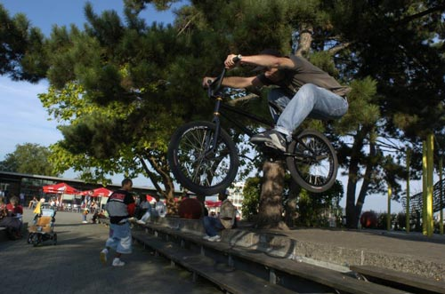

# Strassenleben

Nein, ich lebe nicht auf der Strasse. Das nur vorweg. Hier geht es ausschliesslich um gute Streetspots und um Bern. Nein, Rampen kommen hier auch nicht vor. Ja, es gibt Streetspots in Bern.

Texte und rider : Carlo "Kater" Viscione / Photos : Pirate Splint

Wenn ich Leute aus anderen Städten frage, wie denn ihre Streetspots sind, erhalte ich häufig die Antwort "...eigentlich haben wir keine Spots...". Selbst bei grösseren Städten wie Zürich oder Genf ist diese Meinung stark vertreten.

Ich habe mich oft gefragt, ob das wirklich stimmt, oder ob die jeweiligen Fahrer zu hohe Erwartungen haben. Dinge wie "curved wallrides" oder schöne, grosse Plätze aus Granit und Marmor mit "ledges", "rails" und Treppen sind in der Schweiz sicherlich dünn gesät (wenn überhaupt vorhanden). Jedoch gibt es alleine im altmodisch-langsamen Bern diverse Streetspots, die ich regelmässig besuche, auch wenn es nichts wirklich besonderes ist.

Da wären beispielsweise die "Ausserholligen Banks": Etwa 12m breit, 3,5m lang, relativ steil und mit einem Zaun am oberen Ende der sich prima als "fence ride" vergewaltigen lässt. Die Anfahrt ist grossräumig und nur manchmal ein wenig zuparkiert. Direkt vor den Banks und mit ihnen verbunden ist ein Absatz (Trottir) der aber überhaupt nicht stört. Im Gegenteil, man kann viele Tricks darauf aufbauen. Die Banks und alles Drumherum sind übrigens beleuchtet und fast gänzlich überdacht. Kein Wunder, der Spot besteht aus einer Autobahnauffahrt und Parkplatz. Dieser Spot ist sicherlich schon ein grosses Highlight unter Berns Schauplätzen der urbanen Kultur.

Nur 200m weiter stadteinwärts auf der linken Seite steht ein perfektes Handrail. Lang, mit Kink und noch Jungfrau. Wer sich Handrails runterschmeisst, sollte dort unbedingt vorbeischauen. Ich will aber Fotos davon!

Im Zentrum, nämlich am Hauptbahnhof, besser gesagt auf dem Dach des Bahnhofs, auf der "grossen Schanze" befindet sich ein grosses Areal mit einem Granitbrunnen, der zum Grinden einlädt. Er ist fast quadratisch und unterschiedlich hoch (von ~20-50cm), von allen Seiten anfahrbar und im Sommer natürlich mit Wasser gefüllt, was aber nicht tragisch ist. Der Brunnenrand ist genügend breit um darauf fahren zu können. Und sonst gibts halt eine kühle Erfrischung.

Die "grosse Schanze" ist ein grosser Platz mit vielen Curbs, Bänken, Treppen und Absätzen, einem Restaurant, einer grossen Rasenfläche mit Liegestühlen und Ausblick über ganz Bern. Ein wenig daneben auf der gleichen Höhe befindet sich die Universität, die neben ziemlich hohen Curbs zwei Holzquader (ca. 50 und 70cm hoch) anbietet. Eine Treppe mit Handrail gibt es auch noch.

Wer Bern ein wenig kennt, kennt vielleicht auch das "Guayas", welches eine House-Disco ist. Das interessante ist sicherlich nicht die Disco, sondern die Treppen mit der riesigen Ledge auf der linken Seite. Nicht sehr hoch, aber steil und enorm rutschig. Auch sie wurde noch nie befahren, ist aber definitiv machbar (Fotos!).

Falls man sich die "Guayas-Ledge" nicht traut und zum nächsten Spot will, muss nur 3min gemütlich fahren um seine Pegs abnutzen zu können. Von der "Guayas-Ledge" aus gesehen alles geradeaus der Strasse entlang den Schienen folgend und schon kann man ein paar Curbs grinden die von allen Seiten aus anfahrbar sind und sehr gut rutschen. Sie sind verschieden hoch (ca. 40/70cm). Daneben noch eine kleine 3er Treppe.

Bestimmt gibt es noch andere gute Spots, die einen Besuch wert wären, ich muss sie nur noch ausfindig machen. Sogar in solch einer alten, urchigen Stadt gibt es also gute Streetspots. Vielleicht nicht unbedingt für die "höher-schneller-weiter"-Fraktion, aber Techniker werden garantiert auf ihre Kosten kommen.

Also, wenn Bern sowas hat, werdet ihr da draussen sicherlich auch fündig. Schaut euch um und geht in Quartiere und auf Schulen, die ihr noch nicht so genau unter die Lupe genommen habt. Es kommt nur darauf an, wie man die Dinge sieht und was für Erwartungen man hat.

Ride on.

Carlo "Kater" Viscione

Swiss BMX Freestyle

