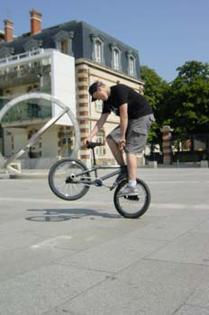
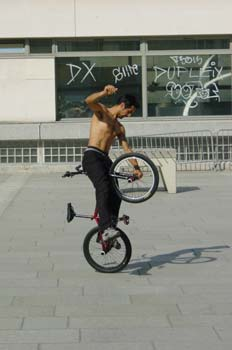
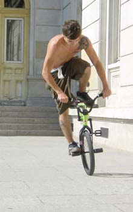
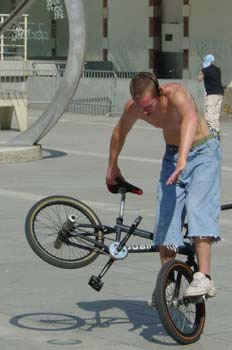
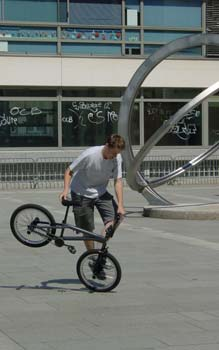
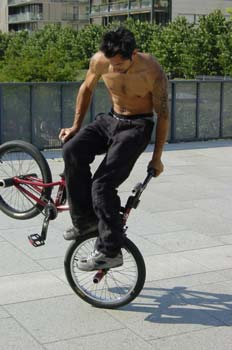
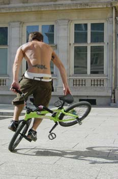

# Un flatlander suisse à Paris

Paris

De passage dans la ville des lumières pour un court séjour je décidais de trouver des collègues de ride, les BMX n’étant pas accepté dans l’avion et n’ayant pas pu prendre le train cette fois ci pour diverses raison je du laisser mon matos à la maison.

Je fis donc le tour des spots connu à paris et référenciées sur agoride et j’appris donc qu’entre les places envahies de touristes japonais ,les places interdites au noble art du BMX et les recoins sombres de la capitale française il n’existe que quatre spots encore fréquenté régulièrement par les riders parisiens. Il y a le Dupleix ,une place de taille moyenne (demi salle de gym) au grand air dans un quartier calme avec un petit coin à l’ombre pour se poser en cas de grosse chaleur mais pas assez grand pour rider en cas de grosses grosses chaleurs ,autre désavantage la place ferme à partir de 19h30 et une trop forte affluence de gamins certains jours ne permet pas de rider ,j’y ait rencontré Manu Massabova ,Romain et Andy, le premier jour c’est Andy qui m’a accueilli et voulant déjà trouver d’autres riders il m’a redirigé sur la mairie du 15ème alors qu’un certain the cat arrivait enfin sur la place. Or donc partant pour la mairie du 15ème où ride normalement Jimmy Petitet ,je ne trouve d’abord que quelques skateurs sur place ,je me disait que paris semblait bien pauvre en rider finalement curieux pour une ville dont on m’avait vanté les mérites pour ses légendes vivantes du ride. Soudain je vis une rideuse qui m’assura que c’était bien le spot régulier de Jimmy, elle était encore néophyte dans le domaine pratique du ride mais pas théorique et me raconta ses souvenirs mémorables du ninja spin qui avait été organisé par Alex Jumelin qu’elle connaissait aussi.

Puis après une heure d’attente Jimmy arrive et je ne suis pas déçu du spectacle ,sur une place d’environ 3 mètres sur 15 un des membres de la team stéréo panda me faisait une démo de flat sur son bmx ou il avait monté le jps2 cadre de sa fabrication que j’ai eu le plaisir de testé (une plume est plus lourd que ce cadre.

Après un temps qui me parut trop court je décidais de revenir le lendemain voir les performances de Manu Massabova ,Andy m’ayant assuré qu’il viendrait au dupleix étant sa place de flat ,bien sur le matin j’avais le temps de suivre les cars de japonais pour visiter le paris touristique parce quand même si on est venu à paris et qu’on a pas vu les groupes de touristes agglutinés devant un guide tel un troupeau de gamins devant un nouveau jeu vidéo , ces mêmes touristes souvent japonais ce n’est pas qu’un mythe tenté de se débattre avec un plan et vous demandant comment aller au sacré cœur en japonais vous prenant pour un autochtone on a rien vu du paris touristique . Et si la tour Eiffel et l’arc de triomphe vous sont connus comme votre poche alors vous pouvez toujours aller au seul et unique magasin de BMX de paris (ce qui est étonnant pour une grande ville comme ça …Le BMX n’est toujours pas reconnu à sa juste valeur snif) Mais qui est tout de même très bien fournit en matos de toute sorte. Passez y ça fait toujours du bien de voir tout ce matos étalé sous ses yeux on se sent tel un gamin devant un magasin de bonbon pendant quelques minutes.

Urban ride sur la rue de Rome situé en face d’un parc très sympa surtout pour patienter quand le patron est à la bourre pour ouvrir le magas...

Après une courte mais fructueuse visite dans ce beau magas (une potence flybikes trône à présent sur le bmx d’un ami rider) je décide de retourner au dupleix puisqu’un rider revient toujours à son spot pour son entraînement quotidien, et j’y retrouvais Andy qui me fit une démo par ordre de complexité des tricks commençant par basic bien entendu et finissant sur hitchiker backward tout juste pas encore rentré ce qui ne devrait pas tardé j’en suis sûr aujourd’hui. Puis Romain un second rider qui n’avait plus retouché son bike depuis quelques longues et pénible semaine (et oui on ne peut pas toujours prendre son bike en vacances ). Mais pas en petite forme pour autant après un petit échauffement c’est parti il enchaîne hitchiker, funky chicken et steam roller sans trop de problème mais le soleil ayant une forme d’enfer le rider doit s’avouer vaincu et faire de nombreuse pose dans ces cas là ,c’est vrai j’imagine mal un rider s’évanouir au milieu d’un tricks mais on sait jamais. Puis arrive enfin celui dont je n’espérais même plus la venue depuis un moment Manu Massabova . Il commence par un petit échauffement aussi pour essayer un nouveau guidon qu’il vient de poser sur sa machine ,conclusion il n’aime que très moyennement son nouveau guidon ,mais personne ne pouvais l’imaginer avant qu’il ne le dise lui même car un sans faute sur des enchaînement de dingues ça aide pas à imaginer que le bike est pas au goût du rider .

Puis c’est parti pour celui qui a créé sa propre marque de bike ,si on me demandait une figure emblématique du bmx français j’hésiterais entre Manu Massabova et Alex jumelin (que je n’ai pas eu la joie de voir malheureusement) ,alors imaginer le choc ,le voir rider là juste devant moi ,bien sur photos superbe à la clé ,je ne pourrais pas vous décrire tous les tricks qu’il enchaînait à la suite car entre chaque transition entre pédale et pegs il fallait suivre ou le reste du vélo était placé si il partait en switchiker en steam roller to hitchiker, death truck forward,…Malheureusement je ne connais pas encore très bien tous les noms des tricks connus pour pouvoir tous vous les décrire . Puis le vendredi soir vint et malheureusement je ne put pas rejoindre les riders au marché st-Honoré ou ils se donnent tous rendez-vous les vendredi soir à partir de 19h30 et le dimanche toute la journée un rendez-vous manqué que je regrette vraiment mais après une longue réflexion pas prise à la légère ( 2.5 minutes) je retournerais à paris et cette fois-ci je vous ramènerais les photos des riders sur un des meilleurs spots de Paris le marché st-honoré .

Bon ride à tous !

Remerciements : Andy, Romain ,Manu Massabova, Jimmy Petitet ,Mélaine et tous les riders parisiens qui font vibrer la ville des lumière de leur crissements de pneus.

David Canova

Swiss BMX Freestyle

