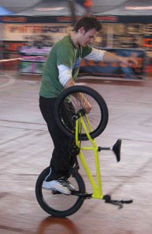

# BRAUN Lôzflat Contest - 19 et 20 mars 2005 - Les résultats

Voici les résultats du BRAUN Lôzflat Contest, organisé par Swiss BMX Freestyle.

Merci à tous d’être venus si nombreux et j’espère que vous avez passé un bon weekend de riding à Lausanne!

Swiss BMX Freestyle tient à remercier tout spécialement les sponsors qui nous ont soutenus pour cet événement :

- [BRAUN](http://www.braun.com/)
- [Wethepeople](http://www.wethepeople.de/)
- [Keetch Clothing](http://www.keetch.ch/)
- [48sbmx Shop](http://www.48sbmx.com/)
- [L’artillerie](http://www.artillerieshop.com/HTML/page001.html)
- [Condor Records](http://www.condor-records.com/)

Steven Blatter

Swiss BMX Freesytle

Flatland pro

1. Alex Jumelin (France)
1. Raphael Chiquet (France)
1. Oli Müller (Suisse)
1. Michaël Husser (France)
1. Michael Tapia (Suisse)
1. Stefan Loeber (Suisse)
1. Floriant Guilteaux (France)
1. Marco Vetterli (Suisse)
1. Etienne Giraud (France)

Hors jugement : Steven Blatter (Suisse)

Flatland amateur

1. Tomas Hirsch (Allemagne)
1. Rui Catalao (France)
1. Andreas Walter (Suisse)
1. Karin Bleile (Suisse)
1. Jony Kudaibergen (Suisse)
1. Arnaud Guignard (Suisse)
1. Camel Sabil (France)
1. Ludovic Matthey (Suisse)

Absent en finale : Antoine Andoque (France)
