# SBF au Flat Time King 2003

International flatland jam au Flat Time King d’Echirolles (Grenoble, France)

Texte et photos : Paul Guyon

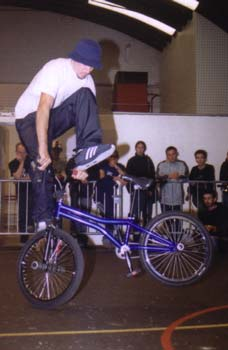

Deux riders suisses sur la scène grenobloise, la motivation était présente. Le départ s’est fait depuis Plaipalais à Genève. Il y avait Steven, Marco, Vin’s et moi-même (Paul). Nous étions tous les 4 en super forme et impatients d’y être…

Il est samedi, 10h du matin quand nous décidons d’attaquer les 150 kilomètres qui séparent Genève d’Echirolles. Nous voilà partis pour 2 heures de route sur des airs de rock, de rap US à Steven et de beat-box à Marco pour se mettre la motive.

A 12h30, nous arrivons enfin au gymnase qui a plus l’habitude de rencontrer des tennismen, des basketteurs et d’autres passionnés quels qu’ils soient, mais ces deux jours-ci étaient spécialement réservés aux flatlandeurs qui venaient de l’Europe entière ; il y avait même l’américain Jesse Puente et le finlandais Martti Kuoppa!!! David Artz1 était présent et a trop assuré son organisation ; il a quand même réussi à réunir 3’000.- Euros pour le price-money, ça c’est du joli !!!

Première impression : la salle était bondée de bi-cross, l’aire de flat était parfaite, la musique hypra forte et malheureusement on manquait de place pour les deux roues, ce qui restera toujours le comble.

A 14h, les premiers runs commencent par ceux des amateurs (Pourquoi je n’ai pas participé ?!). Il y a eu de belles démonstrations ainsi que du niveau. Les amateurs enfin passés, les entraînements continuent. Marco s’échauffe, il n’a guère de place mais lors de son run, il arrive quand même à se qualifier pour le jour suivant, 7ème place, sacré veinard !!!

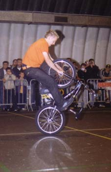

A propos de Steven, il n’est guère arrivé à rentrer ses tricks habituelles pendant le petit moment d’entraînement. Vingt minutes après, il passe, il déchire tout dans sa catégorie, il rentre sa fameuse tricks sur les pédales, la replaque et ainsi de suite en faisant un très joli run. Il arrive à la 3ème place en expert et se qualifie, magnifique Steven! La première journée s’est terminée vers 19h dans la bonne humeur avec de jolis souvenirs rien que pour le samedi.

Dans la soirée, nous cherchons un endroit pour dormir. On a enfin trouvé un Formule 1 à Gières. Steven voulait qu’on dorme dans la voiture ou dans l’atelier de David Artz1 avec une dizaine d’Allemands, ach, nein danke !!! Merci quand même David. La soirée a continué dans une boîte, une soirée BMX, rien que le fait d’être à l’entrée de la boîte, on se demandait si les murs allaient tenir. C’était rempli à foison de gens et le son venait s’écraser dans les oreilles à 300’000km/h, En plus le verre de bière était bien trop cher !!!

Pour ma part, la soirée a été plutôt cool et détendue, une bonne ambiance (il n’y avait pas trop de trasheurs, ça allait !!!) et on en a profité avec Marco pour faire quelques photos, es war toll !!! Une heure après, nous sommes repartis au Formule 1 pour aller faire dodo et pour se mettre en forme pour le lendemain mais malheureusement on a mis une heure pour retrouver ce maudit Formule 1. A demain, bonne nuit…

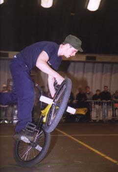

Le lendemain, nous revoici au gymnase. C’est aujourd’hui que Steven et Marco vont essayer de faire leur plus belles prestations. Martti Kuoppa possède un joli vélo KGB, beaucoup de technique, des tricks futuristes, très new-school et bien sûr une première place au contest avec un gros pactol d’euros dans la poche, il est trop fort ce mec !!!

L’Américain est arrivé second, il a surdéchiré le flat, il nous a impressionné avec ses tricks qui venaient d’une autre planète, vous pouvez pas imaginer. La troisième place était réservée pour Alex Jumelin. Le rider parisien n’était pas trop dans son assiette, on l’a déjà vu mieux rider !!! Mais j’ai particulièrement apprécié son style rapide et ses tricks très jolies. Je vous respecte tous !!!

Cette seconde journée s’est très bien terminée, c’était malheureusement la dernière. Steven et Marco sont quand même repartis avec des prix, ils ont bien ridé. Il est l’heure de dire au revoir à tout le monde, d’échanger encore des paroles avec les autres riders, de leur dire combien ils ont été sympas !!! Combien ils ont trop bien ridé !!!

L’heure du départ approche, nous quatre repartons dans nos villages respectifs avec la même pensée : A L’ANNÉE PROCHAINE !!!

Merci à tous les riders, à David Artz1, Steven, Marco et Vin’s…

Paul Guyon

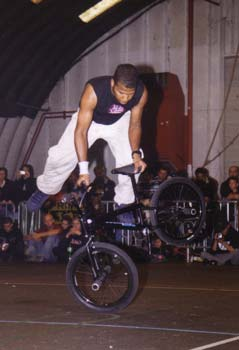
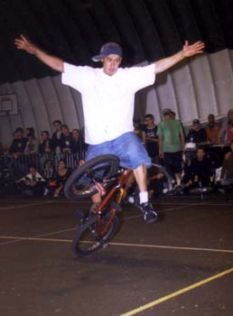
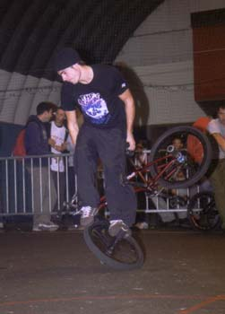
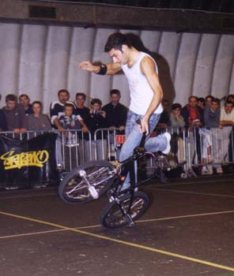
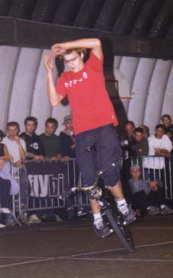
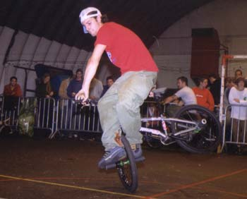
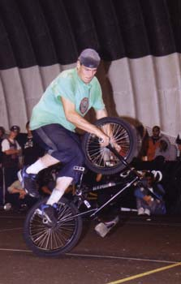
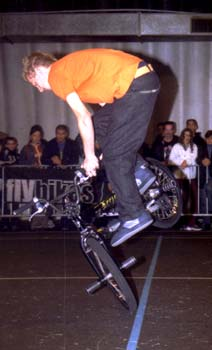
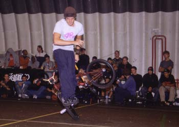
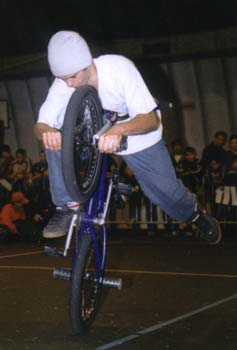
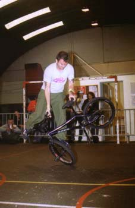
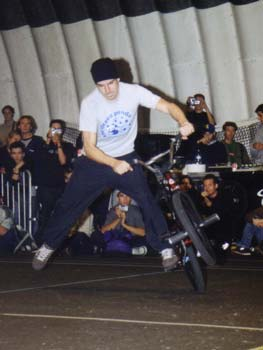
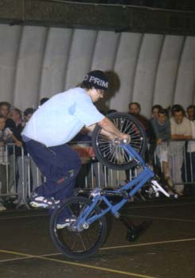
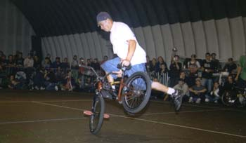
