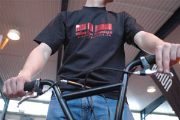
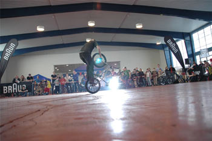
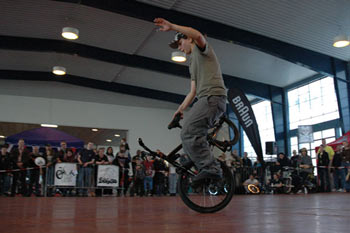
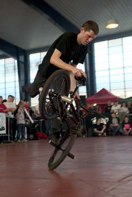
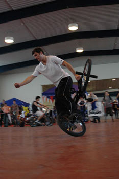
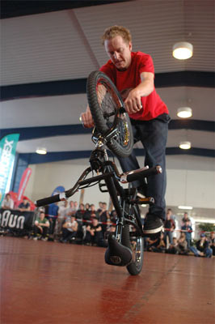
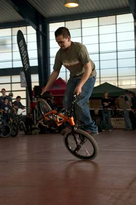
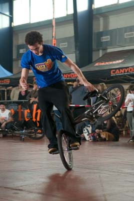
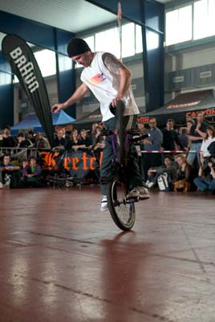
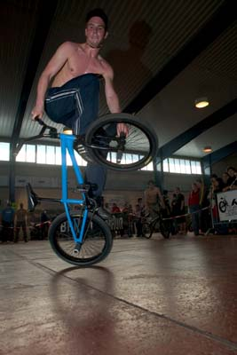

# BRAUN Lôzflat Contest - 19. und 20. März 2005

Texte : Marco Vetterli / Photos : Matthieu Gadoni (ECAL) et Yvan Delafontaine

Am Wochenende vom 19. und 20. März 2005, traf man im Lausanner Palais de Beaulieu an der Zweiradmesse zwischen verrückten Menschen auf viel zu kleinen Motorrädern, hüpfenden Einradaktivisten und kleinen Kindern auf grossen Cruise-Rädern auch auf einige Anhänger der BMX- bzw. Flachlandkultur.

Einmal mehr nahm Steven Blatter von Swissbmx die Gelegenheit wahr und organisierte im Rahmen der Lausanner-Zweiradmesse einen kleinen Flatlandcontest. Wobei hier eher auf eine gute Stimmung und lockere Jams Wert gelegt wurde statt auf Conteststress. Als Stefan (Löber) und ich am Samstagmittag nach einigen Staus auf der Autobahn ankamen, wurde bereits heftig gejamt. Neben den fahrerischen Highlights von Alex Jumelin und Raphael Chiquet war es vor allem wieder cool, die ganze Schweizer-Flatlandszene vereint anzutreffen - eine seltene aber immer wieder schöne Sache:

- Matthey Ludovic und Arnaud Guignard rockten bei den Amateuren einige stylische Sachen auf den Boden.
- Der Local «Jonny» Kudaibergen geht seinen ganz eigenen Weg, was Tricks, Style und Innovation betrifft. Mit einem Street-Rahmen, einem Lenker, welcher schon zweimal auseinander gebrochen war und unzähligen Tüchern und Farben am Fahrrad machte er allen klar, was für ihn Flatland bedeutet - Respekt!
- Der Kubaner Michael Tapia aus Bern war neben dem "Muscle-Man of the Weekend" auch der unbestrittene "Mister Old School". Er rollte nonstop und zeigte unendliche FunkyChicken-PinkySqueaks (???), no-handed-Gerator mit Lenkerdreh und zwischendurch auch einen guten alten Cherrypicker.

- Auch Kilian Stocker und Andreas Walter aus Stans/Luzern drehten ihre Runden. Kilian rollte die lockersten one-handed Steamrollers und Andy stylte mit Karl Cruisers into Halfpackers und anderen harten Roll-Tricks.
- Karin „Real Women ride 20inch bikes“ Bleile aus Basel zeigte ihren männlichen Kollegen was innere Ruhe bedeutet. Endlos smoothe backwards Hitchiker und Steamroller gehörten bei ihr zur Tagesordnung.
- Steven „el Presidente“ Blatter war leider nur am Sonntag dabei und kümmerte sich um den Ablauf des Contests. Zwischendurch fand aber auch er noch Zeit, um rückwärts im upside-down-Wheelie über die Fläche zu fahren oder sich mit Hinterrad-Bikeflips die Zeit zu vertreiben.
- Mein Road-Trip-Gefährte Stefan Löber war das ganze Wochenende voll in seinem Element und pushte die fettesten Hitchiker- und Crackpacker-G-Turns mit einem unvergleichbaren Style.

- Aus dem tiefen Untergrund gängsterte Oli „D’Rrolllli“ Müller hervor. Mit flowigen Halfpacker-G-Turns und Hang5-Pinky-G-Turn-Sachen wütete er das ganze Schlachtfeld nieder.
- Und auch ich (Marco Vetterli) erfreute mich an der guten Stimmung und dem glatten Boden, welcher sich schön für ein paar Vorderrad-Spins und G-Turns eignete.

Frankreich war ebenfalls im Haus:

- Rui Catalao rollte auf einem orange-farbigen KHE-Rahmen schöne Switchfooted-Steamrollers und backwards Half- und Hitchikers.
- Michaël Husser setzte seinen Weg des ewigen Rollens fort und tat dies mit einem solchen Flow, dass ich manchmal Angst hatte, er fliesse ganz davon. Halfpackers, Hitchikers, Hang10s und no-handed Crackpackers beherrschte er wie kein anderer.
- Etienne Giroud war für mich persönlich die grösste Überraschung des Wochenendes. Beeindruckend, wie man in so kurzer Zeit solche Fortschritte machen und dabei so bescheiden bleiben kann. Etienne war von früh bis spät immer auf der Fläche, spinnte Crackpackers und g-turnte Hitchikers.
- Camel Sabil kam zusammen den Pros aus Paris und zeigte sehr schnell PinkySqueak und G-Turn-Sachen.
- Floriant Guilteaux fuhr nur am Sonntag, aber auch da sehr selten. Umso schöner waren seine flowigen No-Brake-Combos anzusehen.
- Raphael Chiquet strotzte vor Originalität geradezu. Neben der Tatsache, dass er fast alle seine Tricks in G-Turns umwandeln kann, fiel mir auf, dass er sich beinahe aus jeder Position rauspushen kann ohne zu scuffen oder abzusteigen. Namen zu Tricks gefällig? Keine Chance, zu neu und zu kompliziert.
- Grossmeister Alex Jumelin war natürlich der Star dieses Weekends. Er verbindet Geschwindigkeit mit Style. Unglaublich, wie flink dieser Typ sein Rad rumschwingt und zwischendurch noch G-Turns pusht. Ich glaube, ich könnte seine Combos immer noch nur halbwegs verstehen, wenn ich sie in Zeitlupe anschauen würde. Der fetteste Trick war für mich sein crossfooted-Hang10 to cross-/switchfooted Karl Cruiser ohne dabei den Lenker zu berühren. Er fuhr ausserdem auf dem Prototyp des neuen KGB-Rahmens.

Am Samstag fuhren die Amateure ihre Qualifikations-Runs und die Pros einen Jam für die Zuschauer, wobei hier Linoel Cardoso einmal mehr als Microphone-Checker agierte. Auch wenn die Zweiradmesse meines Erachtens eher schlecht besucht war, so herrschte doch eine heitere Stimmung bei der Show der Pros – vor allem unter den Fahrern. Den restlichen Tag fuhr man gemütliche Jam-Sessions, plauderte über dies und das, betrachtete die neuesten BMX-Parts am 48s-Stand von Michel Carmona oder schaute sich vielleicht sogar den Rest der Zweiradmesse an… Am Abend verschlug es einige ins „Loft“, den Trend-Club in Lausanne, während andere es vorzogen, sich in einer gemütlichen Bar ein paar Bier zu gönnen. Stefan, Oli und ich hatten das Glück, die Duschen des Lausanner Jeunhôtels benützen zu können, um danach gemeinsam mit Andy Walter und Kili Stocker zu dinieren. Danach hatten Stefan, Oli Müller und ich noch den Weg von Lausanne nach Genf zu bewältigen, was mit drei BMX-Rädern, viel Gepäck und drei Personen in einem Ford Fiesta ja nicht gerade einfach klingt. Doch als Hobby-Road-Tripper meisterten wir auch diese Herausforderung und kamen ohne Probleme nach Genf. Hier konnten wir es uns in der modernen Wohnung von Oli und seinen Kollegen gemütlich machen und schon ein paar Flatland-DVDs später fielen unsere Augen definitiv zu. Ein Dankeschön nochmals an unseren Gastgeber - D’Rrollli!

Sonntag: Nach einem sonnigen Frühstück auf der Autobahnraststätte „La Côte“ trafen wir auch schon wieder im Palais de Beaulieu ein. Vor der Messehalle lieferten sich Freaks auf geschrumpften Rennmotorrädern, Polinis genannt, ein Rundkurs-Rennen. Krank, wie diese Herren ihre Maschinchen unter Kontrolle hatten und auf jeden Fall ein Randgruppensport… Egal, wir schlenderten wieder zur Flatlandfläche, wo Steven Blatter, Monsieur le Président der Swiss BMX Freestyle Association, bereits dabei war, die nötigen Vorbereitungen für die Contests zu treffen. Er war nach seiner Abwesendheit vom Vortag in bester Laune und freute sich über das zahlreiche Kommen der Flachlandfahrer. Langsam wurden alle richtig wach und die Combos auf der Fläche härter.

Um 13 Uhr stand dann das Finale der Amateure auf dem Programm. Dritter wurde Andy Walter mit einem perfekten crossfooted-Hitchiker und einem fast gestandenen Karl Cruiser to Halfpacker.

Rui Catalao fuhr sehr sicher und ruhig und sicherte sich damit den zweiten Platz. Thomas Hirsch aus Deutschland machte den langen Weg in die Westschweiz nicht umsonst und heimste unumstritten den ersten Platz ein. Mit vielen PinkySqueak-Variationen (normal und switchfooted), einem switchfooted Hang5 auf der Pedale und einem Decade ohne Bremse hätte er auch bei der Pro-Klasse einige auf die hinteren Plätze verwiesen. Ausserdem übernachtete Thomas mutterseelenallein im Schlafsack am See von Lausanne, um beim Contest dabei zu sein – das gibt dicke Props an ihn!

Ein, zwei Stunden später fuhren auch die Pros ihren Contest und zwar – genau wie bei den Amateuren – in einer Battle-Jamsession. Jeweils zwei Fahrer hatten fünf bis sechs Minuten die Fläche für sich und versuchten abwechslungsweise, das Publikum und die Judges von sich zu überzeugen. Etienne Giraud und ich hatten Pech und waren wohl etwas zu nervös – Platz neun und acht für uns.

Florian Guilteaux fuhr zwar smooth, musste aber am Ende seiner Combos zu oft absteigen, Platz sieben für ihn.

Steven Blatter fuhr verdammt sicher, machte ewig lange Hinterrad-Combos und einen schönen no-handed Crackpacker. Da er aber auch zu den Judges gehörte, kämpfte er nicht um einen Platz, sondern fuhr einfach aus Freude und fürs Publikum. Stefan Löber barflippte sich auf Platz sechs und stand auch einen seiner stylischen Hitchiker-G-Turns.

Der Showman Michael Tapia fuhr mit einigen Old School- und Stimmungs-Tricks fürs Publikum sicher auf Platz fünf. Platz vier ging an Michaël Husser. Er selber war mit seinem Run nicht ganz zufrieden, obwohl er seinen Flow auch im Contest beibehielt und viele Combos schön finishte.

Der bestplatzierte Schweizer war Oli Müller. Er erfreute uns mit Halfpackers auf beiden Seiten, PinkySqueaks, Hang5-G-Turn-Sachen und seinem hammerharten Backpacker-Jump-to-Hitchiker… rrrrä, wiänä Uzzi, nää wot nit du si…

Die Plätze eins und zwei teilten sich – wen wundert’s – Raphael Chiquet und Alex Jumelin. Fairerweise fuhren sie auch den Battle gemeinsam und rockten gewaltig das Haus. Obwohl beide ein paarmal absteigen mussten, packten sie Sachen aus ihrer Trickkiste, die sowohl das Publikum als auch die Judges zu beeindrucken wussten. Raphael g-turnte sich in andere Dimensionen und auf Platz zwei und Monsieur Jumelin ging schlussendlich nach seinem Spinning-Cliffhanger mit einem Fuss auf dem Lenker als Gewinner vom Platz.

Nach dem Contest wurden die Preise verteilt, Hände geschüttelt, eine gute Zeit gewünscht und die meisten Fahrer machten sich auf den Heimweg. Wir Deutschschweizer blieben noch eine Weile und fuhren eine letzte dicke Jamsession, bis auch wir völlig erschöpft waren und uns ebenfalls in Richtung Sweet Home machten.

Ein sehr motivierendes Wochenende ging zu Ende und bleibt mir in bester Erinnerung. An dieser Stelle möchte ich mich bei Steven Blatter, der Swiss BMX Freestyle Association und all den sympathischen Leuten, die mitgeholfen haben, herzlich bedanken für die Organisation dieses Events. Merci beaucoup et à la prochaine. PEACE

Marco Vetterli

Swiss BMX Freestyle

Swiss BMX Freestyle would like to thanks all the sponsors of this event: BRAUN, Wethepeople, Keetch Clothing, 48sbmx Shop, L’Artillerie, Artzone and Condor Records.

