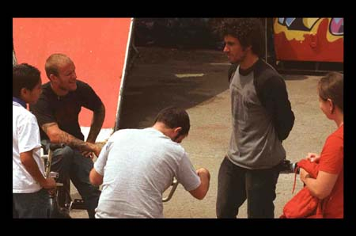
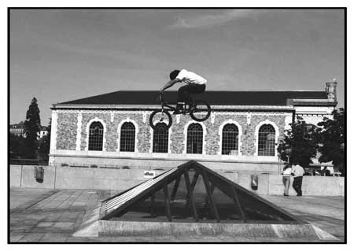
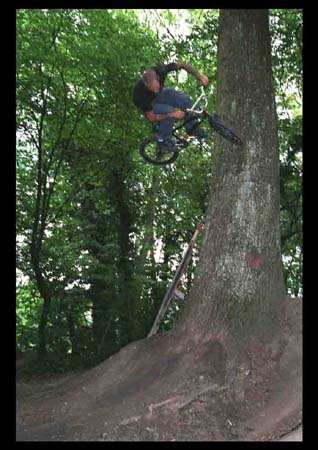
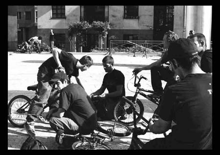
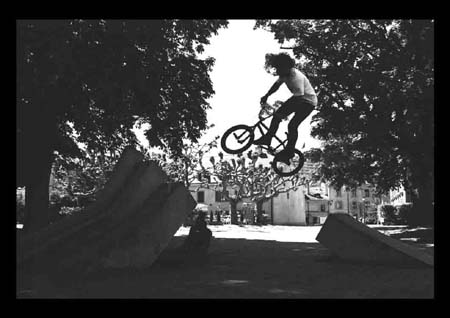
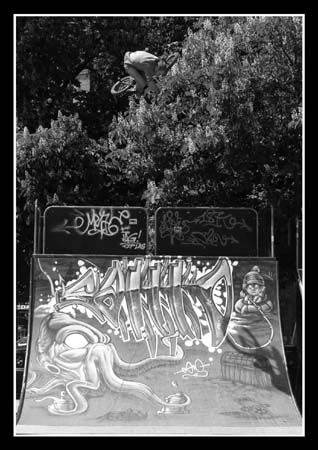
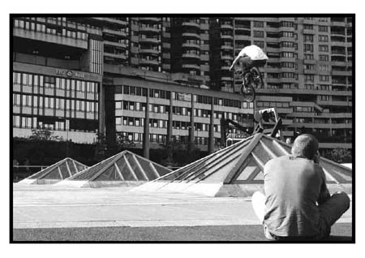

# Joe et Ruben à Genève - du 21 au 25 mai 2005

Photos : Jimmy Pouzet (cible image)

Notre petite ville a eu le grand honneur de recevoir la visite de Joe Rich et Ruben Alcantara entre le 21 et le 25 mai 05.

Informés à la toute dernière minute par les lyonnais, les riders genevois se sont tout de suite mis à trembler de joie. Il a fallu faire vite car ils étaient déjà dans le train quand la dépêche est arrivée sur le portable de Thomas Wullschlegger.

Tout aussi excité qu’intimidé par la présence de telles stars du B.M.X., une bande de locaux s’est mise en branle pour leur réserver un accueil bien de chez nous et leur faire visiter le bowl des pâquis sitôt délestés de leur bagages. Nos invités ont donc eu le plaisir de découvrir la cité de Calvin comme tout bon rider en rêverait. Ballade guidée de spot en spot à commencer par le ditch de l’aéroport (merci Michaël Mettler) où les appareils ont eu le temps de se chauffer. Joe nous aura montré comment on se sert d’une pelle aux U.S….

Départ pour le spot de Claparède (merci Adrien clap). On a bien vite compris que Joe est un biker et un vrai car ni les huit kilomètres à vélo ni les séries de sens uniques ne l’auront dérangé. Il nous a aussi confié que pour lui une voiture sert à se déplacer et non à se balader donc la sienne reste au garage à moins qu’il doive partir en tournée. Respect! Ruben nous a rejoint dans la Michelcarmonamobile recouvrant encore de sa fatigue de la veille. Arrivés à Clap, ainsi appelé dans le bouchonnois, il n’aura pas fallut longtemps au trail pour se faire retourner à coup de gros 36, chancres (can-can no foot), bar spins et autres joeries. S’en est suivi une longue étude de comment grimper aux arbres à une putain de vitesse et exploser les limites de la physique. Ca fait quoi d’être là haut Joe? Voir photo (merci Jimmy!)

Retour par le cratère (à découvrir absolument!) qui s’est pris de méchantes saucées d’airs dans tous les sens malheureusement sans la présence de Ruben. Nous y reviendrons…

Le lundi fût un jour chômé et pluvieux pendant lequel nos amis se sont promenés à pied tout autour de la ville en passant par les plus beaux lieux de celle-ci. Merci donc au tenancier de la pension Dizerens (Renaud aka Popey) pour les avoir si bien logés, nourris et guidés tout au long de ce séjour. T’es cool Renaud! Ton hospitalité fera parler d’elle.

La nuit tombée, ce fût mon tour de nourrir la clique avec une bonne spécialité de la maison : tofu, thon et calamars arrosé au lait de coco bien pimenté… Qu’ils n’ont manqués de saluer ni de dévorer. Plaisir de les voir s’acclimater à la cuisine de la maison.

Mardi, Ruben cette fois bien reposé nous aura montré de quelle bois on se chauffe là-bas en Espagne; oui oui, les espagnols se chauffent et ils n’y vont pas de main morte. Petite analyse du terrain super professionnelle et départ pour des wall to wall aussi verticaux qu’impensables, des transferts sur une sculpture avec replaque de quinze centimètres de large et angles vifs en béton. Bref, de quoi éveiller la curiosité d’une poignée de villageois de notre petite Carouge, autrement appelée la cité Sarde.

Et cela n’était pas suffisant :

- Dites voir M’dam la serveuse? Abuserions-nous de vos charmes en vous demandant de bien vouloir déplacer deux vieilles ainsi que trois chaises juste le temps que Monsieur Ruben Alcantara, ici présent, pulvérise le bunny-hop to sculpture de deux mètres cinquante de long to énorme gap de dix mètres to replaque au plat entre deux de vos tables?
- Bien au contraire cher monsieur. Ce sera pour nous un plaisir de servir votre cause.

La courtoisie a parfois bien de bonnes choses à nous apporter (merci au restaurant l’Olivier de Provence). Il aura fallu plus d’une respiration pour que tous les badauds postés aux alentours reprennent leur chemin comme leur souffle. De même pour les pollueurs de remettre leurs engins en marche.

Une fois la route balayée d’un gros coup de folie, un autre ride à travers la ville en direction de l’Ecole des Charmilles nous a tous calmés. Les gamins, eux, tout excité de notre arrivée se sont empressés de déclarer haut et fort :

- Eh! Viens voir! Y’a les gars là, y vont faire des trucs dangereux!

Pour une fois, ces enflés de marmots n’avaient pas tort. Gros flow de Ruben en wall tap 270 contre un mur de briques saillantes et de même pour Mooky qui ne manqua pas l’occasion de nous abattre avec son pire style de françois. Fatiguant tout ça, non?

Allez, on s’envoie deux doubles cafés et on remet une couche de but en blanc. Décidément, beaucoup de kilomètres ce week-end. Nos escapades nous ont remmenés au cratère où, on le savait, leur étonnement allait être grand devant cette merveille de l’aménagement urbain situé dans une école de Champel. Vaste étendue de goudron et de pavés dessinant un jump pouvant être pris dans tous les sens et arrivant dans un bowl initialement prévu pour un toboggan. Ruben et Joe choisirent comme d’habitude des trajectoires différentes Joe l’a survolé en gros table top alors que Ruben en a fait de même avec une sortie en whip.

Enfin, le crew vraiment fatigué est parti pour chez Adrien où une bière bien fraîche et des saucisses ont accompagné la bosse de dirt posée au milieu du jardin. Que du délire chez ce jeune gars de 88 qui fait déjà bien parler de lui dans la région. Merci encore à lui pour l’accueil ainsi qu’à sa famille qui aura pour sûr marqué nos visiteurs.

L’histoire tire à sa fin… Après une dernière matinée, trois larmes et un big hug. Ben merde, y sont partis!

Quel plaisir ça aura été pour nous tous de rencontrer ces riders venus de loin à la découverte de nouvelles contrées. On leur connaissait un gros niveau et une bonne dose de classe mais ils nous auront surtout montré une humilité sans égale et une simplicité à vous trouer le cul. Bel esprit chez ces messieurs à qui on souhaite bien du bonheur dans leur continuation de pros et d’autres rencontres tout aussi excellentes que celles faites au long de cette étape… On en aura pris plein la vue et il va de soi qu’un tel échange aura su nous donner un coup de fouet pour continuer dans notre passion tout en ayant de bonnes bases bien saines comme référence. Merci de la part de tout Genève pour nous avoir enrichi de cette expérience et « keep on doing your thing guys…»

Cette article ne pourrait ce terminer sans une méga note de remerciements à tous ceux que je n’ai pas cités et qui auront contribué à leur manière à faire de notre réputation ce qu’elle est.

P.S. : Si vous deviez les croiser ; ne manquez pas de leur rappeler les rudiments de notre langue. Autrement dit "ENCOULEE".

Stéphane Bachmann

Swiss BMX Freestyle
