# Xpress Flatland Jam 2 samedi 9 juillet 2005

La Xpress Flatland Jam 2 organisée par Swiss BMX Freestyle à Prangins était en gros comme celle de l’année passée avec du bon riding dans une ambiance plus que COOL!! See you next year!

Bonne vacances,

Steven Blatter

Photos : Marco Vetterli

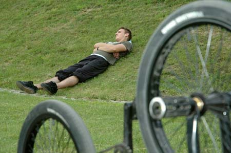
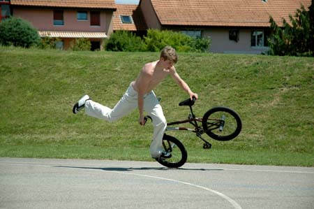

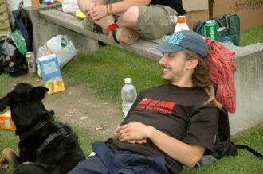

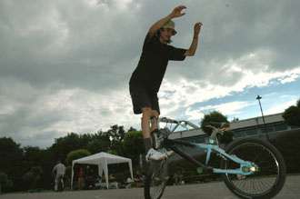
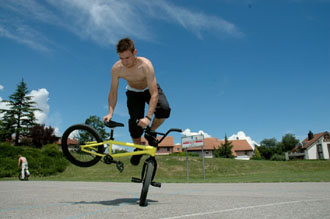
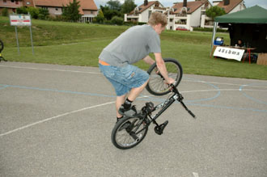
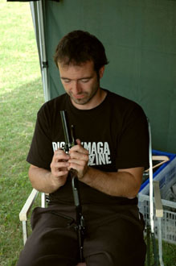
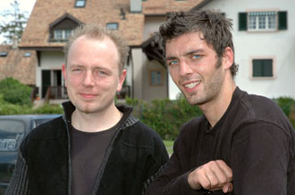
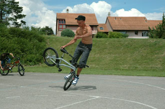
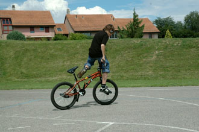
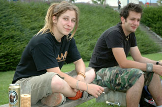
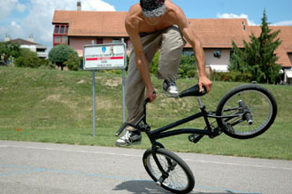
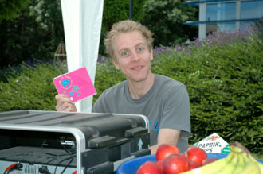
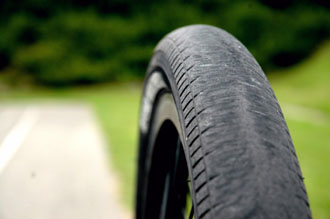
