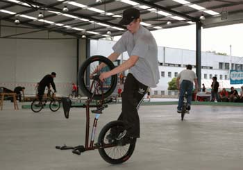
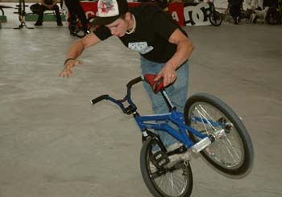
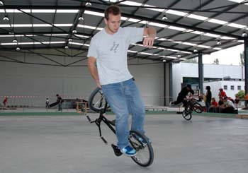
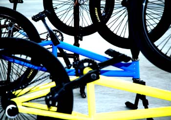
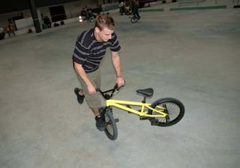
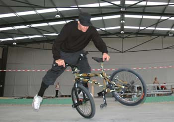
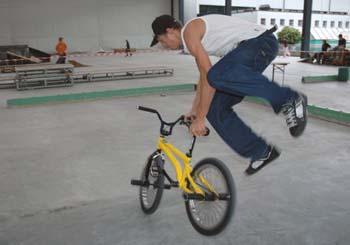
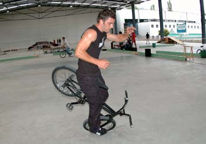

# Port Maritime Contest, Luzerne - les 13 et 14 Août 2005

Der erste offizielle Flatland-Contest in der Deutschschweiz fand am 13. und 14. August 2005 in Luzern statt. Andreas Walter aus Stans lud zu einem der besten Flatlandspots der Schweiz ein – der Swiss Life Arena. 

Texte et photos: Marco Vetterli 

Der erste offizielle Flatland-Contest in der Deutschschweiz fand am 13. und 14. August 2005 in Luzern statt. Andreas Walter aus Stans lud zu einem der besten Flatlandspots der Schweiz ein – der Swiss Life Arena. Ein wunderschön feiner und ebener Boden, kombiniert mit einem hohen Dach, das perfekt vor Regen schützt, motivierte die Flachland-Anhänger aus allen Ecken der Schweiz. Bis auf die fast vollständige Schweizer Flatland-Szene (auch Dani Cacavo und Fabian Müller – zwei CH-Flatlander der ersten Stunden) waren Ettienne Giraud aus Frankreich und sogar Frank Lukas und sein Kumpel Beni (leider hab ich seinen Nachnamen vergessen) aus Deutschland am Start. Frank zermürbte leider schon am frühen Samstagnachmittag sein Tretlager und so konnten wir seine neuen Combos und seinen stylischen Flow und nur am Freitagabend bewundern. 

Der geplant Contest am Samstag ging schlussendlich in unzähligen Jamsessions unter und so handelte man einfach die beiden besten Fahrer des Tages in der Kategorie Pro und Expert aus. So wurde Oli «drrr’Ollli» Müller zum Pro of the day ernannt, während sich der 17-jährige Arnaud Guignard aus Payerne mit seinem Talent und viel Style zum besten Expert spinnte. Wie sie beide bekamen auch alle anderen Fahrer Preise in Form von Carhartt-Klamotten. An dieser Stelle noch ein Merci an die Sponsoren; Carhartt, Red Bull und Goofy&amp;Regular (wobei hier zu erwähnen ist, dass «Mister Goofy&amp;Regular» persönlich nicht die geringste Ahnung von BMX-Kultur hat, aber das ist eine andere Geschichte). 

Leider war das Wochenende mit viel Fahrfreude und gemütlichem Zusammensein wieder einmal viel zu schnell vorbei. Dicke Props gehen natürlich an den Organisator; Mister Andy Walter. Und weil ich weiss, was er alles auf sich genommen hat für diesen Event, gibt’s gleich noch eine grosse Portion Respekt für ihn! Und ich denke, dass ich im Namen aller Beteiligten spreche, wenn ich sage, dass auch Andy’s Familie ein riesengrosses Dankeschön verdient hat! Sie stehen wirklich hinter ihrem Sohn/Bruder und auch hinter seinem Lifestyle. Ausserdem ist es wirklich nicht selbstverständlich, drei Typen ein Wochenende lang zu beherbergen, ihnen ein Frühstück à la Discretion vorzubereiten und am Samstagabend spontan für 15 Leute einen Garten-Grillabend mit allem drum und dran zu organisieren. Deshalb nochmals: Vielen herzlichen Dank! Wir kommen jederzeit gerne wieder… 

Peace, August-ZweiDoppelNullFünf 

Marco Vetterli 

Swiss BMX Freestyle

