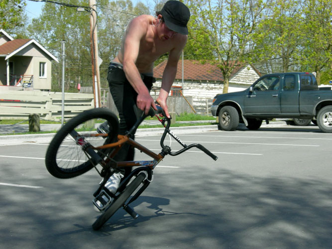

# Canada from West to East. 18.03-21.07.2006

Die erste Frage lautet, wie soll man vier seiner erlebnisreichsten Monaten in einen möglichst kurzen Text verpacken… Naja, ich versuch’s einfach mal mit der trockenen Materie: Fakten…

Texte et photos: Marco Vetterli

Zuerst habe drei absolut hammermässige Monate an der Westküste in der wunderschönen Stadt Vancouver verbracht, wo ich eine Sprachschule besucht habe um mein Englisch auf Trab zu bringen. Natürlich war auch mein Kinderfahrrad dabei und so bin ich auch dort das ein- und andere Mal Flatland gefahren, unter anderem auch zusammen mit Travis Collier und Cory Stratychuck. Übrigens empfehle ich Vancouver allen Street-Fahrern. Eine enorm grosse Szene mit vielen Pros, zahlreiche kleine Skateparks und unzählige schöne Spots machen diese Stadt zu einem wahren Street-Mekka.

Nach diesen drei Monaten bin ich während einem Monat mit einem Dodge Grand Caravan quer durch ganz Kanada gereist (wer Kanada ganz und gar nicht kennt, soll die nächsten paar Städtenamen einfach überlesen):

Von Vancouver ging’s vorerst mal bis nach Calgary und die erste Woche meines Roadtrips verbrachte ich mit zwei Kollegen in den Rocky Mountains zwischen Banff und Jasper, zwei sympathischen kleinen Touristendörfchen. Wer die raue, wilde Natur und das Camping-Leben liebt, sollte unbedingt einmal diese Gegend abchecken. Mit den dichten, weitläufigen Wäldern, kristallklaren Flüsse, türkisblauen Seen und einer Tierwelt, wie man sie sonst nirgends zu Gesicht bekommt, gehören diese paar hundert (oder tausend) Quadratkilometer sicherlich zu den schönsten in ganz Kanada. Bei so viel Sightseeing lohnt es sich auch, sein BMX-Gerät mal für eine Woche wegzustellen.

Nach dieser Woche machte ich mich dann alleine auf den Weg nach Edmonton, Saskatoon und Regina. Da ich diese Zeit meistens on the road verbrachte um Kilometer zu fressen, fühlte ich mich nach ein paar Tage etwas einsam. Die Ankunft in Winnipeg sollte dies aber rasch ändern. Durch einen witzigen Zufall (eine andere Geschichte…) traf ich schon eine Stunde nach meiner Ankunft auf die gesamte Flatland-Szene der Stadt (Billy, Brent, Kevin und Terry). Da ein Tag später noch «Canada-Day» war (etwa wie der 1. August bei uns in der Schweiz), entschied ich mich, ein bisschen in dieser Stadt zu bleiben. Zu meinem Glück wurde gerade an diesem Wochenende ein extrem schöner Skateparks mit vielen Real-Street-Elementen und einer wunderschönen Pool-Landschaft neu eröffnet und somit verbrachten wir die meiste Zeit dort mit der restlichen 20Zoll-Gemeinde. Nicht weit vom Skatepark gab es auch ein paar Flatland-Spots und so kamen auch wir voll auf unsere Kosten.

Zwei Tage später tourte ich weiter in Richtung Osten. Mein Weg führte über Thunder Bay, ca. tausend Kilometer entlang dem Lake Superiour (auch eine traumhafte Gegend mit wunderschönen unbelebten Stränden) bis nach Ottawa, Kanada’s Hauptstadt (ja ja, nicht Vancouver oder Toronto, wie viele denken). Mit vielen altmodischen Schlössern und hochmodernen Glaskomplexen mixt Ottawa dem Besucher ein sehr sympathisches Stadtbild. Dort traf ich den einzigen Flatlander der gesamten Stadt (Prasheel) und konnte zwei Tage bei ihm wohnen. Ein paar Runden auf dem BMX waren natürlich auch hier Pflicht und ein schmerzhafter Sonnenbrand auf meinem Rücken der Preis dafür…

Von Ottawa fuhr ich weiter nach Québec-City, eine Stadt, die zu den ältesten in Kanada gehört und mit ihrem Charme tausende Touristen anlockt. Kurz mit Jayson Plourde, dem wiederum einzigen Flatlander dort, telefoniert und schon rollten die 20Zoll-Räder wieder auf dem Asphalt. Jayson ist zwar erst 20 Jahre alt, doch fährt er mit so viel Style und Sicherheit, dass mir Angst und Bange wurde. Von diesem Junge wird man sicher noch einiges hören.

Von Québec-City ging’s dann weiter nach Montreal, wo ich auch einige Tage verweilte. Montreal rult! Eine sehr angenehme Atmosphäre, viele schöne Ladies und eine Flatland-Szene, die ihr Ding auf einem sehr hohen Niveau durchzog, machten diese Stadt sehenswert. Hier hatte ich auch die coolste Session meines gesamten Kanada-Aufenthalts. Zu viert rockten wir den Parkplatz von 17.00 bis 23.00 Uhr mit non-stop-Riding. Und die Locals hier haben’s faustdick hinter den Ohren; Simon Marsan macht crossfooted Rolling-Tricks die ich noch nie gesehen habe und die schnellsten Hitchhiker-Jugglers auf der ganzen Welt, J.F. sieht aus und fährt wie Hiro Morisake und Mike rollt mit seinem ganz eigenen, speziellen Style und mit einer Geschwindigkeit die man verbieten sollte. Dicke Props nach Montreal, auch diese Jungs werden sicher noch so manche Contests rocken.

Die letzte Etappe meiner Reise führte von Montreal nach Toronto. Und holly shit, Toronto war mit Abstand die grösste Stadt, die ich bis anhin gesehen habe. Obwohl mich die riesigen Wolkenkratzer sehr beeindruckten, könnte ich nie dort leben. Zu busy war mir der «pace of live» und auch die Luftqualität liess zu wünschen übrig. Trotzdem hat Toronto dem Touristen einiges zu bieten wie zum Beispiel eine Aussicht vom scheinbar höchsten Gebäude der Welt (CN-Tower, 553 Meter). Nach einem sehr erlebnisreichen ersten Abend downtown verabredete mich am nächsten Tag mit dem Ober-Flatland-Gangstah Jeff DesRoches. Wer den Typen einmal auf dem BMX gesehen hat, kann sich vorstellen, wie viel Energie er in sein Fahren steckt. Neben seinem Flatland-Talent war der Herr auch noch sehr gastfreundlich. So konnte ich ein paar Tage bei ihm wohnen und den Pool und Whirlpool seiner Nachbarn geniessen. Da es die Hitze in Toronto fast unmöglich machte, Flatland zu fahren (35°Grad und 95% Luftfeuchtigkeit), waren meine letzten Tage in Kanada eher chilliger Natur. Am letzten Tag verkaufte ich noch mit einem tränenden Auge meinen Van und ehe ich mich versah, landete ich schon wieder in Zürich…

Voilà, das wär’s auch schon, 9’000 Kilometer on the road können ja so schnell vergehen... Am Schluss möchte ich noch erwähnen, dass Kanada wirklich eine Reise wert ist. Nicht nur die einzigartige Natur, sondern vor allem auch die offenherzigen und gastfreundlichen Menschen in diesem Land versprechen einen perfekten, abenteuerlichen und garantiert erlebnisreichen Road-Trip. Canada , I’ll be back soon enough!

Peace out

Marco Vetterlii

17.07.2006

