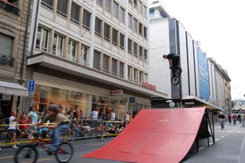
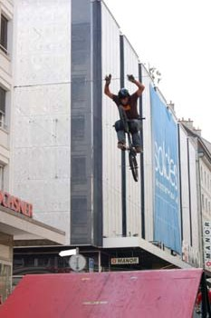
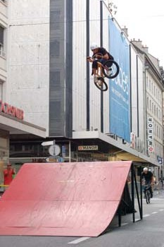
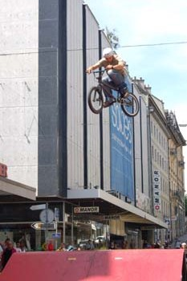
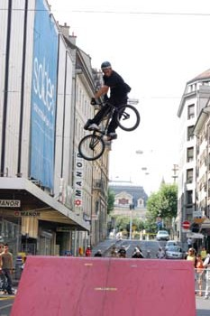
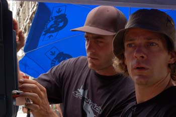
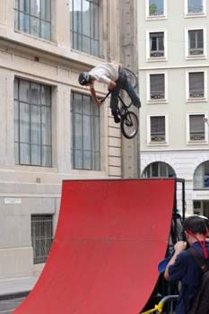
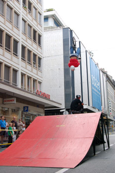

# Fun Box démos à Genève - le 30 juillet 2006

Yeah dudes ! Ce dimanche 30 juillet nous aura bien remués. Tous présents à la rue Rousseau avec en surplus l’exceptionnelle présence de Serginho do Brasil et le Fred Borel venus de loin pour les yeux des badauds du bled.

Texte : Stephane Bachman

photo : Jimmy Pouzet

Il suffisait de se diriger vers la Placette pour remarquer l’anormale présence d’une fat funbox (merci Hannes) et une belle clique de furieux à vélo. Le son aussi était présent (merci Elvis) et a bien contribué à la bonne ambiance smooth de la journée... L’urban funbox show a commencé vers deux heures par une démo de quinze minutes qui déjà donnait des signes de motivation de la part des riders de notre cru et d’ailleurs. Des jumps surdimensionnés de Fred le Fazon avec des tricks énormes de Serginho ont sollicité les passants à se poser sur l’asphalte et apprécier le spectacle. La journée s’est déroulée sans accroc mis à part quelques éraflures et chaque heure a été ponctuée d’une démo respectable. La présence de Claudio Molo et ses rafraîchissements, elle aussi, Était appréciée de tous. Bref, une belle journée de rare unité chez les riders et un engouement général pour les trains (suites dites tchou-tchous) à vingt ; c’est pas souvent qu’on voit à ça chez nous !

Je tiens spécialement à remercier la délégation à la jeunesse et Alain Mathieu pour leur soutien, le journal 20 minutes qui aura su faire figurer le rookie number one, Adrien Clapier, à la une ainsi que www.igeneve.ch pour la parution sur le net de quelques belles images. Mais surtout un énorme "BIG UP !" à Thomas Wullschleger alias la Schlaguée pour son organisation et sa présence constante dès qu’il s’agit de mouiller le maillot au nom du BMX. HIP HIP HIP! Yeah Schlegg ! En ce qui me concerne et j’espère que vous l’aurez compris, ce fut une putain de journée !!!

P. S. : big thanks to our photographer, mr Jimmy Pouzet !

Swiss BMX Freestyle

Stéphane Bachmann

