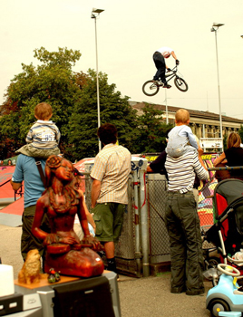
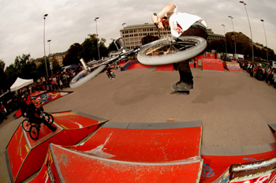
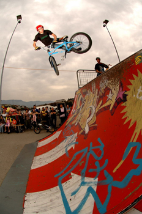
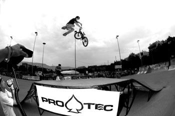
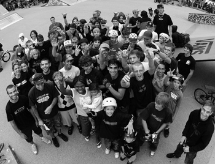

# BMXJAM 06 - STREET - Samedi 23 septembre 2006

Chers internautes,

Me voilà ravi de pouvoir vous dire que la BMXJAM 06 s’est terminée dans une bonhomie collective et ceci pour plusieurs raisons. Premièrement le temps ne nous aura pas donné de grandes espérances quant à la possibilité de celle-ci. L’alternative de la Praille a été évitée de justesse grâce à une météo pas aussi terrible qu’on pouvait le craindre. Ensuite, le temps imparti pour l’organisation a donné lieu à un marathon et finalement rappelons nous l’extraordinaire froid de l’an passé qui ne donnait pas envie de mettre un seul pied dehors.

Texte : Stephane Bachman / Photos : Alex Pittet

Nombreux ont été les gens à se déplacer pour cette cinquième édition qui fût agrémentée d’une surprise pour tous. Hannes Erb et sa funbox nous ont fait l’honneur de venir égayer le skatepark et donner lieu à des transferts inhabituels, merci à lui pour sa contribution à la qualité de cet événement. Les bons sons d’Olivier Rosset ont eux aussi apporté un plus et du bon groove dans la place.

Bref, un contexte idéal pour s’exprimer avec son vélo et (re) découvrir des tricks. Je pense là à Serginho Santana qui suite à sa perfo vient me dire que ça faisait quatre ans qu’il n’avait plus fait de flair. On ne s’en est pas vraiment rendu compte en le voyant s’envoler sans faire de détail.

D’autres ont étonné par leurs ages car le jeune Ayrton a fêté ses cinq ans il y a peu. On n’attendait pas non plus de voir notre Fazon national lancer des 3-6 downside whips ni d’aussi énormes Superman seat grabs car là, je me permets d’émettre l’idée qu’il a tout déchiré. Le Omar nous a même fait peur ainsi qu’à lui-même en allant péter le score avec un air sur le quarter communément appelé “à Joe Rich” à une hauteur anormale pour terminer sa chute coincé dans les structures sans le moindre souci. On le connaissait pour sa témérité et l’on n’a pas été déçu. Tommy Lauque n’a pas volé sa deuxième place suivi de Kalkoff, tous deux dignes de représenter la new school dans tout son flow.

J’aurais peine à citer toutes les prouesses ni les noms des pros tellement la liste est longue alors je vous laisse plutôt lire les résultats adjoints tout en sachant que ce n’est qu’un classement et le jury a fait de son mieux pour attribuer les places selon ses propres critères qui ne seraient peut-être pas les mêmes chez chacun de nous…

Pour les remerciements, je suis infiniment reconnaissant auprès de tous ceux et celles qui étaient de l’organisation (merci les filles !) et aux autres qui ont fait l’effort de venir de leurs plus ou moins lointaines contrées. BMX is alive comme a pour habitude de dire notre bon vieux Matt Hoffman qui avait compris avant même la naissance de ce mouvement que rien ne vaut un bel investissement collectif pour jouir des plaisirs de la réussite et s’envoler vers de nouvelles aventures.

Puisse la jeunesse porter cet amour de la toute petite reine plus loin encore que nous autres (old school riders) l’avons fait et soyez sûrs que vous nous entendrez taper du pied pour encourager vos efforts !!! Never stop, never give up !!!

SWISS BMX FREESTYLE voudrait remercier la clique de personnes investies dans le développement d’une passion, la nôtre et tout spécialement les sponsors qui nous ont soutenu pour cet événement : Déléguation à la Ville de Genève, 48sbmx shop, Felt BMX, Vans, Trust&Ride, Alias1 shop, Reef et Protec.

Le Primate

Swiss BMX Freestyle

Street pro

1.  Serginho Santana
1.  Tommy Lauque
1.  Kevin Kalkoff
1.  Omar Berreddad
1.  Maxime Chaveron
1.  Pascal Guérard
1.  Alexandre Bourguignon
1.  Alexandre Valentino
1.  Frédéric Borel (nitch)
1. Stéphane Bachmann
1. Thibault Emorine
1. Pierrick Hovette
1. Hannes Erb (hàà)
1. Cédric Mitaud
1. Marcelo Rigo (Gordo)
1. Jérémy Polissier
1. Félix Coelho
1. Laurent Koum
1. Raphaël Jeremiasz
1. Thibault Lamarche
1. Manu Stemper
1. Adrien Steinig (Clap)
1. Lucas Kneobohler
1. Timur Karadschajew
1. Joachim Douat
1. Matthieu Pierre
1. Loïc Thiollier

Street expert

1. Sebastien Waridel
1. David Lefebre
1. Adrien Sabatier
1. Mohamed Ishuayed
1. Loïc Zbinden
1. Yoann Schmid
1. Mathieu Birraux
1. Thomas Benedetti
1. Tomas Charrier
1. Clyde Dorio

