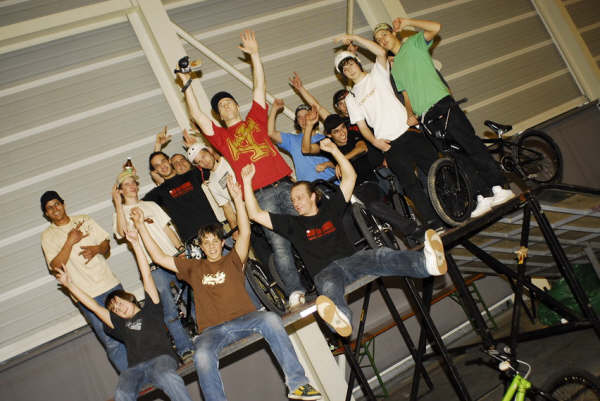
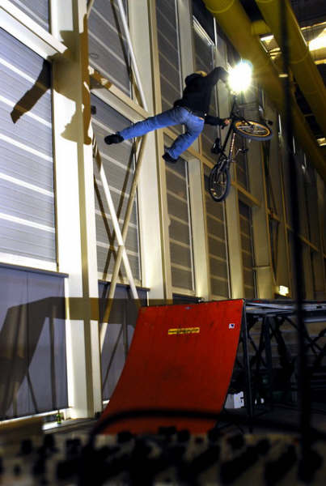
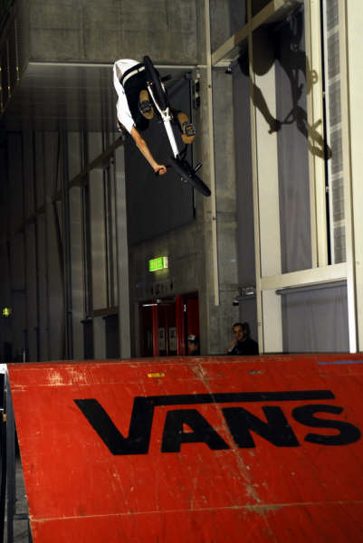
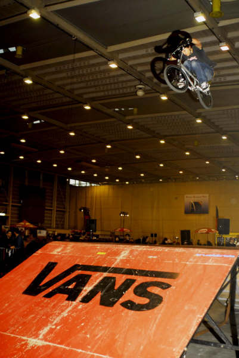
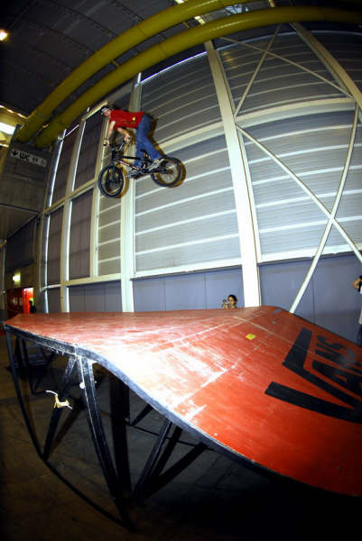

# Démos de Swiss BMX Freestyle pour l’AGS au Palexpo, Genève - 2 au 4 février 2007

Texte et photos : Alex Pittet

3.2.1 go!!! Simple, 3days of BMX. "AGS" l’Association Genevoise des Sports nous invite à occuper le plus grand stand du Salon vacances,sports et loisirs 2007 "MERCI" ! On a été  jusqu’à une bonne vingtaine de riders sur place pour représenter le BMX au travers de "SBF" Swis Bmx Freestyle !!!!

Les gars merci pour le déplacement en particulier le couple Dupré et le couple Borel venu de France, Strap venu de Lausanne A1et Anès cité plus bas !!! Merci à nos demoiselles présentent au stand dans lequel on présente les T-shirts SBF, une expo photos que j’ai la chance de présenter et des BMXs en prêt avec leurs indispensables casques pour initier les jeunes à rouler l’air de street de la "DEJ" Délégation à la jeunesse (merci pour les modules) et pour les plus courageux, rouler la magnifique fun box à Hannes Erb que je remercie infiniment pour s’être déplacé de Thun avec sa fun box et de venir comme toujours avec tant d’énergie!!!! Les riders ont toute la journée pour rester chaud en perfectionnant leurs tricks et en essayants de nouveaux.

On fait 3, 4 démos par jours de 15 à 20 minutes. Les riders s’élancent du fond de la halle 7 de Palexpo pour prendre un max de speed pour flyer la fun box et montrer au public ce qu’est le BMX qui ne fais qu’évoluer. Pour épater la gallerie on tous vu des hauteur folles de Fred Borel sponso ETNIS, ses whip, no foot can can, LE Foison superman sit grab tendu comme un string aha... et parmis d’autre son nouveau condor qu’il tate depuis 2 semaines et maîtrise déjà sévèrement.Stéphane Bachman qui à joué un grand rôle dans l’organisation de cette événement avec Thomas Wullschleger et qu’on peut tous remercier pour leur investissement depuis de longues années dans le BMx suisse BIG UP à ces 2 anciens la toujours présent ! Stéphane et son style pas croyable fly avec des tricks que je ne saurais nommé.. ah si, de gros backflip .. vous pouvez certains de ces tricks sur :  [http://www.igeneve.ch/geneve_album_photo.php?num=293](http://www.igeneve.ch/geneve_album_photo.php?num=293) merci à Dimitri d’avoir mis les pixs si vite sur son site. Des 3.6 tournent de tous les côtés et même des ptits malins y mettent des x-up avec encore plus de flow, de hauteur et de style à chaque vol. C’est dur de cité tous les riders. Julin Dupré  qui avec 4 mètres d’élant passe le fun box easy en oubliant pas d’y poser un bon no fot can can par exemple..Jo,Rémi,Mathieu (merci pour l’aide),Cédric (qui s’est déboité l’épaule..),Luka,Yoahn,Mat,la nouvelle génération Quantin et Alex. Mais encore Momo trop stylé qui s’est mis  à faire des 3.6 nose dive interdits!!!!et des condor avec trop de facilité c pas normal!!. Adri Lapelle aie aie aie il fait mal celui la! il nous mis des rien "nothing", 3.6,3.6xup (oui c un des ptits malins cités plus haut..) no foot can can pleins les yeux avec un style bien à lui qu’on ne peut qu’aimer. Le Brésil était la avec Marcelo el Gordo revenu de vacances depuis 2,3 jours, Bruno et de Serginho. Ils ont mis le feux ces trois la aussi avec des turn down, look down, whip, backflip ...  Strap d’Alliasone.com nous a offert des whips par exemple.Anès sur sa fun box avec d’énormes hauteurs, whip, superman, bachflip et autres tricks nous à tous fais plaisir avec encore un style adorable!! J’en oubli surement déso le gars....

En gros, un stand énorme, un spot royal, des tonnes de riders, une ambiance folle pour faire le show à palexpo avec des tricks de fous bien maîtrisés par tous pour venir montrer à Genève qu’on est la et toujours plus à représenter les BMX!!!

J’ai aimé voir toutes ces ptites caméras et appareils photos tourner autour de nos riders merci à nos médias privés comme j’ai envie de les appelers . Ca permet de montrer que le BMX développe dautres talents... Je tiens à remercier aussi Julien de l’ ATB sans lequel on aurait bien galèré !! Voila une partie de ce que j’ai pu voir ce week end,venez tous plus nombreux l’an prochain !!!

Alomé je t’aime! Si ’est l’article qui va paraitre sur le site sachez,chères  lecteurs, qu’il est mon premier et pondu à ma manière...éspérant quelle vous plaira Ah oui merci à Thomas W. pour avoir speaker jusqu’à épuisement et m’avoir permis aussi de prendre le micro pour les deux dernières démo, jme suis bien marré!!!! Au plaisir de tous vous revoir,Alex Pittet pour vous servir à ma manière ;-) Bye

Alex Pittet

Swiss BMX Freestyle

