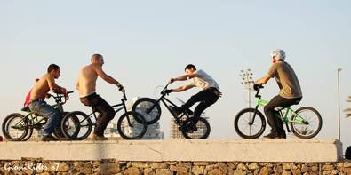
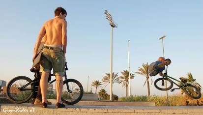
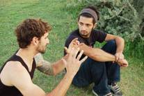
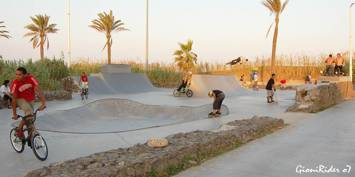
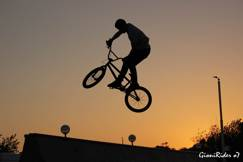

# GioniRider à Barcelone - Juillet 2007

Mon petit séjour de 4 jours à Barcelone était tout simplement magnifique, j’ai pu trouver presque tout ce que je voulais, une bonne ambiance, des jolies plages, évidemment remplies de jolies femmes et bien sûr des places pour le bmx, street et flat, malheureusement je n’avais pas pris mon bébé / bmx avec moi dans le train.

J’ai consacré 2 jours à la recherche des endroits où on peut trouver des riders (streeters et flatlanders), sans succès… Seulement le troisième jour je suis tombé sur les streeters qui sautaient dans un mini-skate parc, que se trouve sur la plage Mar Bella, près du Parc de Poblenou.

En discutant avec eux un peu, j’ai appris qu’ils viennent tous les mercredi après-midi, même l’hiver, si le sol est sec. Et puis ils m’ont appris qu’il n’y a pas beaucoup de flatlanders à Barcelone, quelques 2 ou 3 seulement, en plus des débutants. Par contre des streeters il y en a assez là-bas et certains d’entre eux ont un bon niveau.

Bref, si vous allez à Barcelone vous allez rien rater et si vous aimez sortir le soir, je vous conseil d’aller au Disco-club, « RAZZMATAZZ », il y a 5 étages du bon son, le vendredi est le jour parfait d’y aller là-bas, mmm… petit inconvénient, l’entrée coûte 25 euros, mais ça vaut la peine !

Article et photos pour swissbmx.ch : Gionibek Kudaibergen

Mon Artblog : [http://gionirider.skyrock.com/](http://gionirider.skyrock.com/)

