# Xpress Flatland Jam 3 samedi 22 juillet 2007

Photos : Steven Blatter

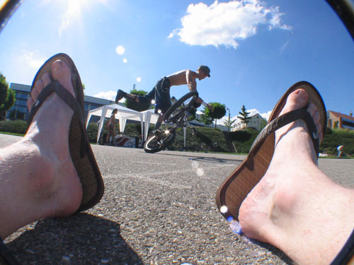

Et oui... la 3ème édition a été comme les 2 autres : CHILL OUT!!

En gros y a eu un énorme soleil de Californie, des bonnes sessions de riding par les flatlanders suisse, du très bon riding d’un rider français Mr Marksou, un bon BBQ comme au States des USA, des boissons et des fruits offerts aux riders, du bon son hiphop/rock... et ouai... on est pas tous des rappeur/flatlander ;-) et pour finir le plus petit contest du monde avec 3 inscrits!

1er prix du contest : 1 autocollant Swiss BMX Freestyle!

Bigup à Cédric Blumenstein pour m’avoir aidé à organiser cette ptite jam à Prangins!

See you all next year!

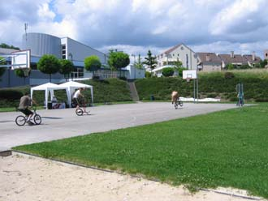
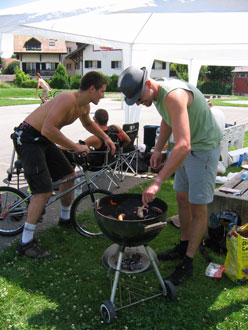
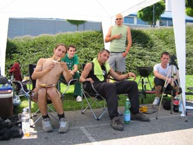

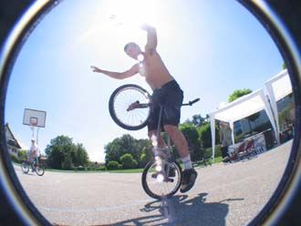
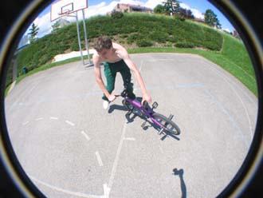
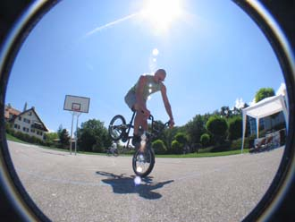
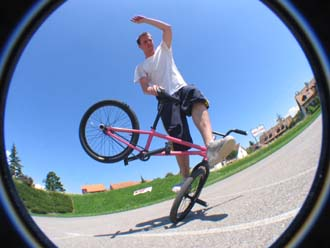
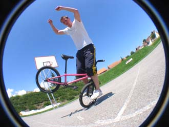
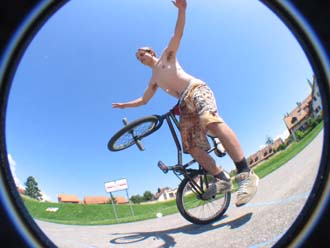
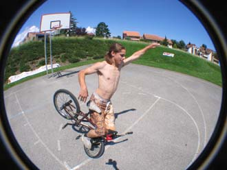
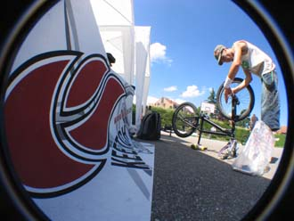
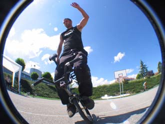
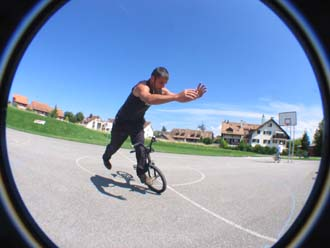
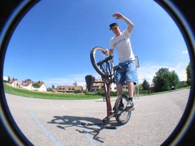
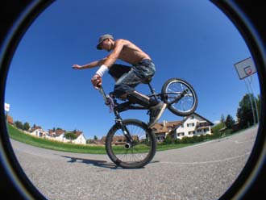
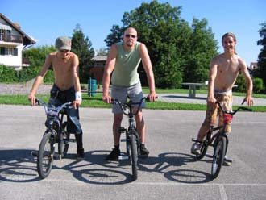
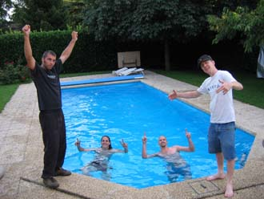
