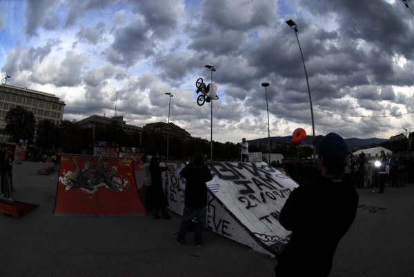

# BMXJAM 07 - Samedi 29 septembre 2007

Photos : Alex Pittet

Ouf, on a réussi !

Quel soulagement ! Des  idées nouvelles nous sont apparues pour cette édition 2007 de la BMX Jam et les réaliser n’a pas été chose simple.

Premièrement, un wall est né sur la deck de la mini à spine ! Plan incliné du côté mini et vert wall du côté park. Merci les sudistes (Le Mick, Aurél Volx et Angélique Péni) spécialement venus 48 heures à l’avance pour la construction de ce petit dernier aidé de votre dévoué Président !!!

Deuxièmement, un contest mini-ramp voit le jour cette année suite à de nombreuses et multiples hésitations sur la question : faire un classement overall ou deux classements séparés (Street + mini ramp) ? Pour une fois la mini est ridée à sa juste valeur. Alors évidemment on n’allait pas laisser un contest comme celui-ci avoir lieu sans une nouveauté sur la mini…

Pour le riding, on notera que cette édition a été surprenante sous bien des angles comme par exemple la présence sur le podium de jeunots comme Maxime Charveron (immense flair to peg stall sur la mini) et Thibault Emorine (flip whip à une hauteur de fou sur la funbox). Mes cheveux se sont aussi dressés quand j’ai vu Alexandre Bourguignon s’ENVOLER en 3.6 sur le spine du park et je n’ai pas été le seul. Du jamais vu à Genève. Bravo à la jeunesse pour nous avoir pareillement soufflé.

Les pros connus de la BMX Jam ont aussi eu leur mot à dire et ce n’a pas été une surprise que de voir Fred et Serginho se présenter sur le podium du classement mini. Des amplitudes toujours plus affolantes pour Fred le Fazon et des cascades “Evil Knievelesques” pour notre désormais « Serge National » comme le franchissement de l’infranchissable et nouveau Wall en rock an’ roll. À quand le 3.6 tail tap là-haut… sur la montagne.

Pour les signatures du week-end, je souhaite en mentionner une ou deux comme le fufanu du Mick David en haut du vert wall, le 720° de Serginho (pendant la remise des prix !!! Qui l’a vu ?) sur le spine de la mini et bien sûr le 180° plus immense qu’improbable de Cédric (le Manouche) par-dessus la pyramide. Et je mentionne non sans un malin plaisir notre invité surprise du week-end Niels Schack qui avec son style et son bike tout droit sorti de retour vers le futur a fait tomber les minettes de son age (15 ans maxi). Hahaha ! Merci Niels et Lol comme dirait ta génération. Le Koum aussi a fait impression avec un peg stall en haut de vert wall. Comme je ne pourrais citer tout le monde, je tiens à faire un grand BRAVO à tous les riders qui ont démonté le parc !!! Hannes, Fazon, Lukee… Mais ne pensez pas que je vais oublier l’team marseille-picon-stretch-pants-brazilierro-clapesque (on vit en démocratie), les initiés me comprendront.

Pour les amateurs, mais qu’est-ce qu’on met dans leur soupe à ces rookies qui défrayent la chronique et venant tenter de pareilles cascades ? On aura tout vu à la BMX Jam mais un tel niveau chez les amateurs c’est indécent. On entendra encore, je pense, parler de Yoann Schmid et je ne suis pas le seul à avoir cet avis. Le jury impartial sur la question m’a avoué avoir été scotché par l’originalité de son run et c’est de ces remarques qui font plaisir à entendre.

Alors pour les traditionnels remerciements je commencerai par les nouveaux sponsors de cette année que furent [Indem Clothing](http://www.indemclothing.com) et [Keetch](http://www.keetch.ch) mais aussi [Sold](http://www.sold-sports.ch), [Vans](http://www.vans.ch), [Alias one](http://www.aliasone.com), [Trust & Ride](http://www.trustandride.com) et surtout (mais SURTOUT) la Délégation à la Jeunesse (DEJ). Merci aussi à 48sbmx.com et Alias one pour leurs stands et à toute l’équipe de bénévoles qui se mouille à chaque fois pour faire de cet event une compétition pas comme les autres !!!

Spécial Big up à Thomas W. pour le speaking, Olivier Rosset pour le DJing, Moe and others pour l’affiche et l’ex président Steven Blatter pour sa présence et la mise sur internet de cet article sans oublier les juges, ma Giu pour son rôle de secrétaire inébranlable, Angélique pour la vente de T-shirt et tout le reste du SBF crew.

Pour voir un aperçu télévisuel de la BMX Jam 07 rendez vous sur le site [Léman Bleu](http://www.lemanbleu.ch) et cliquez sur l’émission sport ado du 3 octobre 2007.

Mais surtout ne manquez pas la traditionnelle vidéo Made by The Jimmy Pouzet Himself (Powered by Nitch and co.) que vous ne manquerez pas d’insérer dans vos centre d’intérêts MySpace et autres comptes flickr comme tout bon supporter de la BMX Jam que vous êtes tous et toutes!!!

Pour cela, rendez-vous sur : [http://fr.youtube.com/](http://fr.youtube.com/) et mettez les tags BMX Jam Genève 2007.

Si vous n’avez pas encore vu celles de l’année dernière et avant, allez donc faire un tour sur [http://fr.youtube.com/profile?user=leprimate78](http://fr.youtube.com/profile?user=leprimate78) (chez moi) et dites bonjour en passant…

Mais avez-vous visité le site [www.swissbmx.ch](http://www.swissbmx.ch) ? Et avez-vous envoyé votre adresse e-mail à stephane.bachmann@swissbmx.ch pour être informé des news de l’asso ? Que de choses à faire, time consuming is the internet.

Et pour des photos faites-vous plaisir sur : [http://www.keetch.ch/php/galleries.php?gallery=bmxjam07](http://www.keetch.ch/php/galleries.php?gallery=bmxjam07)

En attendant l’année prochaine, bien des folies et bon riding !!!

« Un jour viendra, le lendemain du Grand Soir, où la propriété de chacun sera réduite à l’unique bicyclette source de toute joie, de toute santé, de toute ardeur, de toute jeunesse, la bicyclette, compagne fidèle de l’homme. » Maurice Leblanc

Stéphane Bachmann

Actuel Président SBF

Street pro

1. Thibault Emorine
1. Sergio Sant’Anna (Alias One, Master Bikes)
1. Maxime Charveron (Nike 6.0)
1. Alex Bourguignon ( ???)
1. Frédéric Borel (Etnies, Trust & Ride) aka : le Fazon
1. Michaël David (Unleaded BMX, Colony, Terrible One)
1. Hannes Erb (Vans 48sbmx, Mankind)
1. Lukee (Carhart, Simple Bikes, New Era, Bike Agent)
1. Georgy Doremos
1. Cédric le Manouche (Pantapette)
1. Marcelo Rigo (SOLD) aka : Gordo
1. Mathias Augris
1. Adrien Steinig (Alias One) aka : le Clap
1. Berenger Cordier
1. Laurent Compaoré (Frenchys, Gravis) aka : Koum
1. Félix Coelho
1. Mohamed Ishuayed
1. Mathieu Pierre
1. Sébastien Sigillo (Reef)

Street expert

1. Yoann Schmid
1. Gérald Coindre
1. Malek Youssef
1. Mathieu Birraux
1. Thomas Benedetti (mini Kalfoff)
1. Romain Fougère
1. Clyde Dorian
1. Laurent Serve
1. Marc Leuenberger
1. Yann Bolciolu
1. Adrien Grometho
1. Laurent Tirefort
1. Ochsenbein
1. Florian Barral
1. Damien Hussy
1. ex æquo : Niels Schack, Lionel Vellas, Maxime Capponi, Romain Chagny, Loïc Zbinden, Thomas Bolciolu, Santos Wuillemin (Albert)

Mini rampe

1. Thibault Emorine
1. Sergio Sant’Anna (Alias One, Master Bikes)
1. Maxime Charveron (Nike 6.0)
1. Alex Bourguignon (???)
1. Frédéric Borel (Etnies, Trust & Ride) aka : le Fazon
1. Michaël David (Unleaded BMX, Colony, Terrible One)
1. Hannes Erb (Vans 48sbmx, Mankind)
1. Lukee (Carhart, Simple Bikes, New Era, Bike Agent)
1. Georgy Doremos
1. Cédric le Manouche (Pantapette)
1. Marcelo Rigo (SOLD) aka : Gordo
1. Mathias Augris
1. Adrien Steinig (Alias One) aka : le Clap
1. Berenger Cordier
1. Laurent Compaoré (Frenchys, Gravis) aka : Koum
1. Félix Coelho
1. Mohamed Ishuayed
1. Mathieu Pierre
1. Sébastien Sigillo (Reef)

