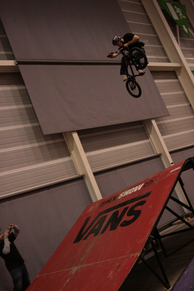
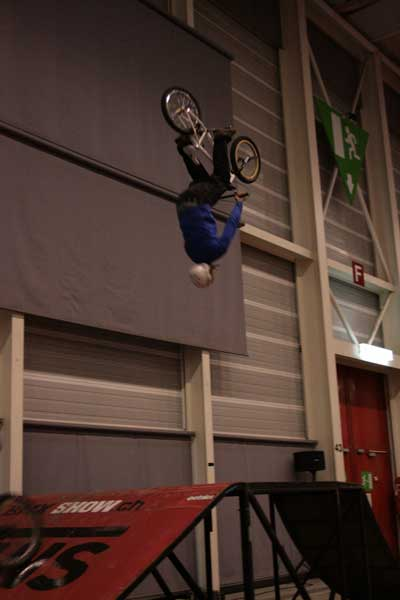
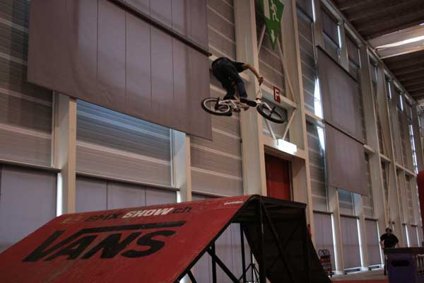
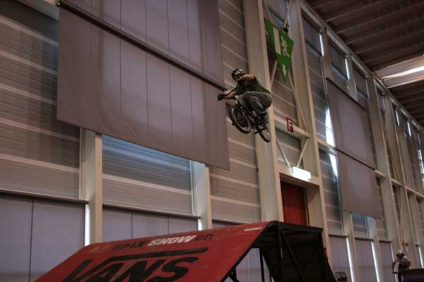

# Salon Vacances, Sport et Loisirs - 25-27 janvier 2008

Salut L'équipe,

L’association SBF a encore fait parler d’elle. Et en bien… Nous avons participé, cette année encore, au salon Vacances, Sports et Loisirs.

L’événement s’est déroulé sur trois jours bien que nous avons commencé jeudi à installer les divers éléments. Le vendredi aura été marqué par la « slam » de Malek, plus de peur que de mal, Dieu merci ! Il restera sans faire de vélo pendant trois mois car son rein a été légèrement perforé. Tous nos remerciements au Docteur Rielle pour son intervention. Cet incident a malheureusement marqué la fin de la première journée.

Le samedi a été une vraie bonne journée de démos. Bien que le public ne soit pas venu par car de japonais, on aura réussi à attirer une foule allant jusqu’à soixante personnes autour du stand lors de la deuxième démo. Et le nombre de riders présents était encourageant, merci pour le déplacement les gars.

Dimanche fut une journée plus calme avec une grande demande pour les initiations car plus de 20 caïds ont pu s’essayer au BMX en moins de deux heures. La seule démo de la journée a été calme en termes de spectateurs, mais notre feeling était plutôt bon car tout le monde est resté en « chill mode ». Merci aux riders pour être venu un deuxième jour consécutif.

Pour les spéciales du week-end, je commencerai par notre nouveau couple national !!! Serginho Sant’Anna vv se marie avec Adriana Burgi le jeudi 24 janvier. Malek se tôle comme il faut et garde le sourire. Le Mick (David) nous rend visite d’Auvergne avec le pti Eliot tout neuf de 5 semaines. 

Hannes démonte sa fun box dans tous les sens du terme (J’ai bien aimé les 360 turndown) ! Mais encore, toute l’équipe genevoise met le paquet avec, en invité surprise, Thibault Lamarche tout droit revenu d’Australie. Un Big Up à Thomas Wullschleger qui nous a honoré de sa présence tout du long comme speaker et même qu’il a piqué un ou deux vélos pour se faire plaisir quelques minutes !

Pour terminer, c’est avec un très grand plaisir que je vous convie tous à l’apéro de clôture de l’événement le vendredi 15 février à la cabane du skate park de Plainpalais (18h30) pour une petite séance d’info sur les souhaits de l’organisation pour l’année prochaine. Et tout cela grâce à nos sponsors et soutiens financier sur l’événement, je cite : La Délégation à la Jeunesse et l’Association Genevoise des Sports.

Je vous rappelle aussi que nous sommes une association et que vous avez la possibilité de nous apporter votre aide lors d’organisation d’événements ou même de venir nous trouver avec des projets innovants et originaux tout droit sortis de vos rêves les plus fous !!!

À la prochaine…

Votre dévoué Président

Stéphane Bachmann
