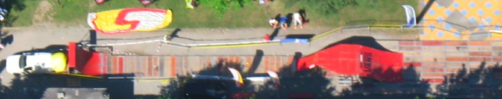
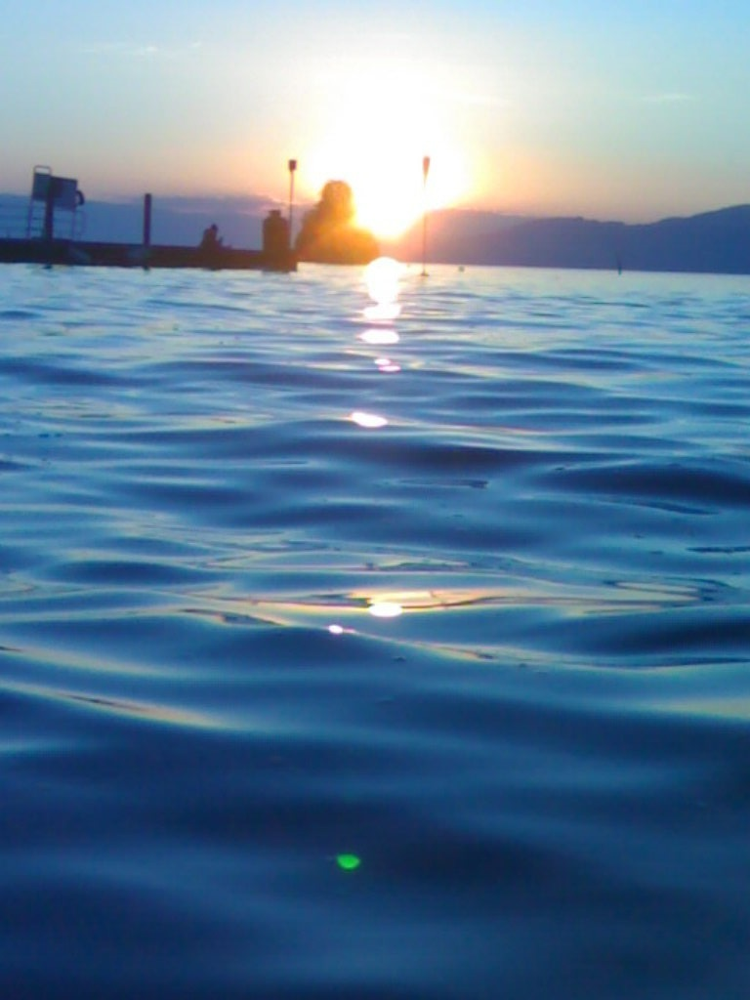

# Vertigo 08 - Juin 2008

Nous voilà revenu du Vertigo avec des images plein la tête ! 6 jours de plaisance et de riding avec en parallèle des compètes de wake board, de parapente et d’aile delta.

Sans parler de l’organisation énorme et les concerts de la fête de la musique qui nous ont bercé jusqu’au bout de la nuit... On a spécialement apprécié les pédalos et le parapente ainsi que les 10 stands représentant l’art culinaire des trois quarts de la planète.

La funbox de Hannes a encore fait fort et le speaker Thomas (RJ) Wullschleger a lui aussi mis le feu. Un grand merci à tous les riders présents : Maxime (Max) Charveron, John (Geon) Petit, Fréderic (Fazon) Borel, Adrien (Clap) Steinig, Yohann (Pirloui) Schmied, et nos invités d’Yverdon et Yannick Wenger d’Aigle ! Le public était chaud tout comme le lac.

Une spéciale dédicace aux allumés de l’organisation comme Paul-André, Dom, Alex, Julien, Nadège, Daphné et tout les autres à qui ont doit toute l’infrastructure généreusement mise en place.

Un événement à ne pas manquer auquel nous avons eu bien du plaisir à participer.

En photo, quelques images citées ci-dessus à vous faire partager et d’énormes tricks de nos trois dignes représentants du deuxième week-end que vous reconnaîtrez, je pense.

Merci pour votre visite et bonne sessions.

P.S. : Pour plus d’images, rendez-vous sur la page du site d’Adrénaline. Merci Serge-Alain !

[http://www.adrenalinetv.tv/news-details.php?langue=fr&amp;id_txt=44](http://www.adrenalinetv.tv/news-details.php?langue=fr&amp;id_txt=44)

Toujours selon eux…

BMX : La terre ferme a également été le théâtre d’acrobaties complètement folles grâce aux pilotes complètement allumés de Swiss BMX. Stéphane Bachmann et ses potes s’en sont donné à cœur joie sur un park construit spécialement pour l’occasion. Bachmann et son team de pro-riders sera présent jusqu’à dimanche prochain à la place de l’Ouchettaz pour donner des démonstrations et des initiations de BMX.

Trust and Ride. A l’année prochaine !!!

Stéph

