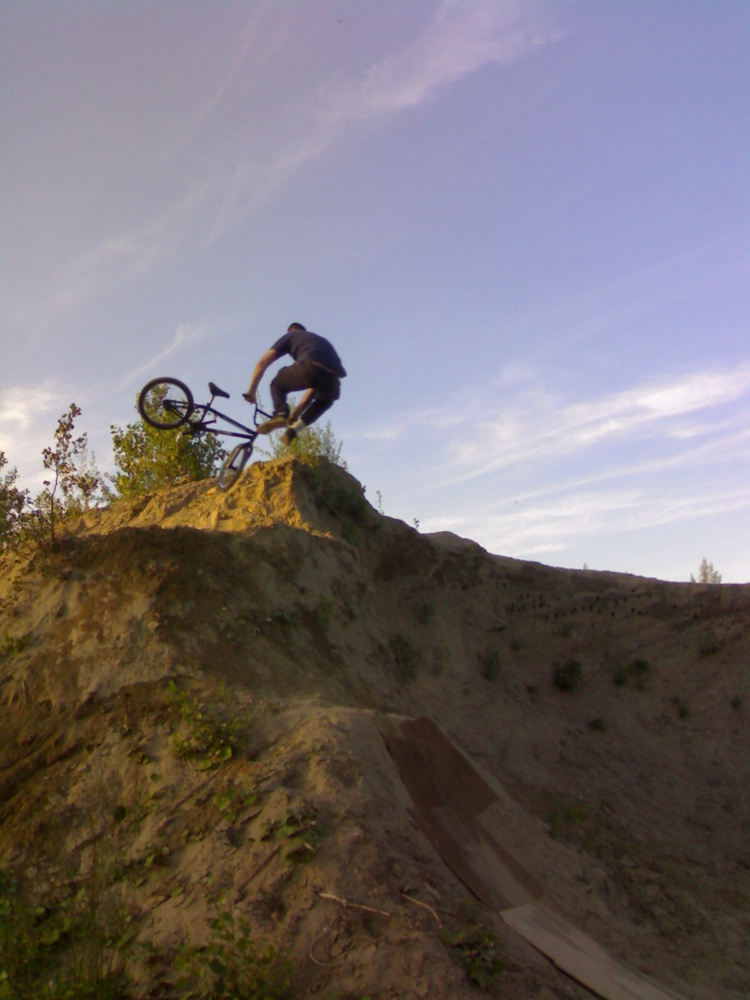
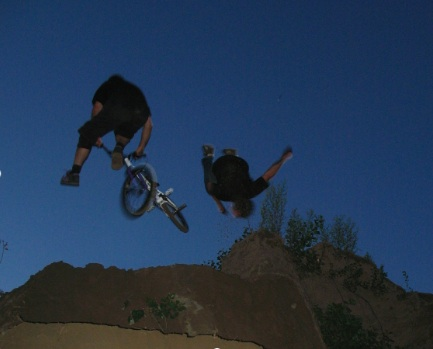
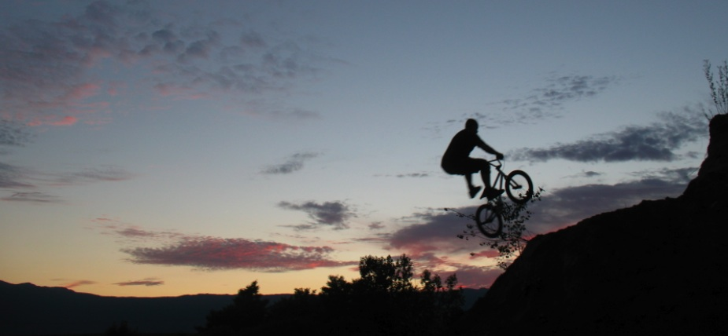

# New dirt spot GVA - Juillet 2008

Le nouveau spot en step-up ou la courbe à tout lancer…

En se promenant dans la campagne genevoise avec Olivier l’autre jour, un vieux souvenir d’enfance m’est revenu. Une vieille dune qui trône sur le haut d’une colline offrait la parfaite configuration pour notre projet… Entre les nids d’hirondelles, la route et les blaireaux, il a fallu, de quelques coups de pelle seulement, mettre le tas en forme et sont nés, un step-up (merci Elvis, le Perpi et Yoann) et un plan incliné (merci Thomas) pour la réception en hip à droite. La terre n’en est pas et à notre surprise nous avons remarqué que le tas est fait de sable. Une fois tassé, c’est un bonheur. Seul défaut, la prise d’élan très branlante et le fait de devoir mettre des planches sinon le kicker en cacahuète.

Pour le riding, tout est fait pour se lâcher et faire de bons vieux tricks old school à l’américaine. Nothing et whip (Olivier), can-can no foot (d’autres), 180 seat grab (Haa), et même des flips et flairs en primeur de certains. Avec le coucher de soleil et le ciel d’enfer, il y a eu de quoi faire quelques jolies prises de vue.

Voilà, cette petite news pour vous dire que faire naître un spot peut prendre quelques instants seulement et offrir un plaisir énorme dès les premiers essais. N’hésitez pas à appeler vos amis, prendre des pelles et nous envoyer vos photos. C’est ainsi que se développe notre passion.

Stéph.

