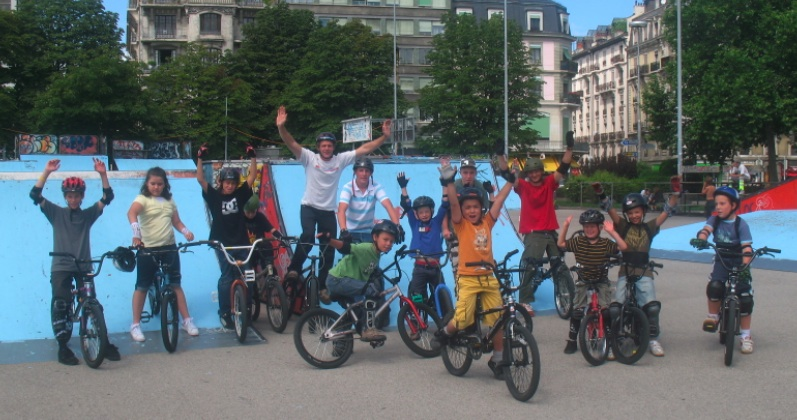
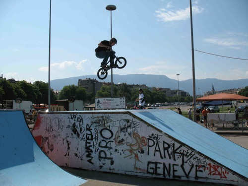
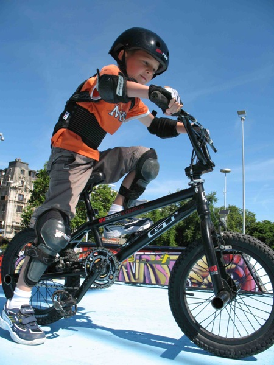
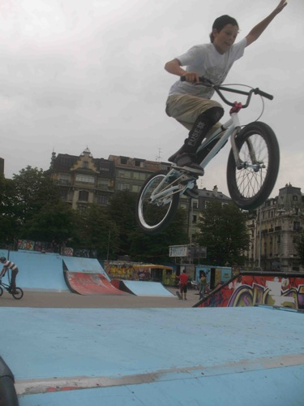
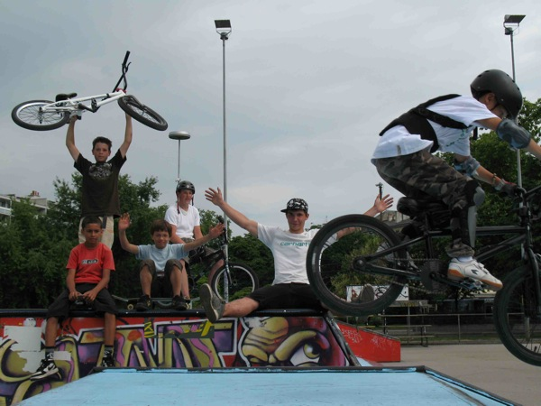
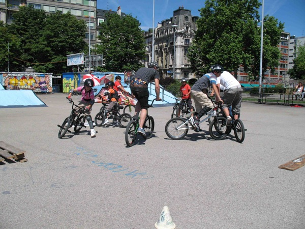

# SBF BMXCAMP - Juillet et août 2008

Cette vieille envie de pouvoir à notre tour transmettre la passion du bmx aux rookies a vu le jour il y a de ça quelques années. Il a fallu se le dire et se le redire pour que finalement le camp de bmx estival voie le jour.

Organisés par SBF, les camps de juillet et août ont réuni un total de 17 participant(e)s, belle réussite pour une première en la matière !!!

Ces kids sont juste fou ! Après une semaine d’initiation sur un vélo, les rouent décollent du sol, les pieds des pédales, les mains des guidons… Du sang neuf disent les aînés en voyant cette clique sillonner les courbes de Plainpalais. Quelle motivation ! Quel courage ! Mais en fait, on était aussi comme ça à leur âge ?

Je me rappelle encore de ma fascination pour un dénommé Fabrice Minazzi qui lors de mon premier cours de bmx avait gracieusement effectué un alley-oop sur une courbe de Champel.

A nous le tour de faire passer le virus si bon du vélo à cette armée de motivés qu’un méchant coup de pédale ne découragera pas. A nous de leur laisser la place aussi, tout en gardant un œil sur ces jeunes desquels on se sent si proches. Il paraîtrait même que certains dorment déjà avec leur vélo ! Que de souvenirs ! Merci à vous tous les jeunes riders qui nous offrent de belles sensations en tant que spectateurs.

Transmettre ; la tâche est belle, le mot est beau et le résultat nous donne comme un frisson ! Merci à toutes les personnes qui se sont mouillées dans cette belle histoire ! Je pense aux parents, aux magasins partenaires (SOLD, Hot Point, Bike Passion), aux riders qui ont participé à cette aventure et à madame la présidente.

Le Président masqué

