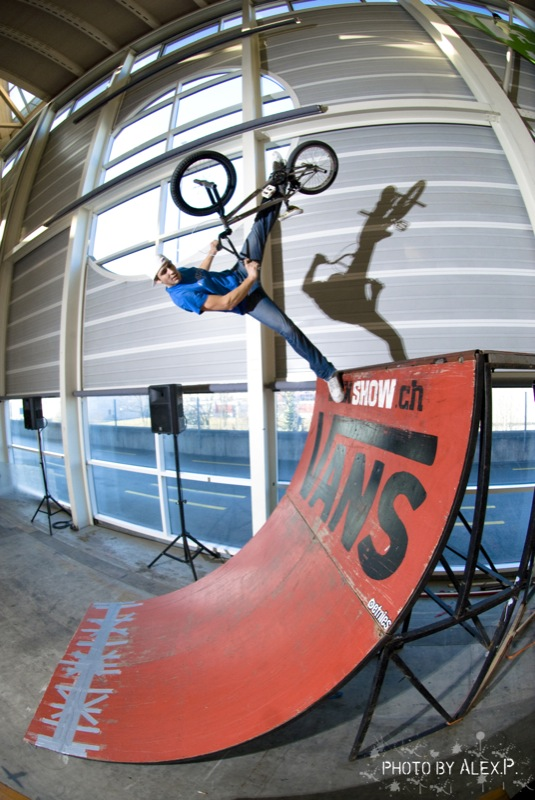
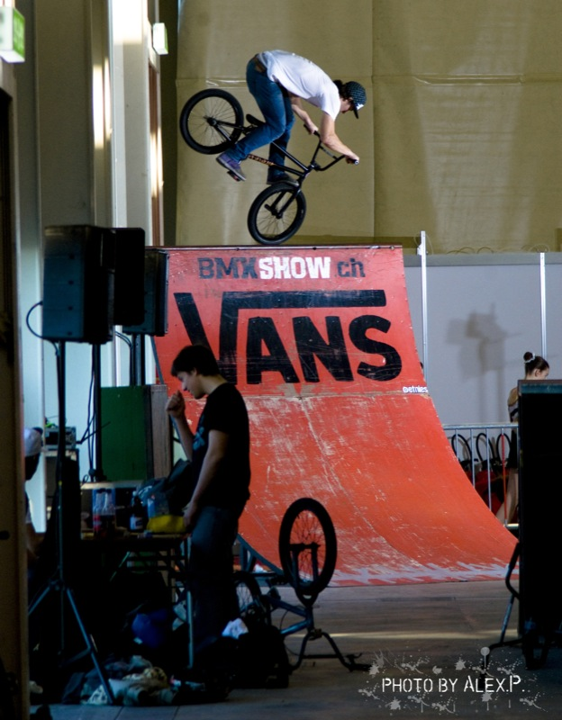
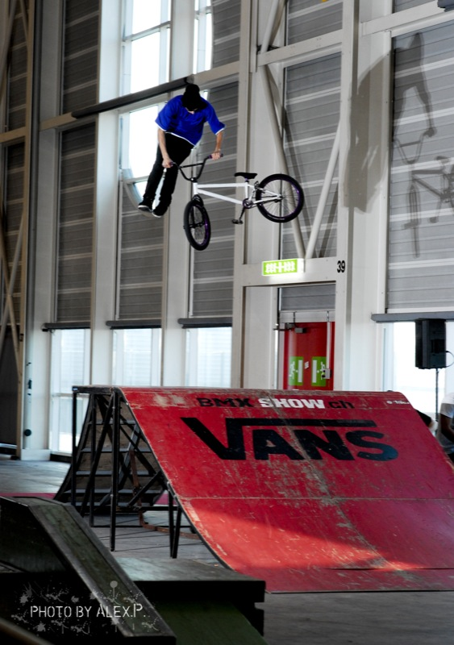
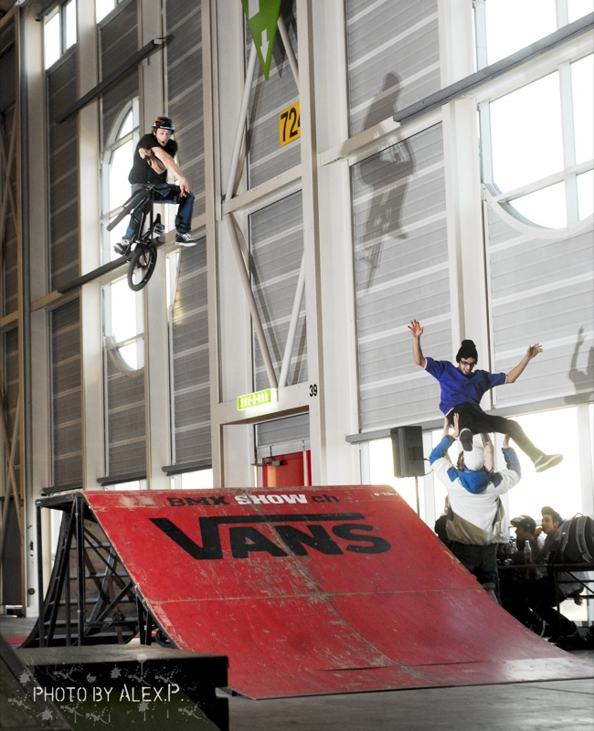
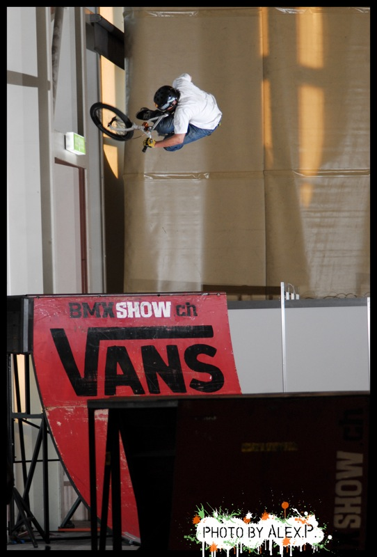

# ds brichtli über d bmxshow ar feriemess

## VSL 2009 l’article

L’année commence une fois de plus avec pour 1er événement de notre calendrier Swiss BMX Freestyle le Salon Vacances Sports et Loisirs 2009 dans la halle 7 de Palexpo.

Une fois le labyrinthe traversé, on arrive dans l’arrière-salle du salon où boxeurs, danseurs, patineurs et autres se côtoient. Au centre, des voitures sont exposées près d’une étrange rampe de lancement… C’est nous !

La structure de cette année accueille plus de modules pour les initiations grâce à la DéJ qui une fois de plus nous met à disposition tout son attirail. En plus de cela nous avons aussi le quarter de Hannes ainsi que la funbox montés jeudi soir par l’asso.

Les jeunes arrivent un à un et la première remarque est « il fait chaud !!! ». On a pas l’habitude de rider au dessus de 0° C. ces jours.

Les démos sont peuplées de visiteurs surpris de voir du BMX au centre de ces enfants faisant leurs premiers pas de gym et nos voisins les patineurs arrivent même à attirer les riders pour une partie de unihoc.

Tous nos remerciements vont aux riders s’étant déplacés pour démontrer leur talent. Je pense à Manu, Hannes, Malek, Yoann, Andréas, Momo, Perpi, Sarem et les autres. N’oublions pas les cadets avec Quentin, Mathieu et tous ceux que j’ai oubliés. Le tout dans la gaieté et la bonne humeur sans même réveiller les souvenirs douloureux de l’année passée.

Une quinzaine de jeunes ont aussi été initiés au BMX lors de cet événement et cela grâce au soutien de l’AGS que nous remercions de plus belle !!!

Avant de se dire à l’année prochaine, je vous laisse apprécier les photos d’Alex Pittet qui une fois de plus a fait un superbe travail en capturant tail whip, foot jam, aerial et foot plant de notre crew maison !

Stéph

_Et maintenant, ouf tütch :_

## hie ändlech ds brichtli über d bmxshow ar feriemess

Swissbmx het zum dritte mal ar Ferie- und Sportmess im Palexpo in Genf Bmxshows gfahre.

Näbe Kunstturn-, Schach- und Autorenn-Clubs het Swissbmx uf dr Jumpbox und Quarter vo bmxshow.ch spektakuläri Shows zeigt.

Es si houptsächlech Gänfer Rookies am Start gsi wo hei zeigt wo dr Newschool-hammer hanget. Mohamed mit Tailwhips über d’Jumpbox oder 360° Drops vor Box abe, oder No-Hand to Barspin Flyout!

Yohan mit ice to Nosepick uf dr Quarter. Stéphane mit stylishe Nacnac’s oder Backflip. Moderiert het das ganze Thomas Wullschleger-National.

Zum Schluss hets jewils es paar Zügli mit allne 10 Fahrer gä, das zieht immer am beste are Show!

Es isch cool gsi ar wermi chönne z’Fahre! Merci für d’Organisation Stéph.

Ride On Hää

[01-honour-your-mother-and-your-father](./media/01-honour-your-mother-and-your-father.mp3)

