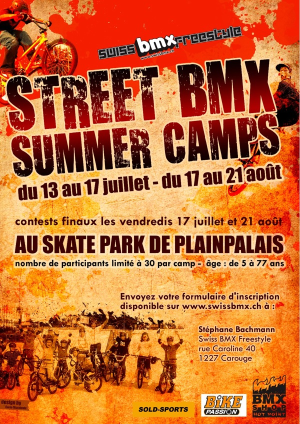

# Summer camps

Street BMX Summer Camps

du 13 au 17 juillet

du 17 au 21 août

Au [skate park de Plainpalais](http://maps.google.com/maps?f=q&amp;source=s_q&amp;hl=en&amp;geocode=&amp;q=geneve&amp;sll=37.0625,-95.677068&amp;sspn=50.02446,78.398437&amp;ie=UTF8&amp;ll=46.199646,6.140467&amp;spn=0.005384,0.00957&amp;t=h&amp;z=17) à Genève

nombre de participants limité à 30 par camp

âge : de 5 à 77 ans

contests finaux les vendredis 17 juillet et 21 août

Les horaires sont de 9 heures du matin à midi.

le prix est de 150.- pour la semaine avec une réduction de 20.- pour les personnes déjà membres de Swiss Bmx Freestyle.

Envoyez votre [formulaire d’inscription](./media/fiche-de28099inscription-au-c2abc2a0street-bmx-summer-campc2a0c2bb-2009.pdf) à :

Stéphane Bachmann

Swiss BMX Freestyle

rue Caroline 40

1227 Carouge

Notre encadrement prévoit tout ce dont votre enfant aura besoin entre lé début des activités et la fin de celles-ci. Les boissons seront à notre charge et les moniteurs expérimentés assureront un cadre de qualité à vos enfants. Veuillez quand même prévoir un léger pic-nic pour l’encas de 10h30.

Versement : le 1er jour du camp ou par CCP au : 17-257546-8 (nous amener le récépissé, svp)

Venez nombreux et à bientôt !!!

